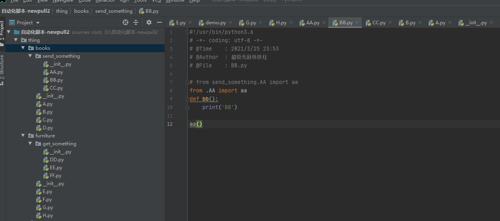
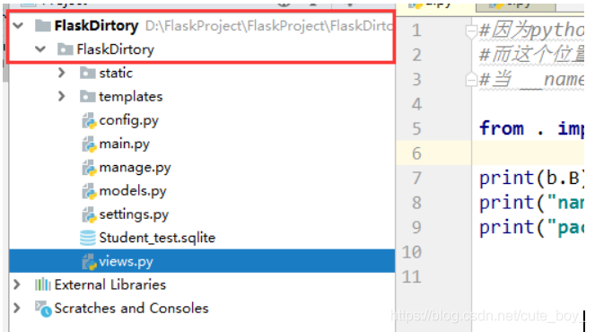
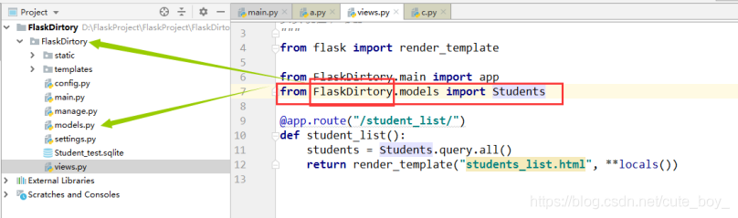

# Python 相对导入与绝对导入

Python | Jul 21, 2016 | [python](http://kuanghy.github.io/tags/#python)

🔺Python 相对导入与绝对导入，这两个概念是相对于包内导入而言的。包内导入即是包内的模块导入包内部的模块。

## Python import 的搜索路径

- 在当前目录下搜索该模块
- 在环境变量 PYTHONPATH 中指定的路径列表中依次搜索(我们定义的环境变量)
- 在 Python 安装路径的 lib 库中搜索

## Python import 的步骤

python 所有加载的模块信息都存放在 `sys.modules` 结构中，当 import 一个模块时，会按如下步骤来进行

- 如果是 `import A`，检查 sys.modules 中是否已经有 A，如果有则不加载，如果没有则为 A 创建 module 对象，并加载 A
- 如果是 `from A import B`，先为 A 创建 module 对象，再解析A，从中寻找B并填充到 A 的 `__dict__` 中

## 相对导入与绝对导入

绝对导入的格式为 `import A.B` 或 `from A import B`，相对导入格式为 `from . import B` 或 `from ..A import B`，`.`代表当前模块，`..`代表上层模块，`...`代表上上层模块，依次类推。

相对导入可以避免硬编码带来的维护问题，例如我们改了某一顶层包的名，那么其子包所有的导入就都不能用了。但是 **存在相对导入语句的模块，不能直接运行**，否则会有异常：

```
ValueError: Attempted relative import in non-package
```

这是什么原因呢？我们需要先来了解下导入模块时的一些规则：

在没有明确指定包结构的情况下，Python 是根据 `__name__` 来决定一个模块在包中的结构的，如果是 `__main__` 则它本身是顶层模块，没有包结构，如果是`A.B.C` 结构，那么顶层模块是 A。基本上遵循这样的原则：

- 🔺如果是绝对导入，一个模块只能导入自身的子模块或和它的顶层模块同级别的模块及其子模块
- 🔺如果是相对导入，一个模块必须有包结构且只能导入它的顶层模块内部的模块

如果一个模块被直接运行，则它自己为顶层模块，不存在层次结构，所以找不到其他的相对路径。

Python2.x 缺省为相对路径导入，Python3.x 缺省为绝对路径导入。绝对导入可以避免导入子包覆盖掉标准库模块（由于名字相同，发生冲突）。如果在 Python2.x 中要默认使用绝对导入，可以在文件开头加入如下语句：

```
from __future__ import absolute_import
```

## `from __future__ import absolute_import`

这句 import 并不是指将所有的导入视为绝对导入，而是指禁用 `implicit relative import`（隐式相对导入）, 但并不会禁掉 `explicit relative import`（显示相对导入）。

那么到底什么是隐式相对导入，什么又是显示的相对导入呢？我们来看一个例子，假设有如下包结构：

```
thing
├── books
│   ├── adventure.py
│   ├── history.py
│   ├── horror.py
│   ├── __init__.py
│   └── lovestory.py
├── furniture
│   ├── armchair.py
│   ├── bench.py
│   ├── __init__.py
│   ├── screen.py
│   └── stool.py
└── __init__.py
```

那么如果在 stool 中引用 bench，则有如下几种方式:

```
import bench                 # 此为 implicit relative import
from . import bench          # 此为 explicit relative import
from furniture import bench  # 此为 absolute import
```

隐式相对就是没有告诉解释器相对于谁，但默认相对与当前模块；而显示相对则明确告诉解释器相对于谁来导入。以上导入方式的第三种，才是官方推荐的，第一种是官方强烈不推荐的，**Python3 中已经被废弃**，这种方式只能用于导入 path 中的模块。

## 相对与绝对仅针对包内导入而言

最后再次强调，相对导入与绝对导入仅针对于包内导入而言，要不然本文所讨论的内容就没有意义。所谓的包，就是包含 `__init__.py` 文件的目录，该文件在包导入时会被首先执行，该文件可以为空，也可以在其中加入任意合法的 Python 代码。

相对导入可以避免硬编码，对于包的维护是友好的。绝对导入可以避免与标准库命名的冲突，实际上也不推荐自定义模块与标准库命令相同。

前面提到含有相对导入的模块不能被直接运行，实际上含有绝对导入的模块也不能被直接运行，会出现 ImportError：

```
ImportError: No module named XXX
```

这与绝对导入时是一样的原因。要运行包中包含绝对导入和相对导入的模块，可以用 `python -m A.B.C` 告诉解释器模块的层次结构。

有人可能会问：假如有两个模块 a.py 和 b.py 放在同一个目录下，为什么能在 b.py 中 `import a` 呢？

这是因为这两个文件所在的目录不是一个包，那么每一个 python 文件都是一个独立的、可以直接被其他模块导入的模块，就像你导入标准库一样，它们不存在相对导入和绝对导入的问题。**相对导入与绝对导入仅用于包内部**。


#### 执行有相对导入的模块



```python
from .AA import aa
def bb():
    print('BB')

aa()

Traceback (most recent call last):
  File "D:/自动化脚本-newpull2/thing/books/send_something/BB.py", line 8, in <module>
    from .AA import aa
ModuleNotFoundError: No module named '__main__.AA'; '__main__' is not a package
```


#### 执行有绝对导入的模块

```python
from send_something.AA import aa
def bb():
    print('BB')
aa()
Traceback (most recent call last):
  File "D:/自动化脚本-newpull2/thing/books/send_something/BB.py", line 7, in <module>
    from send_something.AA import aa
ModuleNotFoundError: No module named 'send_something'
```


## 总结

#### 一、导入需要区分工作目录

首先可以通过os.getcwd查看当前工作的目录是哪里
通常在python框架开发时候，发现,在项目目录外层嵌套一个工作目录，目录名称通常和工作目录一致。



如果使用编译器打开项目，过多一层或者过少一层打开目录都会导致导入错误，是因为编译器打开那个目录，就将python的工作目录设置那一层，只有上述结构才能实现下面的导入方法



#### 二、 . 和 …导入 相对位置是执行文件的当前目录

因为python的相对导入需要用到父级包作为相对的参考位置
而这个位置是通过__name__属性和__package__属性进行决定的，
当 name 等于 __main__和 package = None的时候导致的问题没有父级包
ImportError: attempted relative import with no known parent package

#### 三、`__init__.py`

在Python 2中是包的标志，只有拥有`__init__.py`文件的目录才会叫做包
在python 3中也是包的标志，但是不强制识别，py2和py3的_`_init__.py`文件共有功能，初始化包

#### 四、`__all__`在模块中的应用

- 导入模块文件中的函数时，使用all来限制导入的函数和常量

```python
#!/usr/bin/python3.6
# -*- coding: utf-8 -*-
# @Time    : 2021/3/25 23:53
# @Author  : 超级无敌张铁柱
# @File    : AA.py

__all__ = ('aa', 'func', 'HOME', 'DEMO')
DEMO = 2
HOME = 'C'
def aa():
    print('AA')
def func():
    print('aaaa')
"""
1. __all__中的函数和常量必须在该模块的下面有申明（要么就别写到__all__里面去），不然from xx.AA import * 的时候就直接会报错（不光from xx.AA import *的时候报错，只要有导入就会报错）。。报错如下：
AttributeError: module 'thing.books.send_something.AA' has no attribute 'HOME'
2. all只对from xxx.AA.py import *这样的起限定作用
"""
```

注意事项：__all__=(必须是一个元祖，函数名用引号引着)---->**只对from (模块名) import *这样的起限定作用**，并且这是写在被调用模块中的


#### 五、`__all__`在包中的应用

- ` __all__ `属性存在于`__init__.py`中，当使用from xxx.包名 import *格式导入包的时候，用于限制导入，只导入`__all__`里面的东西。
- import `<包名>`导入整个包的时候，就是导入 `__init__.py`中定义的方法和属性和常量，当且仅当只导入`__init__.py`中的方法、属性和常量等属性，🔺一定要记住，是导入`__init__.py`中的东西
- from xxx import  `<包名>`**导入整个包**的时候，就是导入`__init__.py`文件中的方法、属性和常量等属性,当且仅当只导入`__init__.py`中的方法、属性和常量等属性，🔺一定要记住，是导入`__init__.py`中的东西
- from xxx.package import * 的时候 也是导入 `__init__.py`文件中的方法、属性和常量等属性，`__all__`对其进行限制
- 🔺如果`__init__.py`中不写`__all__`，from xxx.package import *就是将`__init__.py`中的所有东西都导入

###### 例子：

**包send_something中的`__init__.py`代码如下**

```python

from . import BB
from . import CC
from . import AA

NAME = 'ALEX'
AGE = '18'

__all__ = (
    'BB',
    'CC'
)

"""
通过from xxx.send_something import *和 的时候，只导入了__all__中定义的'BB'和'CC',像NAME = 'ALEX'和AGE = '18'和‘AA’都不可以在调用模块中使用，不然会报错
"""
```


#### 六、`__init__.py`文件的妙用

> 1. ​	**可以避免导入时，写冗长的路径。我们可以将需要的函数、变量写到`__init__.py`文件中**
> 2. ​    **`__all__`里面定义的东西也可以被使用绝对路径来快速导入**