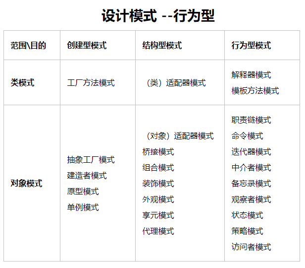

**[原文](https://zhuanlan.zhihu.com/p/78602084)**

[设计模式](https://www.cnblogs.com/ydf0509/p/8527851.html)



根据目的、用途的不同，分为**创建性模式、结构性模式、行为性模式**。创建型模式主要用于创建对象，结构型模式主要用于处理类和对象的组合，行为性模式主要用于描述类或对象的交互以及职责分配。


## 一、Python设计模式：工厂模式

 

#### 1.1 工厂方法

设计模式的“工厂”这个概念就是来源于我们**现实中的工厂**，我们把原材料、图纸等生产资料的投入到一个工厂里面，工厂就会给我们输出相应的产品，所以实现工厂方法很简单，一个函数就是一个工厂。

```python
def fatory(drawing):
    if drawing == 'BMW':
        print("得到一辆宝马汽车")
        return '宝马汽车'

    if drawing == 'Benz':
        print("得到一辆奔驰汽车")
        return '奔驰汽车'

fatory('BMW')
```

**总结：通过传入的参数调用不同的方法**


#### 1.2 抽象工厂

抽象工厂顾名思义是个生产的产品比较抽象的工厂，如果工厂方法生产出来的是汽车，那么抽象工厂生产出来的应该是汽车厂，汽车厂再用来生产汽车，是工厂方法向上再抽象了一层，相当于**创建工厂的工厂**。

```python
class CarFactory:
    def __str__(self):
        return '车厂'


class BoatFactory:
    def __str__(self):
        return '船厂'


class AbstractFactory:
    factory = {
        'boat_factory': BoatFactory,
        'car_factory': CarFactory,
    }

    @classmethod
    def get(cls, factory_name):
        factory = cls.factory.get(factory_name)
        print(f"得到一个{factory()}")
        return factory


AbstractFactory.get('car_factory')
```

缺陷：就是如果我们需要添加工厂，如果添加一个飞机厂，我们要定义个`class PlanFactory:`,然后还要再`class AbstractFactory:的factory`中进行添加，其实也不是什么麻烦的事情，但是嘛，只有懒惰才能使人进步，那么我们有没有方法，只修改一个地方呢？那就是采用映射的方式


#### 1.3 采用映射的方式

```python
class AbstractFactory:

    @classmethod
    def get(cls, factory_name):
        factory = getattr(cls, factory_name)
        print(f"得到一个{factory()}")
        return factory

    @staticmethod
    def boat_factory():
        return '船厂'

    @staticmethod
    def car_factory():
        return '车厂'


if __name__ == '__main__':
    AbstractFactory.get('car_factory')
    a = AbstractFactory()
    a.get('boat_factory')
```

这里其实是有一个缺陷的，那就是当我们使用getattr的时候， 如果factory_name 不存在，那这个时候就会报错了。。

所以我们改进一下

```python
class AbstractFactory:

    @classmethod
    def get(cls, factory_name):
        if hasattr(cls, factory_name):							# 🔺 映射
            factory = getattr(cls, factory_name)
            print(f"得到一个{factory()}")
            return factory
        raise AttributeError('没找到对应的属性')

    @staticmethod
    def boat_factory():
        return '船厂'

    @staticmethod
    def car_factory():
        return '车厂'


if __name__ == '__main__':
    AbstractFactory.get('car_factory')
    a = AbstractFactory()
    a.get('boat_factory')
```

这样我们就可以只在下面添加 def 就行了。


## 二、Python设计模式：建造者模式

和工厂模式不一样，工厂模式是直接返回一个产品（或工厂），输入输出，相当直接，建造者模式就要辛苦一点，**需要指挥者指挥建造者工作之后，才能获得产品**，所以建造者模式需要**指挥者**和**建造者**两个角色。

**① 建造者**

建造者顾名思义，就是搬砖干活的，所以他**应该有各种干活的能力**，这样指挥者才好指挥他们干活，下面是一个能建酒店的建造者。

```python
class HotelBuilder:
    @classmethod
    def get_material(cls):
        print("正在搬运酒店建筑材料...")
        return cls

    @classmethod
    def building(cls):
        print("正在修建酒店...")
        return cls

    @classmethod
    def complete(cls):
        print("修建酒店已完工")
        return "酒店"
```

**② 指挥者**

指挥者毫无疑问就是指挥人干活的，虽然不用每事亲力亲为，但他**需要很清楚干活的步骤**，这样才能发挥他的领导才能。

```python3
class Director:
    def __init__(self, builder):
        self.builder = builder

    def direct(self):
        building = self.builder.get_material().building().complete()
        print(f"{building}已建成")
        return building
```

**③ 开始干活**

把酒店建造者给指挥者，然后指挥者开始指挥，最后得到产品。

```python
hotel = Director(HotelBuilder).direct()
```


## 三、Python设计模式：模板方法模式

模版方法模式指**定义一个模版框架，将一些具体行为放到子类取实现，模版方法使得子类可以不改变算法结构即可重新定义该算法的某些特定行为。**

模版方法就是提供一个代码复用平台，有时候我们遇到一系列步骤需要执行，从更高层次看这个过程是相同的，只是有些具体步骤的实现可能不同，这时候就可以用模版方法。

**例如每个公司员工的一天工作流程都是相似的，只是实际的工作内容不同，这时候就可以创建一个员工模版定义一天工作流程的框架，具体工作内容在子类实现。**

**① 员工基类**

员工基类**相当于一个员工模版，定义了一个员工的通用行为**，例如打卡上班，午休，打卡下班等。


```python
import abc


class Employee(metaclass=abc.ABCMeta):

    def __init__(self, name):
        self.name = name

    def clock_in(self):
        print(f"{self.name} 打卡上班")

    @abc.abstractmethod
    def work(self):
        pass

    def noon_break(self):
        print(f"{self.name} 正在午休")

    def clock_out(self):
        print(f"{self.name} 打卡下班")

    def daily_work(self):
        self.clock_in()
        self.work()
        self.noon_break()
        self.work()
        self.clock_out()
```

**② 具体员工**

具体员工继承员工基类，**定义了属于自己的特定行为**。

```python
class Analyst(Employee):
    def work(self):
        print(f"{self.name} 正在分析行情...")


class Trader(Employee):
    def work(self):
        print(f"{self.name} 正在执行交易...")
```

**③ 员工开始自己的日常工作**

```python
Analyst('Chris').daily_work()
Trader('Ryan').daily_work()
```


**总结一下：**

上面采用了抽象基类的概念，那就是我们通过基类模板继承的子类必须实现work方法


## 四、python设计模式：观察者模式

观察者模式也叫发布订阅模式，**定义了对象之间一对多依赖，当一个对象改变状态时，这个对象的所有依赖者都会收到通知并按照自己的方式进行更新。**举个现实生活的例子，**职员们趁老板不在，都在玩着自己的东西，同时观察着前台小姐姐，前台小姐姐在老板回来的时候，发布通知让各同事回到工作状态。**

**① 职员们**

**都是观察者，时刻观察着前台小姐姐，等她提前通知老板的到来。**

```python
# 看股票的职员
class StockClerk(object):

    def __init__(self, name):
        self.name = name

    def open_office_software(self):
        action = getattr(self, 'close_stock', NotImplemented)
        action()
        print('打开办公软件')

    def close_stock(self):
        print(f'{self.name}关闭股票软件')
        

# 睡觉的员工
class SleepingClerk(object):

    def __init__(self, name):
        self.name = name

    def open_office_software(self):
        action = getattr(self, 'get_up', NotImplemented)
        action()
        print('赶快打开办公软件')

    def get_up(self):
        print(f'{self.name}弹射式起床')
```

**② 前台小姐姐**

**给各个观察者通风报信的人。**

```python
class Receptionist(object):
    actions = []

    @classmethod
    def attach(cls, action):
        cls.actions.append(action)

    @classmethod
    def notify(cls):
        print('老板回来了!!!!!!!, 各位同事快点行动')
        for action in cls.actions:
            action()
```

**③ 大家偷懒的时候，老板突然回来，前台小姐姐通知大家回到工作状态**

```python
if __name__ == '__main__':
    # 实例化两名靓仔
    pretty_boy_one = StockClerk('Chris')
    pretty_boy_two = SleepingClerk('Ryan')

    # 告诉前台小姐姐如何通知
    Receptionist.attach(pretty_boy_one.open_office_software)
    Receptionist.attach(pretty_boy_two.open_office_software)

    # 前台小姐姐发布通知
    Receptionist.notify()
```


## 五、python设计模式：备忘录模式（游戏存档模式）

备忘录模式是指在**不破坏封装的前提下，捕获一个对象的内部状态，并在该对象之外保存这个状态，这样可以在以后将对象恢复到原先保存的状态**。

说通俗点就**相当于一个游戏存档，一般我们玩游戏打BOSS前，都会保存一下，如果打BOSS失败了就读取存档再来一遍**，这里面有三个对象，**英雄**，你控制的游戏角色，**存档**，用来保存英雄的状态数据，**存档管理员**，帮你执行保存和读取的工作。

