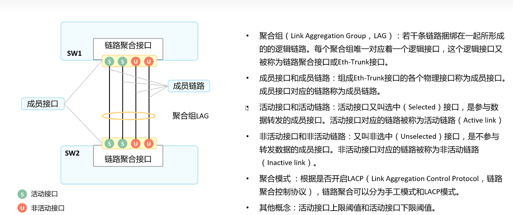
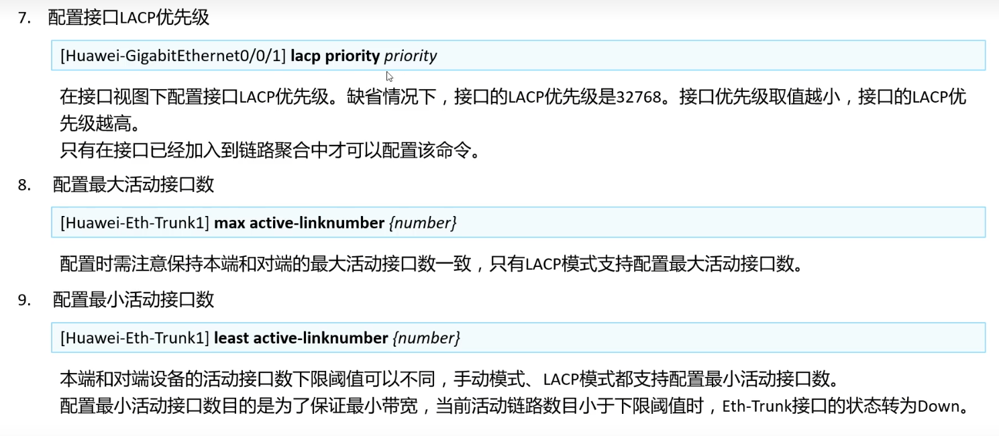

- Loopback地址不能和其他三层接口地址在同一个网段，同理一个三层接口配置了一个网段，另外一个三层接口就不能配置相同网段。

为什么呢？三层接口就是隔离广播域的，不一样的接口肯定属于不一样的广播域，所以三层接口，肯定不能配置相同网段，这是原则，配置了肯定会报错

三层的每个接口都需要配置位于不同网段的IP地址，隔离广播域，设计上就是这样的。也就是你一个接口配了192.168.1.1另一个接口肯定不能配置192.168.1.1了，不然不就冲突了，设备收到数据包转发给谁？三层就相当于都是WAN 口， lan 是二层接口，相当同一个网段。


## 一、VLAN


https://www.bilibili.com/video/BV1RZ4y1M7j7?p=4&vd_source=908f99a5244c42140790061d37500028

```python
# 进入系统模式
system-view						

# 给交换机创建一个名字（这一步不需要哈）
sysname s5700					

# 给交换机创建2个VLAN 10和20
vlan batch 10 20				

# 进入接口
interface GigabitEthernet 0/0/1	

# 修改端口类型为access口
port link-type access

# 将该端口加入到VLAN 10 (所有带 vlan 10 的数据都可以访问)
port default vlan 10

# 退出
quit

# 进入接口
interface GigabitEthernet 0/0/2

# 修改端口类型为access口
port link-type access

# 将该端口加入到VLAN 10 (所有带 vlan 10 的数据都可以访问)
port default vlan 20

# 退出
quit

# 进去vlanif10三层接口
interface Vlanif 10

# 配置vlanif 三层接口的网关地址
ip address 10.32.73.254 24

# 退出
quit

# 进去vlanif20三层接口
interface Vlanif 20

# 配置vlanif 三层接口的网关地址（必须将一个接口划入到vlan下以后才可以配置vlanif，不然命令都敲不出来）
ip address ip address 192.168.8.254 24

# 配置主机PC1的IP地址(主机的网关地址要和vlanif10的网关地址保持一致)
IP 10.32.73.8
netmark 255.255.255.0
gateway 10.32.73.254

# 配置主机PC2的IP地址(主机的网关地址要和vlanif20的网关地址保持一致)
IP 192.168.8.85
netmark 255.255.255.0
gateway 192.168.8.254

# 🔺配置了vlanif以后，该接口只能是
```


作用：
只是在交换机从外部接收到Untagged数据帧时，用于在数据帧有便签情况下判断是否接受该数据帧/无便签情况下给数据帧添加便签用的。

Hybrid类型接口的PVID是可以手动更改的。
华为设备通过命令 port hybrid pvid vlan xx;


Access类型接口将接口划进某一个VLAN时，接口的PVID也随之改变。


Trunk类型的接口的PVID也是可以手动改的。
华为设备通过命令 port trunk pvid vlan xx;


普通交换机的二层端口有三种常见的端口类型：access、trunk、hybird，

access端口一般用作PC或服务器主机接入，通过该端口的数据包都是不带VLAN tag的；

trunk端口可以允许多个VLAN的数据包通过，一般连接其他交换机；

hybird端口比较灵活，可以根据用户需求，对通过该端口的数据包进行VLAN tag打标和去标动作，可以连主机也可以连其他交换机；在开始讲解之前，**请记住交换机内部的所有数据报文是有VLAN tag的，**

下面我们通过分析交换机端口的进、出两个方向对VLAN tag的处理过程来详细说明这三种端口类型的区别；

access端口：

    通过access出去的数据包都是不带VLAN tag的；
    
    在access端口进方向，交换机接收到数据包后，先判断是否带VLAN tag，有则丢弃数据包，没有则打上该端口已配置的VLAN tag；
    
    在access端口出方向，交换机将打了与端口相同VLAN tag的数据包转发出去，并且去掉VLAN tag变成普通数据包。

 这里有一个现象：如果收到了和自己vlan相同的带标签的数据。access口允许同vlan进入，但是接口都是成对的，如果access口接收到同vlan数据，表明对端是trunk口（或者hybrid），数据从trunk口进入access口没问题，但应答数据从access口出去后，会剥离标签，此时再进入trunk口，会打上trunk口的pvid（因为该数据从trunk到access的过程中带有vlan，说明pvid和原有vlan不一样），此时应答数据带有的vlan已经和原有vlan不一样了，所以是无法通讯的。总的来说，一端access，一端trunk，是不合理的网络拓扑


trunk端口：https://blog.csdn.net/yangnianlong/article/details/104267180

```python
通过trunk端口的数据包都必须带上VLAN tag；

在trunk端口进方向，交换机接收到数据包后，先判断是否带VLAN tag，没有则丢弃数据包，有则按照对应VLAN进行转发；

在trunk端口出方向，交换机将带VLAN tag的数据包原封不动转发出去，没有带VLAN tag数据包不会从trunk端口转发出去。

在trunk端口上有一种特殊情况，如果配置了native VLAN（也叫PVID），转发方式等同于access端口，当从端口进来的报文不带vlan tag时，就打上Native vlan tag； 当从端口出去的报文带Native vlan tag时，会剥离TAG。
```


hybird端口：

```python
顾名思义，这是一种混合端口，是access和trunk两种端口的混合，既可以转发无vlan tag报文，也可以转发有vlan tag报文；在hybird端口上通常会配置tag vlan和untag vlan，对于tag vlan，其转发方式与trunk口相同，对于untag vlan，其转发方式与access口相同；

在hybird端口进方向，交换机接收到数据包后，先判断是否带VLAN tag，没有则丢弃，如果没有vlan tag但是配置了PVID，则打上PVID的vlan tag；有则按照对应VLAN进行转发；进方向不看untag配置；

在hybird端口出方向，     vlan的数据包，原封不动发送出去，对于端口配置了untag vlan的数据包，则去掉vlan tag再发送出去；如果是PVID的vlan，则去掉vlan tag再发送出去；
```


```python
# 删除vlanif（删除以后同时也会删除vlanif配置的ip）
undo interface vlanif 10

# 开启vlanif
interface vlanif 10

# 删除vlan(删除VLAN必须先删除vlanif)
undo vlan 10

# 删除access类型
undo port link-type access

# 查看vlan
display vlan

# 查看端口的具体vlan pvid allow-pass 详情
display port vlan

# 进入vlanif
interface vlanif 10
dis this	#查看vlanif三层接口配置
```

需要一层一层的来删除配置，直到恢复到默认的配置。

比如：

配置的时候为：

port link-type access

port default vlan 4

如果直接更改端口模式就会报错为Error: Please renew the default configurations.

所以如果出现这种错误，在这里就需要从后往前删除,即：

undo port default vlan 4

undo port link-type

到这里以后 才可以重新更改端口的模式。


当交换机的接口类型为access类型时，pid＝pvid,也就是说不用任何命令来设置。
pvid这个参数只针对于 trunk、hybird口来说才有意义，对于access口来说没有意义


**S系列交换机配置Trunk口**

```python
# 进入端口
[SW1]interface Ethernet 0/0/1

# 配置类型
[SW1-Ethernet0/0/1]port link-type trunk

# 配置allow-pass vlan(vlan可以不存在，但是必须合法)
[SW1-Ethernet0/0/1]port trunk allow-pass vlan 10 20

# 添加allow-pass vlan (vlan可以不存在，但是必须合法)
[SW1-Ethernet0/0/1]port trunk allow-pass vlan 30

# 删除其中一个vlan
[SW1-Ethernet0/0/1]undo port trunk allow-pass vlan 30

# 删除allow-pass（删除全部vlan以后就删除了 allow-pass了）
[SW1-Ethernet0/0/1]undo port trunk allow-pass vlan 10 20

# 配置PVID(vlan必须存在)
[SW1-Ethernet0/0/1]port trunk pvid vlan 10
```


**CE系列**

```python
# 必须开启端口
interface CE 0/0/1

# 开启端口
undo shutdown

# 提交(CE系列交换机必须提交任务，不然不生效)
commit
```


## 二、华为交换机配置管理口

**user-interface vty 0 4参数说明**

```
user-interface 是指用户界面。

vty ，全称为Virtual Teletype Terminal，指虚拟终端。不带vty的，就是实实在在的端口。

0 4 ：0是初始值，4是结束值。表示可同时打开5个会话，进入交换机去配置命令，并且使用的配置都是一样的
```

```python
display telnet server status

display ssh user-information 

display ssh server status 
```


## 三、CE交换机的NULL0接口

华为交换机配置里interface NULL0意思是是虚拟接口0，是一种纯软件性质的逻辑接口。它永远处于up状态，但不能转发数据包，也不能配置ip地址和链路层协议。如果在静态路由中指定到达某一网段的下一条为null接口时，则任何送到该网段的网络数据报文都会被丢。

因此华为交换机设备通过null接口提供了一种过滤报文的简单方法：将不需要的网络流量发送到null接口，从而免去配置acl（访问控制列表）的复杂工作。

相当于Linux系统的/dev/null


## 四、配置telnet

[SSH](https://so.csdn.net/so/search?q=SSH&spm=1001.2101.3001.7020) Telnet( 简称Stelnet），在华为的网络设备上，它只是“SSH”的另一种叫法（而实际Stelnet和SSH的区别也只是叫法上不同而已）

**第一次配置**

```bash
# 进入系统视图
system-view

# 配置远程登录视图,采用aaa认证
[~HUAWEI]user-interface vty 0 4
[~HUAWEI-ui-vty0-4]authentication-mode aaa
[*HUAWEI-ui-vty0-4]protocol inbound all		# 配置入站传入协议
[*HUAWEI-ui-vty0-4]user privilege level 3
[*HUAWEI-ui-vty0-4]quit

# 配置aaa认证
[*HUAWEI]aaa
[*HUAWEI-aaa]local-user client001 password irreversible-cipher Huawei@123
[*HUAWEI-aaa]local-user client001 level 3
[*HUAWEI-aaa]local-user client001 user-group manage-ug
[*HUAWEI-aaa]local-user client001 service-type ssh
[*HUAWEI-aaa]commit
[~HUAWEI-aaa]quit

# 配置用户
[~HUAWEI]ssh user client001
[*HUAWEI]ssh user client001 authentication-type password
[*HUAWEI]commit

# 开启stelnet 和 snetconf 协议
[~HUAWEI]stelnet server enable
[*HUAWEI]ssh user client001 service-type stelnet snetconf
[*HUAWEI]snetconf server enable 
[*HUAWEI]commit

# 配置密钥+密码登录
## 客户端生成RSA证书（也可以使用,Xshell上面的自动生成）
ssh-keygen -t rsa

## 将公钥转换成16进制字符串形式
ssh-keygen -f id_rsa.pub -e -m pem | grep -v '\-\-\-\-' | base64 -d | xxd -p


## 配置交换机aaa认证账号
[*HUAWEI]aaa
[*HUAWEI-aaa]local-user client010 password irreversible-cipher Huawei@12345
[*HUAWEI-aaa]local-user client010 level 3

[*HUAWEI-aaa]local-user client01 service-type ssh
[*HUAWEI-aaa]commit
[~HUAWEI-aaa]q


## 将公钥导入设备，命名为zmz_rsa
[~HUAWEI]rsa peer-public-key zmz_rsa
[*HUAWEI-rsa-public-key]public-key-code begin
此处粘贴16进制公钥
30818702818100bb4479cb8c2fa0ed888a353338c3de28358b698a7f4d02
3e317dc62d1d93fd63d9fbcd083ccb0dbc4075ee2004aa1e7a15ee9639a4
e4c77d815345f5ff7e37b683bb3b9aca43b04f2dcb045e7928331f7814fd
e82cff737d56ef0032fd6b4109974529589ad71ad25893775fd455d6daa7
0004c81a4b7db7da6c833609b4b333020123
[*HUAWEI-rsa-public-key-rsa-key-code] public-key-code end
[*HUAWEI-rsa-public-key] peer-public-key end
[*HUAWEI] commit

## 配置SSH用户(采用密码+密钥)
[~HUAWEI]ssh user client010 authentication-type password-rsa
[*HUAWEI]ssh user client010 assign rsa-key zmz_rsa
[*HUAWEI]ssh user client010 service-type stelnet
[*HUAWEI]commit
```


**如果已经配置VTY视图，后面添加用户只需要，配置后面的就可以了**

**配置交换机登录端口**

```bash
# 我们这里使用vlanif1 逻辑口来作为交换机登录口， 因为vlan1是系统默认配置的
[~HUAWEI]interface Vlanif 1
[*HUAWEI-Vlanif1]ip address 192.168.56.33 24
[*HUAWEI-Vlanif1]commit

# 进入连线口，开启端口
[~HUAWEI]interface GE1/0/0
[~HUAWEI-GE1/0/0]undo shutdown 
[*HUAWEI-GE1/0/0]commit
```


##  五、交换机

如何查看当前有哪些用户登录了

```bash
display users 			# 如果有人登录， 会显示采用哪个账号进行登录的
display user-interface	# 如果有人在登录 会显示一个+


display ssh user-information client004	# 指定查看某一个配置用户，这个不是登录用户

# 删除一个用户
## 首先删除aaa认证
aaa
undo local-user client003
commit
quit
## 在删除本地用户
undo ssh user client003
commit
```


```
GE1/0/0                    up       up        0.01%  0.01%          0          0
GE1/0/1                    up       up           0%     0%          0          0
GE1/0/2                    *down    down         0%     0%          0          0
GE1/0/3                    *down    down         0%     0%          0          0
GE1/0/4                    *down    down         0%     0%          0          0
GE1/0/5                    *down    down         0%     0%          0          0
GE1/0/6                    *down    down         0%     0%          0          0
GE1/0/7                    *down    down         0%     0%          0          0
GE1/0/8                    *down    down         0%     0%          0          0
GE1/0/9                    *down    down         0%     0%          0          0
GE1/0/10                   *down    down         0%     0%          0          0
GE1/0/11                   *down    down         0%     0%          0          0
GE1/0/12                   *down    down  
```


```bash
[~HUAWEI]undo vlan batch 2 to 4
Warning: The configurations of the VLAN will be deleted. Continue? [Y/N]:Y
Error: The VLAN has an L3 interface. Please delete it first.
删除vlan的时候 如果存在vlanif三层接口的时候，是删除不掉的


[~HUAWEI-GE1/0/5]port trunk pvid vlan 2
Error: The VLAN does not exist.


# hybrid交换机的untagged和tagged是互斥的

# 删除vlan的时候 如果存在vlanif三层接口的时候，是删除不掉的

# 删除VLAN，对应的端口的PVID配置会被清除，untagged、tagged、allow-pass这些不会被清除

# 配置PVID的时候，VLAN必须存在，否则不然配置
```


**access口**


**Trunk口**


交换机的trunk默认是vlan1可以通信的，咱们可以不然这个口子通信，加一条命令

vlan1默认是在allow-pass表中的

```bash
undo port trunk allow-pass vlan 1
```

这样就可以了

**hybrid口**


untagged只在转发的时候有效，上面的左图是错的。

vlan1 默认在untagged表中

## 三层交换机

通过TCP/IP协议的第三层进行转发，就是通过IP地址进行转发

二层交换机就是利用TCP/IP协议的第二层来进行转发，通过MAC地址来转发地址


1.首先你得明白三层交换机的概念。一次路由多次转发。vlan只是纯二层的玩意，不同vlan间不经过三层网络无法实现互相访问。三层交换机实现vlan间的通信，靠的是三层虚接口间的路由来实现。例如你的H3C 7506E上肯定会有interface vlan 10和interface vlan 160这两个三层虚接口，接口地址先不管。从某个接入层交换机的端口上来一个报文，端口上如果PVID是vlan10，则打上vlan 10的tag，发出广播包，广播到任何允许vlan10通过的端口，假如一直都没有，该包到达三层交换机的时候，发往交换机的核心模块，剥离报头信息，在路口表中寻找通往目的IP地址的路由，发现该条路由指向的三层虚接口的interface vlan为160，那么给报文打上vlan160的标签，发往二层端口，由此实现vlan间的通信。

2.采用三层虚接口来实现，而不建议使用hybrid，采用hybrid端口也能实现访问，只是这样容易造成大量的广播风暴，而且H3C的交换机中间配合了hybrid端口则不要再配置trunk端口。你查看交换机的配置，对应的会有interface vlan10和interface vlan160的虚接口地址，你给vlan 70增加一个三层虚接口地址就行了，然后交换机的内部路由表中会出现三个不同vlan所对应的三层虚接口的路由表，由此实现通信。


## 六、交换机工作原理

交换机工作在OSI模型的第二层，数据链路层，主要用于终端用户接入网络，对数据帧进行交换。

交换机对数据帧交换机的过程：

- 学习

​	交换机在进行数据转发时，交换机对发送端MAC地址和端口进行记录，这个过程就叫学习。

​	如果所示，PC1想要传输数据帧到PC2，交换机从E0/0/1口接收数据帧，查看其源MAC地址并将与其对应的E0/0/1口记录进MAC地址表。

​	

- 泛洪

​	交换机收到需转发的数据帧，但是MAC地址表中无目的MAC地址条目，则会将此数据帧发送给所有的端口（除源端口）

​	泛洪的前提

1. 当交换机收到一个广播帧或未知的单播帧会泛洪
2. 接口所属同一WANS
3. 接口是up状态
4. 出去自身接收端口

​	如图所示：交换机路由表内并无PC2的路由条目，此时交换机会从PC1收到的数据帧发送给端口E2 E3  E4。


​	由于PC1 ping PC2， PC2会给PC1回报，所以交换机MAC地址表会获得PC2的MAC地址


- 转发

	交换机需转发的数据帧目的地址是已知的（MAC地址表中存在了的），则会将数据帧发送给对应的目的端口

- 过滤

	当进行转发的时候，除特定端口外，其他端口不转发。

	如图所示，交换机对端口E3  E4没有进行转发，是因为进行了过滤

	

- 老化

​		当交换机学习到某个源MAC地址时候会给这一条目一个时间戳（类似于有效时间，这个时间可自行设置，华为交换机默认是五分钟（display mac-address aging-time命令查看）），每当收到此MAC地址发送的数据帧，时间戳会被更新，若超过时间仍未收到从此MAC地址的数据帧，交换机则会将此MAC条目移除/


一、ICMP协议

因为IP协议不提供可靠的传输服务，也不提供端到端或点到点的确认，如果出错可以通过ICMP报告来看，它是在IP模块中实现。TCP/IP协议设计的ICMP协议就是为了弥补IP协议的不足。它是TCP/IP协议族的一个子协议，用于在IP主机、路由器之间传递控制消息。控制消息指网络通不通、主机可否达、路由是否可用等。这些控制消息传递的并不是用户数据，但是对用户数据的传输起到了重要的作用。

所总结起来，ICMP协议主要作用是负责差错控制、拥塞控制和传输控制。在实际应用中，ping命令和tracert命令就是基于ICMP协议的命令。ICMP报文是包含在IP数据报中的，属于IP的一个用户，所以IP报头就在ICMP报文前面；ICMP报文包括IP头部、ICMP头部和ICMP报文；在IP头部中protocol=1说明是ICMP报文。

二、ARP协议

ARPddress Resolution Protocol)地址解析协议，负责将相应的IP地址解析成MAC地址。在局域网中，网络中实际传输的是“帧”，帧里面包含了目的主机的MAC地址，ARP就是用来获取目的主机的MAC地址的。ARP的功能就是通过目标主机的IP查询其MAC地址。

备注：路由器有阻止广播的作用，如果我们要访问一台远端的主机，那么我们封装的并不是远端的目的MAC地址，而是我们网关的MAC地址。

## 七、命令学习

#### 1、修改Banner信息

```
header login	# 用户登录的时候提示的Banner信息
	header login information #  回车
	输入我们的Banner信息 ,然后以 # 结束
header shell	# 登录后显示的Banner信息
	同上
```

快捷键：Ctrl+] 退出交换机

#### 2、等级

| 用户等级 | 命令等级      | 名称   |
| -------- | ------------- | ------ |
| 0        | 0             | 访问级 |
| 1        | 0 and 1       | 监控级 |
| 2        | 0，1 and 2    | 配置级 |
| 3-15     | 0，1，2 and 3 | 管理级 |

#### 3、用户界面

| 用户界面类型 | 编号 |
| :----------- | ---- |
| Console      | 0    |
| VTY          | 0-4  |

通过`user-interface console 0`来配置Console口的密码，如下

```
[~HUAWEI]user-interface console 0
[~HUAWEI]
```

通过`user-interface VTY 0 4 `来配置telnet/SSH密码，用户等级，如下

```
[~HUAWEI]user-interface console 0
[~HUAWEI-ui-console0]set authentication password cipher huawei@123
[*HUAWEI-ui-console0]commit
```

华为交换机默认允许5个人同时登录，我们可以修改这个上限，通过如下命令进行修改，最多改成0-21

```
[~HUAWEI]user-interface maximum-vty 21
[*HUAWEI]commit
```


#### 4、配置用户界面命令

| 命令                     | 功能                                       |
| ------------------------ | ------------------------------------------ |
| idle-timeout             | 设置超时时间（多长时间不操作以后自动退出） |
| screen-length            | 设置指定终端屏幕的临时显示行数             |
| history-command max-size | 设置历史命令缓冲区大小                     |

https://www.bilibili.com/video/BV1ZY4y1W7ip?p=23&vd_source=908f99a5244c42140790061d37500028


## 八、STP生成树协议

STP协议是用来防环的

https://support.huawei.com/enterprise/zh/doc/EDOC1100213146/d8e5345a

https://www.bilibili.com/video/BV1ZY4y1W7ip?p=23&spm_id_from=pageDriver&vd_source=908f99a5244c42140790061d37500028

#### 1、二层交换机网络的冗余性与环路

我们在网络设计的时候，为了网络可靠性更高。会设计多条线路冗余，但是这样就会引入环路

1、冗余设计引入


2、人因错误引入


#### 2、环路的危害


备注：BUM帧（Broadcast、Unknown unicast、Multicast）指定广播、未知单播、组播


#### 2、STP生成树协议

在网络中部署生成树后，交换机与交换机之间会进行生成树协议报文的交互并进行无环拓扑计算，最终将网络中某个（或某些）接口进行阻塞，从而打破环路


交换机上运行的生产树协议会持续监控网络的拓扑变化，当网络拓扑结构发生变化时，生成树能感知到这些变化，并自动做出调整。因此，生成树既能解决二层环路问题，也能为网络冗余性提供一种方案


解释：STP为了打破环路，将右侧接口阻塞（左图），当主要链路故障（右图），前面被阻塞的链路自动恢复，保障链路的连通性

https://support.huawei.com/enterprise/zh/doc/EDOC1100213146/d8e5345a

#### 3、STP应用位置


- 接入层：接入用户设备（PC、服务器、存储）
- 汇聚层：三层交换机，用来做用户网关的

生成树用来打破二层环路，三层环路有三层的防环技术（不知道）


#### 4、生成树原理

学习生成树是怎么判断去阻塞哪个接口？


在这张图中，有6个接口，他阻塞任意一个接口都能打破环路，问题是，这六个接口它阻塞哪一个呢？

生成树流程（这四个步骤）

1. 选出根桥

  根桥概念：STP主要作用之一就是在整个交换机网络中计算出一颗无环的树（STP树），根桥就是一个STP交换网络中的树根，STP开始工作后，会在交换机网络中选举出一个根桥，根桥是生产树进行拓扑计算的重要“参考点”，是STP计算得出的无环拓扑的树根

- ​	每个交换机只要运行了STP（Spanning Tree Protocol），它就会有一个桥ID（优先级+交换机MAC），桥ID最小的交换机为根桥

    备注：网桥（Bridge），或者桥也就是交换机。每个交换机的标识就是交换机的桥ID。如上图 4096.4c1f-aabc-102c,前面的4096是它的优先级（这个优先级必须是4096的倍数，可以是0倍，例如0、4096、8192, 4096 * n），后面是它的MAC地址

- ​	当所有交换机的优先级一样的时候，MAC地址最小的为根桥，还可以通过认为指定优先级的方式指定根桥

​	https://www.bilibili.com/video/BV1ZY4y1W7ip?p=23&spm_id_from=pageDriver&vd_source=908f99a5244c42140790061d37500028

- 通过`dis stp查看`,交换机默认优先级是32768，同时通过这个命令我们也可以查看到我们交换机的MAC地址

  	

2.选出根端口

- 根桥上面是不选根端口的，根端口只能是在每个非根桥上，选出一个根端口
- 收到BPDU最优的端口就是根端口

3.选出指定端口

- 一个接口，发的BPDU，比收到的BPDU更优，那它就是指定端口DP
- 根桥上面的端口一定是 指定端口DP（因为一定比对面发过来的BPDU优）

4.阻塞其他端口


**接口开销---COSTS概念**

COST（开销）


- 每一个激活了STP的接口都维护着一个COST值，接口的Cost主要用于计算根路径开销，也就是到达根的开销
- 接口的缺省Cost除了与其速率、工作模式有关，还与交换机使用的STP Cost计算方法有关
- 接口带宽越大，则Cost值越小
- 用户也可以根据需要通过命令调整接口的Cost

**Cost计算方法**


接口Cost是已经激活了STP的接口所维护的一个开销值，该值存在默认值，与接口的速率有关联，并且设备使用不通的算法时，相同的接口速率对应不同的Cost值

Half-Duplex  ：半双工

Full-Duplex：全双工

Aggregated Link 2 Port: 链路聚合


**根路径开销--RPC（Root Path Cost）**


- 这台交换机到达根桥的总的开销，在STP的拓扑计算过程中，一个非常重要的环节就是”丈量“交换机某个接口到根桥的”成本“，也就是RPC
- 一台设备从某个接口到达根桥的RPC等于从根桥到该设备沿途所有入方向接口的Cost累加
- 在本例中，SW3从GE0/0/1接口到达根桥的RPC等于接口1的Cost加上接口2的COst

**接口ID--Port ID**


- 运行STP的交换机使用接口ID来标识每一个接口，接口ID主要用于特定场景下选举指定接口
- 接口ID由两部分构成，高4bit 是接口优先级，低12 bit是接口编号，如上图，PID=128.23，  128是优先级，他必须是128的倍数，可以是0倍，后面的23是端口号
- 激活STP的接口会维护一个缺省的接口优先级，在华为交换机上，该值为128.用户可以根据实际需要，通过命令修改该优先级


**BPDU--（Bridge Protocol Data Unit，网桥协议数据单元）**


只要一个交换机开了生成树，那么他就开始发这个生成树工作所用到的数据包，比如说选根桥。开启STP的交换机，互相之间传递生成树的相关信息

- BPDU是STP能够正常工作的根本。BPDU是STP协议报文
- STP交换机之间会交互BPDU报文，这些BPDU报文携带着一些重要信息，正是基于这些信息，STP才能顺利工作
- BPDUP分为两种类型
	- 配置BPDU：是根桥始发的，其他交换机进行转发，根桥交换机周期性发送，两秒一个
	- TCN BPDU（Topology Change Notification BPDU）：哪台交换机发现拓扑有变化了，如果某个非根交换机发现某条线路之前是连接的，后来中断了，这个交换机发现了拓扑变化，他就发送一个拓扑改变通知BPDU，发往根桥
- 配置BPDU是STP进行拓扑计算的关键，TCN BPDU 只在网络拓扑发生变更时才会被触发

**配置BPDU的报文格式**


#### 6、配置BPDU的比较原则

对于STP而言，最重要的工作就是在交换网络中计算出一个无环拓扑。在拓扑计算过程中，一个非常重要的内容就是配置BPDU的比较。在配置BPDU中，有四个字段非常关键，他们就是“根桥ID”、“根路径开销”、“网桥ID”、“接口ID”，这四个字段便是交换机进行配置BPDU的比较的关键内容。

STP按照如下顺序选择最优的配置BPDU：

1. 最小的根桥ID（优先级+MAC地址）
2. 最小的RPC
	1. 选根端口RP时：一个交换机有多个接口，他们都会收到来自根桥的BPDU，谁的RPC最小，谁就是根端口。
	2. 
	3. 选指定端口DP时：一个接口发送的BPDU，比收到BPDU比收到BPDU更优，就是指定端口
3. 最小发送网桥ID
	1. 当根桥ID一样，根路径开销一样，就比较发送BPDU的网桥ID，小的交换机上的端口就是DP
4. 最小的接口ID

在这四个原则中（每条原则都对应配置BPDU中的相应字段），第一条原则主要是用于网络中选举根桥，后面的原则主要是用于选举根桥接口及指定接口

选根端口的时候 要根据这四个原则逐条比较选出，选择指定端口DP的时候也要根据这四个原则逐条比较选出

RP：根端口

DP：指定端口，表示这个端口能正常转发数据


配置BPDU转发过程

#### 7、STP接口状态


#### 8、STP的基本配置命令


## 九、OSPF（open shortest path firs）开放式最短路径路径优先 = 动态路由协议

##### 一、OSPF的特性

1.ospf全称是open shortest path first，开放式最短路径路径优先。ospf通过spf算法达到全网无环路。
2.ospf报文封装在ip报文内，以单播或组播的形式发送。
3.ospf通过LSA（link state advertisement）的形式传递路由。LSA是OSPF报文中比较重要的部分。
任何承载在ip上的的协议都通过报文进行传输的，所以理解好ospf的各个报文至关重要。

##### 二、OSPF的相关概念

1.自治系统：运行同一协议的一组路由器，称为AS。
2.路由ID（RID）：网络中唯一标识。
3.邻居：两台路由器运行协议后协商出来的关系
4.邻接：邻居关系是为了方便进行**路由信息的交换**，邻接是可以进行路由信息交换的过程。
5.LSA：链路状态通告，包括路由信息、接口信息等。

##### 三、OSPF的四张表

OSPF的工作过程分为3个大步骤，分别是形成邻居关系--形成邻接关系--计算路由

OSPF建立邻居关系（这个台路由器可以发现和它直连的这台路由器）-- 生成邻居表，然后收集LAS（链路状态信息）--生成LSDB表，收集完成以后，就形成了邻接关系

用收集到的LAS作为数据源，计算路由 --- 形成全路由表，根据全路由表，计算最优路径，生成路由表。

1.邻居表：存放邻居路由器的信息。
2.拓扑表：**也叫链路状态数据库（LSDB），存放LSA （链路状态信息）**
3.全路由表：通过SPF算法，从拓扑表中计算出到达任一节点的所有路径。
4.路由表：根据全路由表，结合cost计算出的最优路径。

##### 四、OSPF的报文

在第一节中已经介绍，ospf协议是承载在ip网络上的，所以ospf的建立也是通过报文的交互完成的。
1.hello报文：作用是发现、建立、维持邻居关系。以组播地址224.0.0.5每10s发送一次。40s没有收到邻居发送过来的hello报文，断开邻居关系，并且删除从邻居学习到的链路状态信息。
2.DD报文（Database Description）：链路状态描述，包含LSA的头部信息，描述本地LSDB（Link status data base 链路状态数据库，所有LSA都在这数据里面）的摘要信息，用于两台设备进行数据库同步
3.LSR（Link State Request）报文：链路状态请求报文，向邻居请求一条感兴趣的LSA。
4.LSU（Link State Update）报文：链路状态更新报文。作用是对LSR进行回应，包含了具体的LSA信息。
5.LSACK（Link State ACK）报文：链路状态确认包。作用是：对收到的LSU进行确认。

##### 五、Router ID

任何想要运行ospf的路由器都必须有唯一的标识，叫做Router ID。Router ID的选取有以下几种方法：
**①手动通过命令配置Router ID**
**②如果没有手动配置Router ID，将会从loopback接口中选取ip地址最大的。**
**③如果以上均没有，则从up物理接口中选取ip地址最大的。**

```bash
# 配置loolback
[~HUAWEI]int lo	
[~HUAWEI]int LoopBack ?
  <0-1023>  LoopBack interface number

[~HUAWEI]int LoopBack 0
[*HUAWEI-LoopBack0]ip address 3.3.3.3 24
[*HUAWEI-LoopBack0]commit
```

##### 六、OSPF Area

运行OSPF的设备，必须要属于一个区域。区域是从逻辑上将设备划分为不同的组，每个组用区域号（Area ID）来标识


##### 七、DR/BDR

当一个网段中有至少两台路由器启用了ospf，那么需要在这些设备中选择一个DR（designated router）为指定路由器，用来给其他所有的路由器传递路由；而BDR（backup designated router）则是DR的备份，当DR失效时，BDR接替DR的功能；既不是DR也不是BDR的叫做DRother。这个概念也很重要，ospf的建立过程都跟这些息息相关。
所有的DRother都会与DR和BDR形成邻接关系，DRoter之间不会形成邻接关系，所有启用OSPF的路由器都会监听224.0.0.5这个组播地址，只有DR/BDR监听224.0.0.6，后面还会一一讲到。DR/BDR的选取规则如下：

①路由器优先级越大越优先，默认优先级是1，优先级为0代表不参加选举；
②若优先级相等通过Router ID进行选举，Router ID大的优先。

##### 八、OSPF建立过程

ospf的建立过程分为七个状态（广播网络）：

1.down：接口上没有收到任何ospf报文。
2.init（初始化）：接口上收到了OSPFhello报文，但在收到的报文中的邻居列表没有看到自己的信息。
3.two-way：接口上收到了OSPFhello报文，在收到的报文中的邻居列表看到了自己的信息，并开始选取DR/BDR。
4.ex-start（预启动状态）：发送空的DBD报文，目的是选举主从，主导报文的交互。
5.exchange：通过LSR报文和LSU报文交互LSA。
6.loading：回复LSAck，运行算法将LSA载入LSDB。
7.full：进入完全邻接状态，将最优的路由载入到路由表，双发LSA同步完成。


##### 九、华为路由器实现OSPF


备注：上面目前只配置了ip地址未配置OSPF

**配置步骤**

步骤1：

```bash
# 给AR4开启OSPF，指定进程号为1（配置完成自动进入OSPF1视图） 
[Huawei]ospf 1
[Huawei-ospf-1]
# 备注： 我这里没有指定route ID ， 它会自动选取。这里
```

步骤2：

```bash
# 将AR4路由器，划分到区域0（配置完成自动进入到区域视图0）
[Huawei-ospf-1]area 0
[Huawei-ospf-1-area-0.0.0.0]
```

步骤3：

```bash
# 宣告（我十一个路由器，我从哪些接口去发送Hello包--hello包是用来建立邻居的）
# 一般宣告的技巧 --  就是使用这个路由器的直连网段，如果有两个网段，就宣告两次，依次类推
# 注意： 宣告的掩码需要采用反掩码
[Huawei-ospf-1-area-0.0.0.0]network 192.168.1.0 0.0.0.255
[Huawei-ospf-1-area-0.0.0.0]network 192.168.2.0 0.0.0.255
```

采用相同配置方法配置AR5的配置

**查看邻居**

```bash
[~sw1]display ospf 1 peer brief 
OSPF Process 1 with Router ID 1.1.1.1
                   Peer Statistic Information
Total number of peer(s): 1       
 Peer(s) in full state: 1       
-----------------------------------------------------------------------------
 Area Id         Interface                  Neighbor id          State       
 0.0.0.0         GE1/0/0                    2.2.2.1              Full        
-----------------------------------------------------------------------------
[~sw1]
```


**查看路由器收到到所有LAS即LSDB**


```bash
[AR5]display ospf 1 lsdb 

	 OSPF Process 1 with Router ID 192.168.3.2
		 Link State Database 

		         Area: 0.0.0.0
 Type      LinkState ID    AdvRouter          Age  Len   Sequence   Metric
 Router    192.168.3.2     192.168.3.2        551  48    80000005       1
 Router    192.168.1.2     192.168.1.2        594  48    80000007       1
 Network   192.168.2.1     192.168.1.2        594  32    80000002       0
 
 
----------------------------------------------------------------------------


[AR4]display ospf 1 lsdb

	 OSPF Process 1 with Router ID 192.168.1.2
		 Link State Database 

		         Area: 0.0.0.0
 Type      LinkState ID    AdvRouter          Age  Len   Sequence   Metric
 Router    192.168.3.2     192.168.3.2        578  48    80000005       1
 Router    192.168.1.2     192.168.1.2        618  48    80000007       1
 Network   192.168.2.1     192.168.1.2        618  32    80000002       0
```


##### 十、华为交换机实现OSPF

https://www.bilibili.com/video/BV1Kt4y1Q7MJ?p=20&vd_source=908f99a5244c42140790061d37500028

华为三层交换机OSPF单区域配置

loopback 接口的地址通常指定为32 位掩码。一般八loopback作为ospf的route-id

##### 华为设备为什么要设置loopback接口IP地址


```
# 配置ospf
[Huawei]ospf 1 router-id 1.1.1.1
	# 1 表示进程号
	# 1.1.1.1 它不是IP地址啊， 只是和IP地址很像
	

# 配置区域
[Huawei-ospf-1]area 0 (配置属于区域0)
	# 通过 ospf 1进程号进入OSPF里面

# 配置路由规则
[Huawei-ospf-1-area-0.0.0.0]network 192.168.1.0 0.0.0.255
	# 通过 area 0进入区域里面
	
[Huawei]display ospf peer 
	# 通过 上面的命令可以查看我们的邻居
	 OSPF Process 1 with Router ID 1.1.1.1
		 Neighbors 

 Area 0.0.0.0 interface 192.168.20.1(Vlanif20)'s neighbors
 Router ID: 2.2.2.2          Address: 192.168.20.2    
   State: Full  Mode:Nbr is  Master  Priority: 1
   DR: 192.168.20.1  BDR: 192.168.20.2  MTU: 0    
   Dead timer due in 34  sec 
   Retrans timer interval: 5 
   Neighbor is up for 00:24:52     
   Authentication Sequence: [ 0 ] 


display ip routing-table protocol ospf
Destination/Mask    Proto   Pre  Cost      Flags NextHop         Interface

    192.168.1.0/24  OSPF    10   3           D   192.168.30.1    Vlanif30	# 吓一跳是 192.168.30.1 出jie'k
   192.168.20.0/24  OSPF    10   2           D   192.168.30.1    Vlanif30
```


最后会发现，ttl=125 ，证明它经过了3跳路由


##### 十一、OSPF网络类型

申明：一共有4种，P2P（点到点）和 BMA（Broadcast Multiple Access，广播式多路径访问）是最常用的，剩下的两种


##### 十二、DR/BDR

当一个网段中有至少两台路由器启用了ospf，那么需要在这些设备中选择一个DR（designated router）为指定路由器，用来给其他所有的路由器传递路由；而BDR（backup designated router）则是DR的备份，当DR失效时，BDR接替DR的功能；既不是DR也不是BDR的叫做DRother。这个概念也很重要，ospf的建立过程都跟这些息息相关。
所有的DRother都会与DR和BDR形成邻接关系，DRoter之间不会形成邻接关系，所有启用OSPF的路由器都会监听224.0.0.5这个组播地址，只有DR/BDR监听224.0.0.6，后面还会一一讲到。DR/BDR的选取规则如下：

①路由器优先级越大越优先，默认优先级是1，优先级为0代表不参加选举；
②若优先级相等通过Router ID进行选举，Router ID大的优先。

DR 用在广播型网络（多路访问）


如下面五台路由器，每一台都需要去其他四台上面去找LSA，如果有30台呢，那就会狠麻烦，当拓扑出现变更，网络种LSA泛洪，可能会造成带宽的浪费和设备资源的损耗/。DR的作用我举个例子描述：如果你们班上有三十个人，你要去收集每个人的电话号码，你需要一个人一个人问，每次收集都需要找30个人都问一遍，如果这个时候我们选出一个班长，它收集每个同学的电话号码， 如果你需要询问别人的号码，直接问班长就行了。

如果班长请假了呢， 所有需要一个副班长（BDR，备份DR）

所以广播型网络，我们需要选择两个DR，一个作为备用

DR的选举

- 首先看优先级
- 在比较route-id

通过如下命令查看ospf的优先级

```bash
[AR4]display ospf interface 
 Area: 0.0.0.0          (MPLS TE not enabled)
 IP Address      Type         State    Cost    Pri   DR              BDR 
 192.168.1.2     Broadcast    DR       1       1     192.168.1.2     0.0.0.0
 192.168.2.1     Broadcast    DR       1       1     192.168.2.1     192.168.2.2
```


##### 十三、OSPF域与多区域

**单区域**


**多区域**


OSPF只计算自己区域的路由。如果，Area1 想访问 Area 2，就需要边界路由

## 十、聚合链路

https://www.bilibili.com/video/BV1ZY4y1W7ip?p=25&vd_source=908f99a5244c42140790061d37500028


#### 1、链路聚合概念





**活动和非活动的理解**

设备链路聚合使用成员上限的，比如华为的是8根，当我们超过8根以后，多出来的就只能设置成非活动接口

**聚合模式理解**

我们可以手动的进行捆绑，也可以通过LACP自动的进行捆绑


通过`display ip interface brief `可以查看交换机配置所有IP


#### 2、手动聚合的缺陷（为什么要使用LACP自动聚合）


- 为了使链路聚合接口正常工作，必须保证本端链路聚合接口中所有成员接口的对端接口
	- 同属于一个设备
	- 加入同一个链路聚合接口
- 手工模式下，设备间没有报文交互，因此只能通过管理员人工确认




   

## 十一、路由器

**路由表**


**路由条目包含以下信息**

- 目的网络：目的网络的网络号
- 掩码：目的网段的掩码
- 出接口：数据爆从本路由发出的接口
- 下一跳：到达目的网段的下一跳的设备地址

其他：

- Pre （Preference）- 路由协议有限级： 表示此路由的路由协议优先级。针对同一个目的地，可能存在不同下一跳、出接口等多条路由，这些不同的路由可能是由不同的路由协议发现的，也可以是手工配置的静态路由。优先级最高（数值最小）者将成为当前最优路由


**命令**

```bash
display ip routing-table 						# 查看路由表
display ip routing-table protocol direct		# 查看直连路由表
display ip routing-table protocol static		# 查看静态路由表
ip route 目的网段 子网掩码 下一跳					 # 配置静态路由
```


**路由表的产生**


直连：只要路由器的某一个接口配置了ip地址，，生效自动产生一个相关的路由条目

静态路由：手动配置静态路由`ip route 目的网段 子网掩码 下一跳`

动态路由：路由器运行动态路由协议学习到的路由（场景：如果我有1000条路由，难道要我手动配置？不可能吧） -- 动态路由的学习算法有（ospf 、rip、isis）


## 十二、GRP隧道技术（VPN）

背景：一家公司有两个分公司（AR1和AR3），如果要想两个公司之间可以互相访问且安全，方法一：拉一条专线（非常昂贵），方法二：采用已有的

隧道技术应用VPN是Internet技术迅速发展的产物，其简单定义是，在公用数据网上建立属于自己的专用数据网。也就是说不在使用长途专线建立专用数据网，而是充分利用完善的公用数据网建立自己的专用网，它的优点是，既可连接到公网所能达到的任何地点，享受其保密性、安全性和可管理性，又降低网络的使用成本。

- 机制简单，无需维持状态，对隧道两端设备的CPU负担小
- 本身不提供数据加密，如果需要加密，可以与IPSec结合使用
- 不提供流量控制和QoS


步骤1：配置AR7 AR6 AR9上面的地址

步骤2：建立通道（tunnel），协议选择gre

```bash
[AR7]interface Tunnel 0/0/1
[AR7-Tunnel0/0/1]ip address 172.16.0.1 24	# 配置隧道地址
[AR7-Tunnel0/0/1]tunnel-protocol ?
  gre        Generic Routing Encapsulation
  ipsec      IPSEC Encapsulation
  ipv4-ipv6  IP over IPv6 encapsulation
  ipv6-ipv4  IPv6 over IP encapsulation
  mpls       MPLS Encapsulation
  none       Null Encapsulation
[AR7-Tunnel0/0/1]tunnel-protocol gre		# 配置隧道协议为GRE
[AR7-Tunnel0/0/1]source 2.2.2.1				# 配置源端地址
[AR7-Tunnel0/0/1]destination 3.3.3.2		# 配置目的地址
```

步骤3：为了使路由可达，我们采用ospf协议

**给AR7配置OSPF**

```
[AR7]ospf 1
[AR7-ospf-1]area 0	
[AR7-ospf-1-area-0.0.0.0]network 2.2.2.0 0.0.0.255
[AR7-ospf-1-area-0.0.0.0]dis this
[V200R003C00]
#
 area 0.0.0.0 
  network 2.2.2.0 0.0.0.255 
#
return
[AR7-ospf-1-area-0.0.0.0]
```

**给AR6配置OSPF**

```
[AR6]ospf 1
[AR6-ospf-1]area 0	
[AR6-ospf-1-area-0.0.0.0]network 3.3.3.0 0.0.0.255
[AR6-ospf-1-area-0.0.0.0]network 2.2.2.0 0.0.0.255 
[AR6-ospf-1-area-0.0.0.0]dis this
[V200R003C00]
#
 area 0.0.0.0 
  network 2.2.2.0 0.0.0.255 
  network 3.3.3.0 0.0.0.255 
#
return
```

**给AR9配置OSPF**

```
[AR9]ospf 1
[AR9-ospf-1]area 0	
[AR9-ospf-1-area-0.0.0.0]network 3.3.3.0 0.0.0.255
[AR9-ospf-1-area-0.0.0.0]dis this
[V200R003C00]
#
 area 0.0.0.0 
  network 3.3.3.0 0.0.0.255 
#
return
```

**配置静态路由，通过隧道出去**

```
[AR7]ip route-static 10.0.0.0 24 Tunnel 0/0/1
[AR9]ip route-static 192.168.10.0 24 Tunnel 0/0/1
```


## 十三、VXLAN

https://www.bilibili.com/video/BV1Sa4y1H7e3/?spm_id_from=pageDriver&vd_source=908f99a5244c42140790061d37500028 这篇视频也不错

https://www.bilibili.com/video/BV1YU4y1Z7XU/?spm_id_from=trigger_reload&vd_source=908f99a5244c42140790061d37500028

https://mbd.baidu.com/ug_share/mbox/4a83aa9e65/share?product=smartapp&tk=f72006cfe5935a5d42f689c20409eeb5&share_url=https%3A%2F%2Fyebd1h.smartapps.cn%2Fpages%2Fblog%2Findex%3FblogId%3D122217758%26_swebfr%3D1%26_swebFromHost%3Dbaiduboxapp&domain=mbd.baidu.com这篇关于VXLAN的详细讲解

NVO3：网络虚拟化

VXLAN本质上是一条隧道，它是可以创建大二层网络的

由于VXLAN是一条隧道，所以它是工作在Overlay层面的

VXLAN报文封装叫，MAC in UDP，这个封装也决定了它为什么可以创建大二层网络

VXLAN 大于有1600W个

VXLAN是可以用到SDN里面的，也就是说VXLAN这个隧道可以由控制来下发

EVPN就是VXLAN的一个控制平面的CD

VXLAN 它有静态VXLAN和动态VXLAN，如果用的动态VXLAN，EVPN就是它的控制平面，现网中用的都是分布式网关的VXLAN，在分布式网关里面EVPN是一个必备的协议


#### **VXLAN相关的概念**

**Underlay网络（物理网络）和Overlay网络（vxlan技术构建的虚拟网络）**：
VXLAN技术将已有的物理网络作为Underlay网络，在其上构建出虚拟的二层或三层网络，即Overlay网络。Overlay网络通过封装技术、利用Underlay网络提供的三层转发路径，实现租户报文在不同站点间传递。对于租户来说，Underlay网络是透明的，只能感知到Overlay网络。

**VTEP（VXLAN Tunnel Endpoints）**： VXLAN隧道的一个端点，它其实是一个IP地址（隧道可以理解成一个IP到另外一个IP，本端的IP就是一个VTEP）用来标识NVE的IP（一般使用环回口地址，同时也作为隧道地址），比如ospf协议的路由器的router id
VTEP是VXLAN隧道端点，封装在NVE中，用于VXLAN报文的封装和解封装。
VTEP与物理网络相连，分配有物理网络的IP地址，该地址与虚拟网络无关。
VXLAN报文中源IP地址为本节点的VTEP地址，VXLAN报文中目的IP地址为对端节点的VTEP地址，一对VTEP地址就对应着一个VXLAN隧道。

**VNI（VXLAN Network Identifier）**：就是VXLAN的一个ID（VLAN也有ID ，如果1-4094），VNI一共有1600W个

VXLAN网络标识VNI类似VLAN ID，用于区分VXLAN段，不同VXLAN段的虚拟机不能直接二层相互通信。
一个VNI表示一个租户，即使多个终端用户属于同一个VNI，也表示一个租户。VNI由24比特组成，支持多达16M的租户。
在分布式网关部署场景下，VNI分为二层VNI和三层VNI。
二层VNI是普通的VNI，以1：1方式映射到广播域BD，实现VXLAN报文同子网的转发。
三层VNI和VPN实例进行关联，用于VXLAN报文跨子网的转发。（EVPN的分布式网关里会出现三层VNI）

**BD（Bridge Domain）**：广播域，我们知道一个VLAN就是一个广播域，VXLAN也是一样的，它的广播域用BD来表示，相当于VLAN

BD域具有本地意义。BD是VXLAN网络中转发数据报文的二层广播域。
在VXLAN网络中，将VNI以1:1方式映射到广播域BD，BD成为VXLAN网络转发数据报文的实体。
比如PC1和PC2之间跨越vxlan隧道，PC1和PC2的VNI都是1，PC1的BD域是100，PC2的BD域不用必须设置为100（因为BD域具有本地意义）

**vBDif**：VXLAN逻辑接口，类似于vlanif接口，实现不同VNI之间的通信（也就是基于3层VNI通信）
基于BD创建的三层逻辑接口。通过VBDIF接口配置IP地址可实现不同网段的VXLAN间，及VXLAN和非VXLAN的通信，也可实现二层网络接入三层网络。

**VAP（Virtual Access Point）**：当接入节点是二层子接口时，通过在二层子接口上配置流封装类型实现不同的接口接入不同的数据报文，将二层子接口关联广播域BD后，可实现数据报文通过BD转发。
当业务接入点是VLAN时，需要将VLAN绑定到广播域BD，也可以实现数据报文通过BD转发。

报文流封装类

| 流封装类型 | 允许进入VXLAN隧道的报文类型                           | 对VXLAN报文进行封装处理                                     | 对VXLAN报文进行解封装处理                                    |
| ---------- | ----------------------------------------------------- | ----------------------------------------------------------- | ------------------------------------------------------------ |
| dot1q      | 只允许携带指定的一层VLANTag的报文进入VXLAN隧道。      | 进行VXLAN封装时，会剥离原始报文的VLANTag。                  | 进行VXLAN解封装后，会根据子接口上dot1q终结配置的vid为报文添加VLANTag，再转发。 |
| untag      | 只允许不携带VLAN Tag的报文进入VXLAN隧道。             | 进行VXLAN封装时，不对原始报文做处理，既不添加任务VLAN Tag   | 进行VXLAN解封装后，不对报文做处理，包括VLANTag的添加、替换或剥离。 |
| default    | 允许所有报文进入VXLAN隧道，不论报文是否携带VLAN Tag。 | 进行VXLAN封装时，不对原始报文做处理，包括添加、替换或剥离。 | 进行VXLAN解封装后，不对报文做处理，包括VLANTag的添加、替换或剥离。 |
| qinq       | 只允许带有指定的两层VLANTag的报文进入VXLAN隧道。      | 进行VXLAN封装时，会剥离原始报文的所有VLAN Tag。             | 若报文不带VLAN Tag，则先根据子接口上QinQ终结配置的ce-vid和pe-vid为报文添加两层VLAN Tag，再转发；若报文带VLANTag，则先剥掉外层VLAN Tag再根据子接口上QinQ终结配置的cevid和pe-vid为报文添加两层VLAN Tag，再转发。 |

当业务接入点是二层子接口时，通过在二层子接口上配置不同的流封装类型以实现不同的接口接入不同的数据报文，将二层子接口关联广播域BD（Bridge-Domain）后，可实现数据报文通过BD转发，如表2所示。

解释2：（来源于华为交换机文档）

VXLAN业务接入点，可以基于VLAN或报文流封装类型（相关介绍参考**1.2.4**VXLAN接入方式）接入业务：

– 基于VLAN接入业务：在VTEP上建立VLAN与BD的一对一或多对一的映射。这样，当VTEP收到业务侧报文后，根据VLAN与BD的映射关系，实现报文在BD内进行转发。

– 基于报文流封装类型接入业务：在VTEP连接下行业务的物理接口上创建二层子接口，并配置不同的流封装类型，使得不同的接口接入不同的数据报文。同时，将二层子接口与BD进行一一映射。这样业务侧报文到达VTEP后，即会进入指定的二层子接口。即根据二层子接口与BD的映射关系，实现报文在BD内进行转发。


**NVE**：如果一台设备运行了VXLAN，我们就讲这台设备是一个NVE


VXLAN网关分为：

二层网关：用于解决租户接入VXLAN虚拟网络的问题，也可用于同一VXLAN虚拟网络的子网通信。（相同的VNI之间是二层，不用通过配置VBDIF地址就可以进行通信）

三层网关：用于VXLAN虚拟网络的跨子网通信以及外部网络的访问。（不同VNI之间可以通过配置三层网关VBDIF地址进行通信，Vxlan用户和非Vxlan用户之间也可以通过三层网关互访）


#### 详解VXLAN接入方式

在VXLAN网络中，将VNI以1:1方式映射到广播域BD。当报文到达VTEP后，VTEP只要

能够识别出报文所属的BD，就能够选择正确的VXLAN隧道进行转发。VTEP有两种方式

识别报文所属的VXLAN。

##### 1、基于VLAN识别报文所属的VXLAN

基于网络规划，在VTEP上建立VLAN与BD的一对一或多对一的映射。这样，当VTEP收到业务侧报文后，根据VLAN与BD以及BD与VNI的对应关系即能够选择相应的VXLAN隧道进行转发。

如下图所示，VLAN 10与VLAN 20同属于BD 10，VTEP上存在BD 10与VLAN 10和VLAN 20的对应关系，同时BD 10对应的VXLAN的VNI为1000。这样当VTEP接收到PC_1或PC_2的报文时，就能够选择正确的VXLAN隧道进行转发。


说明：

- 配置VXLAN网络采用VLAN方式接入时，若绑定BD域的VLAN对应接口的PVID时，不支持携带多层VLAN Tag且外层VLAN为PVID的报文接入VXLAN网络。

-  配置VXLAN网络采用VLAN方式接入时，不支持报文通过接口类型为dot1q-tunnel的接口接入VXLAN网络。

##### 2、基于报文封装类型识别报文所属的VXLAN

报文的流封装类型可概括地分为携带指定VLAN Tag与不携带VLAN Tag两种。基于此，在VTEP连接下行业务的物理接口上创建二层子接口，并配置二层子接口对报文的不同处理方式，同时将二层子接口与BD进行一一映射。这样业务侧报文到达VTEP后，即会进入指定的二层子接口。VTEP即能够根据二层子接口与BD的映射关系，以及BD与VNI的映射关系，选择正确的VXLAN隧道进行报文转发。

如下表所示，不同流封装类型的二层子接口对报文的缺省处理方式分为四种。

| 流封装类型 | 允许进入VXLAN隧道的报文类型                           | 对VXLAN报文进行封装处理                                     | 对VXLAN报文进行解封装处理                                    |
| ---------- | ----------------------------------------------------- | ----------------------------------------------------------- | ------------------------------------------------------------ |
| dot1q      | 只允许携带指定的一层VLANTag的报文进入VXLAN隧道。      | 进行VXLAN封装时，会剥离原始报文的VLANTag。                  | 进行VXLAN解封装后，会根据子接口上dot1q终结配置的vid为报文添加VLANTag，再转发。 |
| untag      | 只允许不携带VLAN Tag的报文进入VXLAN隧道。             | 进行VXLAN封装时，不对原始报文做处理，既不添加任务VLAN Tag   | 进行VXLAN解封装后，不对报文做处理，包括VLANTag的添加、替换或剥离。 |
| default    | 允许所有报文进入VXLAN隧道，不论报文是否携带VLAN Tag。 | 进行VXLAN封装时，不对原始报文做处理，包括添加、替换或剥离。 | 进行VXLAN解封装后，不对报文做处理，包括VLANTag的添加、替换或剥离。 |
| qinq       | 只允许带有指定的两层VLANTag的报文进入VXLAN隧道。      | 进行VXLAN封装时，会剥离原始报文的所有VLAN Tag。             | 若报文不带VLAN Tag，则先根据子接口上QinQ终结配置的ce-vid和pe-vid为报文添加两层VLAN Tag，再转发；若报文带VLANTag，则先剥掉外层VLAN Tag再根据子接口上QinQ终结配置的cevid和pe-vid为报文添加两层VLAN Tag，再转发。 |

如下图，VTEP基于物理接口GE0/0/1有两个子接口，不同的流封装类型与不同的BD进行绑定。PC_1与PC_2分别属于VLAN 10和VLAN 30，二层交换机上行连接VTEP的接口上配置的接口类型是Trunk，允许通过的VLAN为10和30，PVID为VLAN 30。当PC_1发出的报文经过该接口时，由于接口的缺省VID与报文的VID不同，直接透传该报文到VTEP；当PC_2发出的报文经过该接口时，由于报文的VID与接口的缺省VID相同，剥离VID=30的Tag。因此，PC_1与PC_2发出的报文到达VTEP的GE0/0/1接口时，一个是携带VLAN 10的，一个是不携带VLAN Tag的。为了区分两种报文，就必须要在GE0/0/1上分别创建dot1q和untag类型的二层子接口：

- 创建二层子接口GE0/0/1.1流封装类型为dot1q，允许携带指定VLAN Tag为10的报文进入VXLAN隧道。

- 创建二层子接口GE0/0/1.2流封装类型为untag，允许不携带VLAN Tag的报文进入VXLAN隧道。

当PC_1或PC_2的报文到达VTEP时，根据报文的Tag情况选择进入不同的二层子接口，之后，VTEP根据子接口与BD，以及BD与VNI的映射关系，即能够选择正确的VXLAN隧道进行报文转发。


#### 隧道的建立

VXLAN隧道由一对VTEP IP地址确定，报文在VTEP设备进行封装之后在VXLAN隧道中依靠路由进行传输。在进行VXLAN隧道的配置之后，只要VXLAN隧道的两端VTEP IP是三层路由可达的，VXLAN隧道就可以建立成功


根据VXLAN隧道的创建方式将VXLAN隧道分为以下两种：

- 静态隧道：通过用户手工配置本端和远端的VNI、VTEP IP地址和头端复制列表来完成。静态配置隧道的方式仅支持VXLAN集中式网关场景。
- 动态隧道：通过BGP EVPN方式动态建立VXLAN隧道。在两端VTEP之间建立BGPEVPN对等体，然后对等体之间利用BGP EVPN路由来互相传递VNI和VTEP IP地址信息，从而实现动态建立的VXLAN隧道。通过BGP EVPN动态建立隧道的方式既支持VXLAN集中式网关场景，同时也支持VXLAN分布式网关场景。

## 十四、M-LAG

https://blog.csdn.net/qq_45945548/article/details/124512961?ops_request_misc=%257B%2522request%255Fid%2522%253A%2522166179293516781667872811%2522%252C%2522scm%2522%253A%252220140713.130102334..%2522%257D&request_id=166179293516781667872811&biz_id=0&utm_medium=distribute.pc_search_result.none-task-blog-2~all~sobaiduend~default-1-124512961-null-null.142

https://www.bilibili.com/video/BV1cZ4y1A7c9?spm_id_from=333.999.0.0&vd_source=908f99a5244c42140790061d37500028


**DFS-Group**：在例子中，Spine1和Spine2他们就组成了DFS-Group，什么是DFS-Group呢？可以把它理解成M-LAG的一个控制平面，其中两台设备中，有一个台是主，一台是备。比如上面Spine1是master，Spine2是backup，虽然具备主备关系，但是他们都能转发。唯一的却别是，在故障场景下，他们才有区别，比如有peer link链路断开了，

**peer-link链路**：必须是一个二层链路，并且它必须配置成Eth-Trunk，哪怕你只有一条线，也要组成Eth-Trunk。由于Peer link是用于两台交换机之间，各种表项的同步，所以这条链路非常重要，在现网部署的时候，最好是采用多个接口，并且跨板的接口来做一个聚合

**keepalive链路（双主检测链路）**：三层互通链路，推荐使用MGMT接口。用于m-lag主备设备之间按照1s的周期发送双主检测报文，用于peer-link故障时进行双主检测。keepalive不参与m-lag的任何转发行为。

keepalive接口是一个三层接口，其实三层接口呢，只要你两台交换机之间IP可达就行。比如说我们可以通过管理口，或者是直接拉一条单独的链路，或者直接使用设备里面的逻辑接口，如look back  IP或者VLAN IP，如果这些IP通过上层的路由协议可达，那么它也可以充当一个MAD接口；


## 十五、单臂路由实现VLAN间跨网段通信

网关https://www.cnblogs.com/ShiningArmor/p/14146685.html

三层交换机/路由器如何隔离广播域：https://wenku.baidu.com/view/526c1c185427a5e9856a561252d380eb62942316.html

配置路由器子接口1

```bash
[Huawei]interface GigabitEthernet 0/0/0.1
[Huawei-GigabitEthernet0/0/0.1]dot1q termination vid 10	# 终结掉vlan 10 标签
[Huawei-GigabitEthernet0/0/0.1]ip address 192.168.10.254
```

子接口默认都不支持ARP地址的解析，所以我们要打开，否会造成无法与下面的vlan的主机进行通信

```bash
[Huawei-GigabitEthernet0/0/0.1]arp broadcast enable 
```

同理配置子接口2

```bash
[Huawei]interface GigabitEthernet 0/0/0.1
[Huawei-GigabitEthernet0/0/0.2]dot1q termination vid 20	# 终结掉vlan 20 标签
[Huawei-GigabitEthernet0/0/0.2]ip address 51.32.50.254
[Huawei-GigabitEthernet0/0/0.2]arp broadcast enable 
```

配置交换机

```bash
# 创建vlan 10 20
[~HUAWEI]vlan batch 10 20
# 将vlan 10 20 分别划分给不同的接口
[~HUAWEI]interface GE 1/0/1
[~HUAWEI-GE1/0/1]port default vlan 20
[~HUAWEI-GE1/0/1]interface GE 1/0/0
[~HUAWEI-GE1/0/1]port default vlan 10

# 配置到路由器的上行口，由于上行口要通过vlan10 20  ，所以设置成trunk口，allow-pass通过10 20
[~HUAWEI-GE1/0/0]interface GE 1/0/2
[~HUAWEI-GE1/0/2]port link-type trunk 
[~HUAWEI-GE1/0/2]undo port trunk allow-pass vlan 1
[*HUAWEI-GE1/0/2]port trunk allow-pass vlan 10 20

```

好了 这样就可以通信了


## 十六、二层和三层转发的原理

### 1、二层转发

https://zhuanlan.zhihu.com/p/145782441

什么是ARP协议？

一台主机要发送数据给另一台主机时，必须要知道目的主机的网络层地址（即IP地址）。IP数据报文必须封装成帧才能通过数据链路进行发送。因此数据帧必须要包含目的MAC地址，发送端必须获取到目的MAC地址。

那么如何获取对方的mac地址呢？

通过ARP（Address Resolution Protocol）协议可以根据IP地址获取对方的MAC地址。

如图所示：


主机A（ip为10.0.0.1）要和主机C（ip为10.0.0.3）通信，数据包经过主机A的封装后发给主机C，我们知道主机A封装数据时除了要知道对方的IP地址，还需要知道对方的MAC地址，这时候就需要借助ARP协议了。

下面我们看下ARP是如何获取主机C的MAC地址的？


**ARP协议工作原理**

1、ARP请求：

主机A首先会去检查ARP缓存表（ARP缓存用来存放IP地址和MAC地址的关联信息）中是否存在主机C的MAC地址。

本例中由于是第一次通信，主机A的ARP缓存表中没有主机C的MAC地址。

这时主机A会发送ARP request报文（广播报文）来获取主机C的MAC地址。而广播报文只会在广播域中传播，**路由器可以隔离广播域**。


***ARP request报文封装在以太帧里。\***

帧头中的源MAC地址为发送端主机A的MAC地址，此时，由于主机A不知道主机C的MAC地址，所以目的MAC地址为广播地址FF-FF-FF-FF-FF-FF。

ARP request报文中包含源IP地址、目的IP地址、源MAC地址、目的MAC地址，其中目的MAC地址的值为0。

ARP Request报文会在整个网络上传播，该网络中所有主机包括网关都会接收到此ARP request报文。网关将会阻止该报文发送到其他网络上。

本例中主机B和主机C都会收到主机A发送的ARP广播请求报文。

2、ARP应答：

主机B收到主机A发送的ARP广播请求报文，查看目的IP不是自己会丢弃，但是会在自己的ARP缓存表中记录主机A的IP和MAC的映射关系，在主机B上通过命令arp -a 可以查询到：


主机C发现目的IP是自己，会在自己的ARP缓存表中记录主机A的IP和MAC的映射关系，并会向主机A单播回应ARP Reply报文。

主机A收到主机C的回应报文后后会在自己的ARP缓存表中记录主机C的IP和MAC的映射关系，下次发送数据是就可以查询到主机C的MAC。


ARP Reply报文中的源协议地址是主机C自己的IP地址，目标协议地址是主机A的IP地址，目的MAC地址是主机A的MAC地址，源MAC地址是自己的MAC地址，同时Operation Code被设置为reply。

### 2、三层转发举例


PC1准备向PC2发送数据包

（1） PC1检查报文的目的IP地址，发现和自己不在同一网段，则需要进行三层转发，通过网关转发报文信息；


（2） PC1检查自己的ARP表，发现网关的MAC地址不在自己的ARP表里；


PC1向Router发起arp请求

（3） PC1——》Router（网关）发出ARP请求报文；


（4） Router将PC1的MAC地址学习到自己的ARP表，

（5） Router（网关）——》PC1发出ARP应答报文；


（6） PC1学习到Router（网关）的mac地址，发出报文，此时源ip、目的ip不变，目的mac为Router（网关）的mac

（7） PC1——》 Router（网关）发出报文。


（8） Router（网关）收到报文，发现是三层报文（原因是报文的目的mac是自己的mac）

（9） Router（网关）检查自己的路由表（FIB），发现目的ip在自己的直连网段


（10）Router检查自己的arp表，如果发现有与目的ip对应的mac地址则直接封装报文（目的ip、源ip不变，目的mac为查arp表所得mac）发送给PC2

（11） 如果查ARP表没有得到与目的ip对应MAC，则重复（3）发arp请求


（12） PC2收到ARP广播报文，发现目的IP是自己的IP，于是给Router发送ARP应答报文。报文中会附上自己的mac地址。

（13） Router收到应答报文后，目的mac改为PC2的mac，然后向PC2发送数据帧。


（15） Router收到报文后，向PC1转发报文

VXLAN ARP报文转发逻辑

http://t.zoukankan.com/huaweiyun-p-14522853.html


## 十七、VXLAN转发原理

#### 17.1 VXLAN二层网关与三层网关

和VLAN类似，不同VNI之间的主机，以及VXLAN网络和非VXLAN网络中的主机不能直接相互通信。为了满足这些通信需求，VXLAN引入了VXLAN网关的概念。VXLAN网关分为二层网关和三层网关：

- **VXLAN二层网关：**用于终端接入VXLAN网络，也可用于同一VXLAN网络的子网通信。
- **VXLAN三层网关：**用于VXLAN网络中跨子网通信以及访问外部网络。

#### 17.2VXLAN集中式网关与分布式网关

根据三层网关部署方式的不同，VXLAN三层网关又可以分为集中式网关和分布式网关。

VXLAN集中式网关

集中式网关是指将三层网关集中部署在一台设备上，如下图所示，所有跨子网的流量都经过这个三层网关转发，实现流量的集中管理。

图1-10 VXLAN集中式网关组网图


部署集中式网关的优点和缺点如下：

- **优点：**对跨子网流量进行集中管理，网关的部署和管理比较简单。

- **缺点：**

- - 转发路径不是最优：同一二层网关下跨子网的数据中心三层流量都需要经过集中三层网关绕行转发（如图中蓝色虚线所示）。
	- ARP表项规格瓶颈：由于采用集中三层网关，通过三层网关转发的终端的ARP表项都需要在三层网关上生成，而三层网关上的ARP表项规格有限，这不利于数据中心网络的扩展。

#### 17.3 VXLAN分布式网关

通过部署分布式网关可以解决集中式网关部署的缺点。VXLAN分布式网关是指在典型的“Spine-Leaf”组网结构下，将Leaf节点作为VXLAN隧道端点VTEP，每个Leaf节点都可作为VXLAN三层网关（同时也是VXLAN二层网关），Spine节点不感知VXLAN隧道，只作为VXLAN报文的转发节点。如下图所示，Server1和Server2不在同一个网段，但是都连接到同一个Leaf节点。Server1和Server2通信时，流量只需要在该Leaf节点上转发，不再需要经过Spine节点。

部署分布式网关时：

- **Spine节点：**关注于高速IP转发，强调的是设备的高速转发能力。

- **Leaf节点：**

- - 作为VXLAN网络中的二层网关设备，与物理服务器或VM对接，用于解决终端租户接入VXLAN虚拟网络的问题。
	- 作为VXLAN网络中的三层网关设备，进行VXLAN报文封装/解封装，实现跨子网的终端租户通信，以及外部网络的访问。

图1-11 VXLAN分布式网关示意图


VXLAN分布式网关具有如下特点：

- 同一个Leaf节点既可以做VXLAN二层网关，也可以做VXLAN三层网关，部署灵活。
- Leaf节点只需要学习自身连接服务器的ARP表项，而不必像集中三层网关一样，需要学习所有服务器的ARP表项，解决了集中式三层网关带来的ARP表项瓶颈问题，网络规模扩展能力强。

### VXLAN网络中报文转发机制

https://mbd.baidu.com/ug_share/mbox/4a83aa9e65/share?product=smartapp&tk=f72006cfe5935a5d42f689c20409eeb5&share_url=https%3A%2F%2Fyebd1h.smartapps.cn%2Fpages%2Fblog%2Findex%3FblogId%3D122217758%26_swebfr%3D1%26_swebFromHost%3Dbaiduboxapp&domain=mbd.baidu.com 这边关于VXLAN的详细讲解

#### 集中式VXLAN中同子网互通流程

如图1-12所示，VM_A、VM_B和VM_C同属于10.1.1.0/24网段，且同属于VNI 5000。此时，VM_A想与VM_C进行通信。

由于是首次进行通信，VM_A上没有VM_C的MAC地址，所以会发送ARP广播报文请求VM_C的MAC地址。

图1-12 同子网VM互通组网图


下面就让我们根据ARP请求报文及ARP应答报文的转发流程，来看下MAC地址是如何进行学习的。

#### ARP请求报文转发流程

结合图1-13，我们来一起了解一下ARP请求报文的转发流程。

图1-13 ARP请求报文转发流程示意


1. VM_A发送源MAC为MAC_A、目的MAC为全F、源IP为IP_A、目的IP为IP_C的ARP广播报文，请求VM_C的MAC地址。
2. VTEP_1收到ARP请求后，根据二层子接口上的配置判断报文需要进入VXLAN隧道。确定了报文所属BD后，也就确定了报文所属的VNI。同时，VTEP_1学习MAC_A、VNI和报文入接口（Port_1，即二层子接口对应的物理接口）的对应关系，并记录在本地MAC表中。之后，VTEP_1会根据头端复制列表对报文进行复制，并分别进行封装。

可以看到，这里封装的外层源IP地址为本地VTEP（VTEP_1）的IP地址，外层目的IP地址为对端VTEP（VTEP_2和VTEP_3）的IP地址；外层源MAC地址为本地VTEP的MAC地址，而外层目的MAC地址为去往目的IP的网络中下一跳设备的MAC地址。封装后的报文，根据外层MAC和IP信息，在IP网络中进行传输，直至到达对端VTEP。

1. 报文到达VTEP_2和VTEP_3后，VTEP对报文进行解封装，得到VM_A发送的原始报文。同时，VTEP_2和VTEP_3学习VM_A的MAC地址、VNI和远端VTEP的IP地址（IP_1）的对应关系，并记录在本地MAC表中。之后，VTEP_2和VTEP_3根据二层子接口上的配置对报文进行相应的处理并在对应的二层域内广播。

VM_B和VM_C接收到ARP请求后，比较报文中的目的IP地址是否为本机的IP地址。VM_B发现目的IP不是本机IP，故将报文丢弃；VM_C发现目的IP是本机IP，则对ARP请求做出应答。下面，让我们看下ARP应答报文是如何进行转发的。

#### ARP应答报文转发流程

结合图1-14，我们来一起了解一下ARP应答报文的转发流程。

图1-14 ARP应答报文转发流程示意


1. 由于此时VM_C上已经学习到了VM_A的MAC地址，所以ARP应答报文为单播报文。报文源MAC为MAC_C，目的MAC为MAC_A，源IP为IP_C、目的IP为IP_A。
2. VTEP_3接收到VM_C发送的ARP应答报文后，识别报文所属的VNI（识别过程与步骤②类似）。同时，VTEP_3学习MAC_C、VNI和报文入接口（Port_3）的对应关系，并记录在本地MAC表中。之后，VTEP_3对报文进行封装。

可以看到，这里封装的外层源IP地址为本地VTEP（VTEP_3）的IP地址，外层目的IP地址为对端VTEP（VTEP_1）的IP地址；外层源MAC地址为本地VTEP的MAC地址，而外层目的MAC地址为去往目的IP的网络中下一跳设备的MAC地址。

封装后的报文，根据外层MAC和IP信息，在IP网络中进行传输，直至到达对端VTEP。

1. 报文到达VTEP_1后，VTEP_1对报文进行解封装，得到VM_C发送的原始报文。同时，VTEP_1学习VM_C的MAC地址、VNI和远端VTEP的IP地址（IP_3）的对应关系，并记录在本地MAC表中。之后，VTEP_1将解封装后的报文发送给VM_A。

至此，VM_A和VM_C均已学习到了对方的MAC地址。之后，VM_A和VM_C将采用单播方式进行通信。单播报文的封装与解封装过程，与图1-14中所展示的类似，本文就不再赘述啦！

#### 集中式VXLAN中不同子网互通流程

如图1-16所示，VM_A和VM_B分别属于10.1.10.0/24网段和10.1.20.0/24网段，且分别属于VNI 5000和VNI 6000。VM_A和VM_B对应的三层网关分别是VTEP_3上BDIF 10和BDIF 20的IP地址。VTEP_3上存在到10.1.10.0/24网段和10.1.20.0/24网段的路由。此时，VM_A想与VM_B进行通信。

图1-15 不同子网VM互通流程示意


由于是首次进行通信，且VM_A和VM_B处于不同网段，VM_A需要先发送ARP广播报文请求网关（BDIF 10）的MAC。获得网关的MAC后，VM_A先将数据报文发送给网关；之后网关也将发送ARP广播报文请求VM_B的MAC，获得VM_B的MAC后，网关再将数据报文发送给VM_B。以上MAC地址学习的过程与[集中式VXLAN中同子网互通流程](https://support.huawei.com/enterprise/zh/doc/EDOC1100087027?idPath=24030814|21782165|21782236|22318638|7542409#ZH-CN_TOPIC_0254803611)中MAC地址学习的流程一致，不再赘述。现在假设VM_A和VM_B均已学到网关的MAC、网关也已经学到VM_A和VM_B的MAC，下面就让我们看下数据报文是如何从VM_A发送到VM_B的。

图1-16 不同子网VM互通报文转发流程


如上图所示，数据报文从VM_A发送到VM_B的流程如下：

1. VM_A先将数据报文发送给网关。报文的源MAC为MAC_A，目的MAC为网关BDIF 10的MAC_10，源IP地址为IP_A，目的IP为IP_B。
2. VTEP_1收到数据报文后，识别此报文所属的VNI（VNI 5000），并根据MAC表项对报文进行封装。可以看到，这里封装的外层源IP地址为本地VTEP的IP地址（IP_1），外层目的IP地址为对端VTEP的IP地址（IP_3）；外层源MAC地址为本地VTEP的MAC地址（MAC_1），而外层目的MAC地址为去往目的IP的网络中下一跳设备的MAC地址。

封装后的报文，根据外层MAC和IP信息，在IP网络中进行传输，直至到达对端VTEP。

1. 报文进入VTEP_3，VTEP_3对报文进行解封装，得到VM_A发送的原始报文。然后，VTEP_3会对报文做如下处理：

封装后的报文，根据外层MAC和IP信息，在IP网络中进行传输，直至到达对端VTEP。

- VTEP_3发现该报文的目的MAC为本机BDIF 10接口的MAC，而目的IP地址为IP_B（10.1.20.1），所以会根据路由表查找到IP_B的下一跳。
- 发现下一跳为10.1.20.10，出接口为BDIF 20。此时VTEP_3查询ARP表项，并将原始报文的源MAC修改为BDIF 20接口的MAC（MAC_20），将目的MAC修改为VM_B的MAC（MAC_B）。
- 报文到BDIF 20接口时，识别到需要进入VXLAN隧道（VNI 6000），所以根据MAC表对报文进行封装。这里封装的外层源IP地址为本地VTEP的IP地址（IP_3），外层目的IP地址为对端VTEP的IP地址（IP_2）；外层源MAC地址为本地VTEP的MAC地址（MAC_3），而外层目的MAC地址为去往目的IP的网络中下一跳设备的MAC地址。

 报文到达VTEP_2后，VTEP_2对报文进行解封装，得到内层的数据报文，并将其发送给VM_B。

VM_B回应VM_A的流程上述过程类似，本文就不再赘述啦！


## 十八、VLAN终结

VLAN终结是指设备对接收到的报文中的VLAN标签进行识别，根据后续的转发行为对报文中的单层或双层VLAN标签进行剥除，然后进行三层转发或其他处理。也就是这些VLAN标签只在终结之前生效，之后的三层转发或其他处理不再依据报文中的这些标签。

**VLAN终结的实质包含两个方面：**

● 对接口接收的报文，剥除VLAN标签后进行三层转发或其他处理。

● 对接口发出的报文，将相应的VLAN标签添加到报文中后再发送。

**分类：**

根据对所终结的VLAN报文处理方式的不同，VLAN终结分为以下两种：

● Dot1q终结：对接收到的带有一层或两层VLAN Tag的报文，剥除报文的最外一层VLAN Tag；对从接口发出的报文，添加一层VLAN Tag。

● QinQ终结：对接收到的带有两层VLAN Tag的报文，剥除报文的两层VLAN Tag；对从接口发出的报文，添加两层VLAN Tag。

VLAN终结一般在子接口上进行，如果子接口是对报文中的单层VLAN标签终结，该子接口就称为Dot1q终结子接口；如果子接口是对报文中的双层VLAN标签终结，该子接口就称为QinQ终结子接口。

说明：Dot1q终结子接口和QinQ终结子接口不支持透传不带VLAN Tag的报文，收到不带VLAN Tag的报文会直接丢弃。

**实例**

划分VLAN后，VLAN内的主机可以二层互通，而VLAN间的主机不能二层互通。可以在三层交换机上通过VLANIF来实现VLAN间的三层互通，但如**图****7-1**所示，当三层交换机的三层以太网接口有限，只使用一个接口接入用户或网络时，一个接口上需要传输多个VLAN报文，VLANIF无法实现。此时，可将一个三层以太网接口虚拟成多个逻辑子接口（相对子接口而言，这个三层以太网接口称为主接口）。


由于三层以太网子接口不支持VLAN报文，当它收到VLAN报文时，会将VLAN报文当成是非法报文而丢弃，因此，需要在子接口上将VLAN Tag剥掉，也就是需要VLAN终结。


## 十九、场景举例

#### 1、underlay互联场景（非VXLAN场景）

- 使192.168.10.10 ping 通 192.168.20.20


CE1上面路由表如下

```bash
Destination/Mask    Proto   Pre  Cost        Flags NextHop         Interface

      127.0.0.0/8   Direct  0    0             D   127.0.0.1       InLoopBack0
      127.0.0.1/32  Direct  0    0             D   127.0.0.1       InLoopBack0
127.255.255.255/32  Direct  0    0             D   127.0.0.1       InLoopBack0
   192.168.10.0/24  Direct  0    0             D   192.168.10.1    Vlanif10
   192.168.10.1/32  Direct  0    0             D   127.0.0.1       Vlanif10
 192.168.10.255/32  Direct  0    0             D   127.0.0.1       Vlanif10
   192.168.20.0/24  Direct  0    0             D   192.168.20.1    Vlanif20
   192.168.20.1/32  Direct  0    0             D   127.0.0.1       Vlanif20
 192.168.20.255/32  Direct  0    0             D   127.0.0.1       Vlanif20
255.255.255.255/32  Direct  0    0             D   127.0.0.1       InLoopBack0
```

- 采用单臂路由方式


如果流量是从 GE1/0/1.1 上来的，那么vlan终结是指，GE 1/0/1.1进行三层封装的时候，剥离vlan 10，在转发的时候，GE1/0/1.2给他打上vlan 20 标签

#### 2、 配置VXLAN构建虚拟网络实现相同网段互通示例（静态方式）

企业已经建成比较成熟的园区网络，但是没有专用的数据中心网络，所有的服务器分布在不同的部门，并且不具备集中放置的条件。现在用户希望在已有园区网络上构建一个虚拟网络，需求如下：

● 将散落在不同部门的服务器构建成一个虚拟网络，实现资源整合和业务灵活部署。

● 各服务器上部署着大量的VM，相同业务的服务器之间需要实现二层互通。

● 各VM之间由于业务需求需要在服务器之间进行平滑迁移，且保证业务不中断。如下图所示，企业在不同的位置都拥有自己的服务器，Server1与Server2都属于

VLAN 10，现需要通过VXLAN隧道实现相同业务的服务器之间的二层互通。


##### 配置思路

采用如下思路配置同网段用户通过VXLAN隧道互通：

1. 分别在VTEP1、VTEP2、Switch1上配置路由协议，保证网络三层互通。
2. 分别在VTEP1、VTEP2上配置VXLAN接入业务部署方式，在Switch2、Switch3上配置VLAN
3. 分别在VTEP1、VTEP2上配置VXLAN隧道。

**说明**：园区网络的三层互通是构建虚拟数据中心网络的基础条件，现网中，如果园区网络已经实现三层网络的互通，那么该举例中的步骤1可以省略。

##### 步骤1：配置VTEP1、VTEP2、Switch1使其三层互通

**Swithc1配置**

```bash
<HUAWEI>system-view 
[~HUAWEI]sysname Switch1
[Switch1] interface gigabitethernet 0/0/1
[Switch1-GigabitEthernet0/0/1] undo portswitch
[Switch1-GigabitEthernet0/0/1] ip address 192.168.2.2 24
[Switch1-GigabitEthernet0/0/1] quit
[Switch1] interface gigabitethernet 0/0/2
[Switch1-GigabitEthernet0/0/2] undo portswitch
[Switch1-GigabitEthernet0/0/2] ip address 192.168.3.2 24
[Switch1-GigabitEthernet0/0/2] quit
[Switch1]ospf 1 router-id 192.168.2.2
[Switch1-ospf-1]area 0
[Switch1-ospf-1-area-0.0.0.0]network 192.168.2.0 0.0.0.255
[Switch1-ospf-1-area-0.0.0.0]network 192.168.3.0 0.0.0.255
```


**VTEP1配置**

```bash
<HUAWEI> system-view
[HUAWEI] sysname VTEP1
[VTEP1] interface loopback 1
[VTEP1-LoopBack1] ip address 10.1.1.2 32
[VTEP1-LoopBack1] quit
[VTEP1] interface gigabitethernet 0/0/1
[VTEP1-GigabitEthernet0/0/1] undo portswitch
[VTEP1-GigabitEthernet0/0/1] ip address 192.168.2.1 24
[VTEP1-GigabitEthernet0/0/1] quit
[VTEP1] ospf router-id 10.1.1.2
[VTEP1-ospf-1] area 0
[VTEP1-ospf-1-area-0.0.0.0] network 10.1.1.2 0.0.0.0
[VTEP1-ospf-1-area-0.0.0.0] network 192.168.2.0 0.0.0.255
[VTEP1-ospf-1-area-0.0.0.0] quit
[VTEP1-ospf-1] quit
```

**VTEP2配置**

```bash
<HUAWEI> system-view
[HUAWEI] sysname VTEP2
[VTEP2] interface loopback 1
[VTEP2-LoopBack1] ip address 10.2.2.2 32
[VTEP2-LoopBack1] quit
[VTEP2] interface gigabitethernet 0/0/1
[VTEP2-GigabitEthernet0/0/1] undo portswitch
[VTEP2-GigabitEthernet0/0/1] ip address 192.168.3.1 24
[VTEP2-GigabitEthernet0/0/1] quit
[VTEP2] ospf router-id 10.2.2.2
[VTEP2-ospf-1] area 0
[VTEP2-ospf-1-area-0.0.0.0] network 10.2.2.2 0.0.0.0
[VTEP2-ospf-1-area-0.0.0.0] network 192.168.3.0 0.0.0.255
[VTEP2-ospf-1-area-0.0.0.0] quit
[VTEP2-ospf-1] quit
```

 OSPF成功配置后，VTEP之间可通过OSPF协议发现对方的Loopback接口的IP地址，并能互相ping通。以VTEP1 ping VTEP2的显示为例。

```bash
[~VTEP1]ping 10.2.2.2
  PING 10.2.2.2: 56  data bytes, press CTRL_C to break
    Reply from 10.2.2.2: bytes=56 Sequence=1 ttl=254 time=8 ms
    Reply from 10.2.2.2: bytes=56 Sequence=2 ttl=254 time=10 ms
    Reply from 10.2.2.2: bytes=56 Sequence=3 ttl=254 time=9 ms
    Reply from 10.2.2.2: bytes=56 Sequence=4 ttl=254 time=9 ms
    Reply from 10.2.2.2: bytes=56 Sequence=5 ttl=254 time=4 ms
```


##### 步骤2：分别在Switch2、Switch3上配置VLAN，在VTEP1、VTEP2上配置业务接入点

**配置Switch2**

```bash
<HUAWEI>system-view 
[~HUAWEI]sysname Switch2
[Switch2]vlan 10
[Switch2]interface GE 1/0/1
[~Switch2-GE1/0/1]port link-type trunk 
[~Switch2-GE1/0/1]port trunk allow-pass vlan 10
[~Switch2-GE1/0/1]undo port trunk allow-pass vlan 1

[~Switch2]int GE 1/0/2
[~Switch2-GE1/0/2]undo shutdown
[~Switch2-GE1/0/2]port link-type access 
[~Switch2-GE1/0/2]port default vlan 10
```


**配置Switch3**

```bash
<HUAWEI>system-view 
[~HUAWEI]sysname Switch3
[Switch3]vlan 10
[Switch3]interface GE 1/0/1
[~Switch3-GE1/0/1]port link-type trunk 
[~Switch3-GE1/0/1]port trunk allow-pass vlan 10
[~Switch3-GE1/0/1]undo port trunk allow-pass vlan 1

[~Switch3]int GE 1/0/2
[~Switch3-GE1/0/2]undo shutdown
[~Switch3-GE1/0/2]port link-type access 
[~Switch3-GE1/0/2]port default vlan 10
```

**配置VTEP1业务接入点**

```bash
~VTEP1]bridge-domain 10
[VTEP1-bd10]description VTEP1
[VTEP1-bd10]quit

[~VTEP1]int GE 1/0/2
[~VTEP1-GE1/0/2]port link-type trunk 
[~VTEP1-GE1/0/2]undo port trunk allow-pass vlan 1

[~VTEP1]int GE 1/0/2.1 mode l2
[~VTEP1-GE1/0/2.1]encapsulation dot1q vid 10
[~VTEP1-GE1/0/2.1]bridge-domain 10
```

**配置VTEP2业务接入点**

```
~VTEP2]bridge-domain 10
[VTEP2-bd10]description VTEP1
[VTEP2-bd10]quit

[~VTEP2]int GE 1/0/2
[~VTEP2-GE1/0/2]port link-type trunk 
[~VTEP2-GE1/0/2]undo port trunk allow-pass vlan 1

[~VTEP2]int GE 1/0/2.1 mode l2
[~VTEP2-GE1/0/2.1]encapsulation dot1q vid 10
[~VTEP2-GE1/0/2.1]bridge-domain 10
```

VLAN终结是指设备对接收到的报文中的VLAN标签进行识别，根据后续的转发行为对报文中的单层或双层VLAN标签进行剥除，然后进行三层转发或其他处理。也就是这些VLAN标签只在终结之前生效，之后的三层转发或其他处理不再依据报文中的这些标签。

**VLAN终结的实质包含两个方面：**

● 对接口接收的报文，剥除VLAN标签后进行三层转发或其他处理。

● 对接口发出的报文，将相应的VLAN标签添加到报文中后再发送。

**分类：**

根据对所终结的VLAN报文处理方式的不同，VLAN终结分为以下两种：

● Dot1q终结：对接收到的带有一层或两层VLAN Tag的报文，剥除报文的最外一层VLAN Tag；对从接口发出的报文，添加一层VLAN Tag。

● QinQ终结：对接收到的带有两层VLAN Tag的报文，剥除报文的两层VLAN Tag；对从接口发出的报文，添加两层VLAN Tag。

VLAN终结一般在子接口上进行，如果子接口是对报文中的单层VLAN标签终结，该子接口就称为Dot1q终结子接口；如果子接口是对报文中的双层VLAN标签终结，该子接口就称为QinQ终结子接口。

说明：Dot1q终结子接口和QinQ终结子接口不支持透传不带VLAN Tag的报文，收到不带VLAN Tag的报文会直接丢弃。

在子接口下执行命令**encapsulation** { **dot1q vid** *low-pe-vid* [ **to** *high-pe-vid* ] |**default** | **untag** | **qinq vid** *low-vlan-vid* [ **to** *high-vlan-vid* ] **ce-vid** *lowce-vid* [ **to** *high-ce-vid* ] }配置二层子接口允许通过的流封装类型，实现不同的接口接入不同的数据报文。

缺省情况下，二层子接口没有配置允许通过的流封装类型。

- 二层子接口封装的**dot1q**的VLAN与**qinq**的外层VLAN，不能与对应主接口允许通过的VLAN相同（allow pass/ PVID/tagged/untagged），也不能与全局VLAN相同。
- 二层子接口下配置流封装类型为**untag**时，必须确保对应的主接口没有加入VLAN，并且该主接口下不能在其他子接口下配置**untag**。 


##### 步骤3：分别在VTEP1和VTEP2上配置VXLAN隧道

**配置VTEP1**

```
[VTEP1] bridge-domain 10
[VTEP1-bd10] vxlan vni 2010
[VTEP1-bd10] quit
[VTEP1] interface nve 1
[VTEP1-Nve1] source 10.1.1.2
[VTEP1-Nve1] vni 2010 head-end peer-list 10.2.2.2
[VTEP1-Nve1] quit
```

**配置VTEP2**

```
[VTEP2] bridge-domain 10
[VTEP2-bd10] vxlan vni 2010
[VTEP2-bd10] quit
[VTEP2] interface nve 1
[VTEP2-Nve1] source 10.1.1.2
[VTEP2-Nve1] vni 2010 head-end peer-list 10.2.2.2
[VTEP2-Nve1] quit
```

配置完成后，同网段用户通过VXLAN隧道可以互通。PC1 ping PC2的显示为例。

```
PC>ping 192.168.10.2

Ping 192.168.10.2: 32 data bytes, Press Ctrl_C to break
From 192.168.10.2: bytes=32 seq=1 ttl=128 time=31 ms
From 192.168.10.2: bytes=32 seq=2 ttl=128 time=16 ms
From 192.168.10.2: bytes=32 seq=3 ttl=128 time=15 ms
From 192.168.10.2: bytes=32 seq=4 ttl=128 time=16 ms
From 192.168.10.2: bytes=32 seq=5 ttl=128 time=31 ms
```


#### 3、**配置** **VXLAN** 构建集中式网关部署方式的虚拟网络示例（静态方式

企业已经建成比较成熟的园区网络，但是没有专用的数据中心网络，所有的服务器分布在不同的部门，并且不具备集中放置的条件。现在用户希望在已有园区网络上构建一个虚拟网络，需求如下：

● 将散落在不同部门的服务器构建成一个虚拟网络，实现资源整合和业务灵活部署。

● 各服务器上部署着大量的VM，不同业务的服务器之间需要实现三层互通。如**图****1-62**所示，企业在不同的位置都拥有自己的VM，Server1属于VLAN 10，Server2属于VLAN 20，现需要通过VXLAN隧道实现不同业务的服务器之间的三层互通。


数据准备

| 设备  | VXLAN隧道    | BD   | VNI  | Source IP | Peer IP  |
| ----- | ------------ | ---- | ---- | --------- | -------- |
| VTEP1 | VTEP1—>VTEP2 | 10   | 2010 | 10.1.1.2  | 10.2.2.2 |
|       | VTEP1—>VTEP3 | 20   | 2020 | 10.1.1.2  | 10.3.3.2 |
| VTEP2 | VTEP2—>VTEP1 | 10   | 2010 | 10.2.2.2  | 10.1.1.2 |
| VTEP3 | VTEP3—>VTEP1 | 20   | 2020 | 10.3.3.2  | 10.1.1.2 |

##### 配置思路

采用如下思路配置同网段用户通过VXLAN隧道互通：

1. 分别在VTEP1、VTEP2、VTEP3上配置路由协议，保证网络三层互通。
2. 分别在VTEP2、VTEP3上配置VXLAN接入业务部署方式，在Switch1、Switch2上配置VLAN
3. 分别在VTEP1、VTEP2、VTEP3上配置VXLAN隧道。
4. 在VTEP1上配置VXLAN 三层网关

**说明**：园区网络的三层互通是构建虚拟数据中心网络的基础条件，现网中，如果园区网络已经实现三层网络的互通，那么该举例中的步骤1可以省略。


##### 步骤1 配置路由协议

**VTEP1配置**

```
<HUAWEI>system-view
[~HUAWEI]sysname VTEP1
[~VTEP1]int LoopBack 1
[*VTEP1-LoopBack1]ip ad	
[*VTEP1-LoopBack1]ip address 10.1.1.2 32
[*VTEP1-LoopBack1]commit
[~VTEP1-LoopBack1]quit


[~VTEP1]int GE 1/0/1
[~VTEP1-GE1/0/1]undo shutdown
[*VTEP1-GE1/0/1]undo portswitch
[*VTEP1-GE1/0/1]ip address 192.168.2.2 24
[*VTEP1-GE1/0/1]commit
[~VTEP1-GE1/0/1]quit

[~VTEP1]int GE 1/0/2
[~VTEP1-GE1/0/2]undo shutdown
[*VTEP1-GE1/0/2]undo portswitch
[*VTEP1-GE1/0/2]ip address 192.168.3.2 24
[*VTEP1-GE1/0/2]commit
[~VTEP1-GE1/0/2]quit


[~VTEP1]ospf 1 router-id 192.168.2.2
[*VTEP1-ospf-1]area 0
[*VTEP1-ospf-1-area-0.0.0.0]ne	
[*VTEP1-ospf-1-area-0.0.0.0]network 192.168.2.0 0.0.0.255
[*VTEP1-ospf-1-area-0.0.0.0]network 192.168.3.0 0.0.0.255
[*VTEP1-ospf-1-area-0.0.0.0]network 10.1.1.2 0.0.0.0
[*VTEP1-ospf-1-area-0.0.0.0]commit
```


**VTEP2配置**

```
<HUAWEI>system-view 
[~HUAWEI]sysname VTEP2
[*HUAWEI]commit
[~VTEP2]int GE 1/0/1
[~VTEP2-GE1/0/1]undo shutdown
[*VTEP2-GE1/0/1]undo portswitch
[*VTEP2-GE1/0/1]ip address 192.168.2.1 24
[*VTEP2-GE1/0/1]commit

[~VTEP2]int LoopBack 1
[*VTEP2-LoopBack1]ip address 10.2.2.2 32
[*VTEP2-LoopBack1]commit

[~VTEP2]ospf 1 router-id 10.2.2.2
[*VTEP2-ospf-1]area 0
[*VTEP2-ospf-1-area-0.0.0.0]network 10.2.2.2 0.0.0.0
[*VTEP2-ospf-1-area-0.0.0.0]network 192.168.2.0 0.0.0.255
[*VTEP2-ospf-1-area-0.0.0.0]commit

```


**VTEP3配置**

```
<HUAWEI>system-view 	
[~HUAWEI]sysname VTEP3
[*HUAWEI]commit


[~VTEP3]int GE 1/0/1
[~VTEP3-GE1/0/1]undo shutdown
[*VTEP3-GE1/0/1]undo portswitch
[*VTEP3-GE1/0/1]ip address 192.168.3.1 24
[*VTEP3-GE1/0/1]commit

[~VTEP3]int LoopBack 1
[*VTEP3-LoopBack1]ip address 10.3.3.2 32
[*VTEP3-LoopBack1]commit

[~VTEP3]ospf 1 router-id 10.3.3.2
[*VTEP3-ospf-1]area 0
[*VTEP3-ospf-1-area-0.0.0.0]networ	
[*VTEP3-ospf-1-area-0.0.0.0]network 10.3.3.2 0.0.0.0
[*VTEP3-ospf-1-area-0.0.0.0]network 192.168.3.0 0.0.0.255
[*VTEP3-ospf-1-area-0.0.0.0]commit
```

 OSPF成功配置后，VTEP之间可通过OSPF协议发现对方的Loopback接口的IP地址，并能互相ping通。以VTEP2 ping VTEP3的显示为例

```
[~VTEP2]ping 10.3.3.2
  PING 10.3.3.2: 56  data bytes, press CTRL_C to break
    Reply from 10.3.3.2: bytes=56 Sequence=1 ttl=254 time=8 ms
    Reply from 10.3.3.2: bytes=56 Sequence=2 ttl=254 time=9 ms
    Reply from 10.3.3.2: bytes=56 Sequence=3 ttl=254 time=6 ms
    Reply from 10.3.3.2: bytes=56 Sequence=4 ttl=254 time=8 ms
    Reply from 10.3.3.2: bytes=56 Sequence=5 ttl=254 time=7 ms
```


##### 步骤2：配置业务接入点

**配置Switch1**

```
<HUAWEI>system-view 
[~HUAWEI]sysname Switch1
[*HUAWEI]commit

[~Switch1]vlan 10
[*Switch1-vlan10]commit
[~Switch1-vlan10]quit
[~Switch1]int GE 1/0/1
[~Switch1-GE1/0/1]port link-type trunk 
[*Switch2-GE1/0/1]undo shutdown
[*Switch1-GE1/0/1]port trunk allow-pass vlan 10
[*Switch1-GE1/0/1]undo port trunk allow-pass vlan 1
[*Switch1-GE1/0/1]commit


[~Switch1]int GE 1/0/2
[~Switch1-GE1/0/2]undo shutdown
[*Switch1-GE1/0/2]port default vlan 10
[*Switch1-GE1/0/2]commit
```


**配置Switch2**

```
<HUAWEI>system-view 
[~HUAWEI]sysname Switch2
[*HUAWEI]commit

[~Switch2]vlan 10
[*Switch2-vlan10]commit
[~Switch2-vlan10]quit
[~Switch2]int GE 1/0/1
[~Switch2-GE1/0/1]port link-type trunk 
[*Switch2-GE1/0/1]undo shutdown
[*Switch2-GE1/0/1]port trunk allow-pass vlan 10
[*Switch2-GE1/0/1]undo port trunk allow-pass vlan 1
[*Switch2-GE1/0/1]commit


[~Switch2]int GE 1/0/2
[~Switch2-GE1/0/2]undo shutdown
[*Switch2-GE1/0/2]port default vlan 10
[*Switch2-GE1/0/2]commit
```

**配置VTEP2**

```
[~VTEP2]bridge-domain 10
[*VTEP2-bd10]description VTEP2 to VTEP1
[*VTEP2-bd10]commit
[~VTEP2-bd10]quit

[~VTEP2]int GE 1/0/2
[~VTEP2-GE1/0/2]undo shutdown
[*VTEP2-GE1/0/2]port link-type trunk
[*VTEP2-GE1/0/2]commit
[~VTEP2-GE1/0/2]quit

[~VTEP2]int GE 1/0/2.1 mode l2
[*VTEP2-GE1/0/2.1]encapsulation dot1q vid 10
[*VTEP2-GE1/0/2.1]bridge-domain 10
[*VTEP2-GE1/0/2.1]commit
[~VTEP2-GE1/0/2.1]quit
```


**配置VTEP3**

```
[~VTEP3]bridge-domain 20	
[*VTEP3-bd20]description VTEP3 to VTEP1
[*VTEP3-bd20]commit
[~VTEP3-bd20]quit

[~VTEP3]int GE 1/0/2
[~VTEP3-GE1/0/2]undo shutdown
[*VTEP3-GE1/0/2]port link-type trunk
[*VTEP3-GE1/0/2]commit
[~VTEP3-GE1/0/2]quit

[~VTEP3]int GE 1/0/2.1 mode l2
[*VTEP3-GE1/0/2.1]encapsulation dot1q vid 10
[*VTEP3-GE1/0/2.1]bridge-domain 20
[*VTEP3-GE1/0/2.1]commit
[~VTEP3-GE1/0/2.1]quit
```


##### 步骤3：分别在VTEP2、VTEP3、VTEP1上配置VXLAN隧道

**配置VTEP2**

```
[~VTEP2]bridge-domain 10
[~VTEP2-bd10]vxlan vni 2010
[*VTEP2-bd10]commit

[~VTEP2]int Nve 1
[~VTEP2-Nve1]source 10.2.2.2
[*VTEP2-Nve1]vni 2010 head-end peer-list 10.1.1.2
[*VTEP2-Nve1]commit
[~VTEP2-Nve1]quit
```

**配置VTEP3**

```
[~VTEP3]bridge-domain 20
[~VTEP3-bd20]vxlan vni 2020
[*VTEP3-bd20]commit

[~VTEP3-bd20]int Nve 1
[*VTEP3-Nve1]source 10.3.3.2
[*VTEP3-Nve1]vni 2020 head-end peer-list 10.1.1.2
[*VTEP3-Nve1]commit
[~VTEP3-Nve1]quit
```

**配置VTEP1**

```
[~VTEP1]bridge-domain 10
[*VTEP1-bd10]description VTEP1 to VTEP2
[*VTEP1-bd10]vxlan vni 2010
[*VTEP1-bd10]commit

[~VTEP1]bridge-domain 20	
[*VTEP1-bd20]description VTEP1 to VTEP3
[*VTEP1-bd20]vxlan vni 2020
[*VTEP1-bd20]commit
[~VTEP1-bd20]quit

[~VTEP1]int Nve 1
[~VTEP1-Nve1]source 10.1.1.2
[*VTEP1-Nve1]vni 2010 head-end peer-list 10.2.2.2
[*VTEP1-Nve1]vni 2020 head-end peer-list 10.3.3.2
[*VTEP1-Nve1]commit
```


| 设备  | VXLAN隧道    | BD   | VNI  | Source IP | Peer IP  |
| ----- | ------------ | ---- | ---- | --------- | -------- |
| VTEP1 | VTEP1—>VTEP2 | 10   | 2010 | 10.1.1.2  | 10.2.2.2 |
|       | VTEP1—>VTEP3 | 20   | 2020 | 10.1.1.2  | 10.3.3.2 |
| VTEP2 | VTEP2—>VTEP1 | 10   | 2010 | 10.2.2.2  | 10.1.1.2 |
| VTEP3 | VTEP3—>VTEP1 | 20   | 2020 | 10.3.3.2  | 10.1.1.2 |

##### 步骤4：VTEP1上配置VXLAN三层网关

```
[~VTEP1]interface Vbdif 10
[*VTEP1-Vbdif10]ip address 192.168.10.10 24
[*VTEP1-Vbdif10]commit
[~VTEP1-Vbdif10]quit

[~VTEP1]interface Vbdif 20
[*VTEP1-Vbdif20]ip address 192.168.20.20 24
[*VTEP1-Vbdif20]commit
[~VTEP1-Vbdif20]quit
```


| 接入交换机是否相同 | VLAN是否相同 | 网段是否相同 |
| ------------------ | ------------ | ------------ |
| 相同               | 相同         | 相同         |
| 相同               | 相同         | 不同         |
| 相同               | 不同         | 相同         |
| 相同               | 不同         | 不同         |
| 不同               | 相同         | 相同         |
| 不同               | 相同         | 不同         |
| 不同               | 不同         | 相同         |
| 不同               | 不同         | 不同 ✔       |
|                    |              |              |

