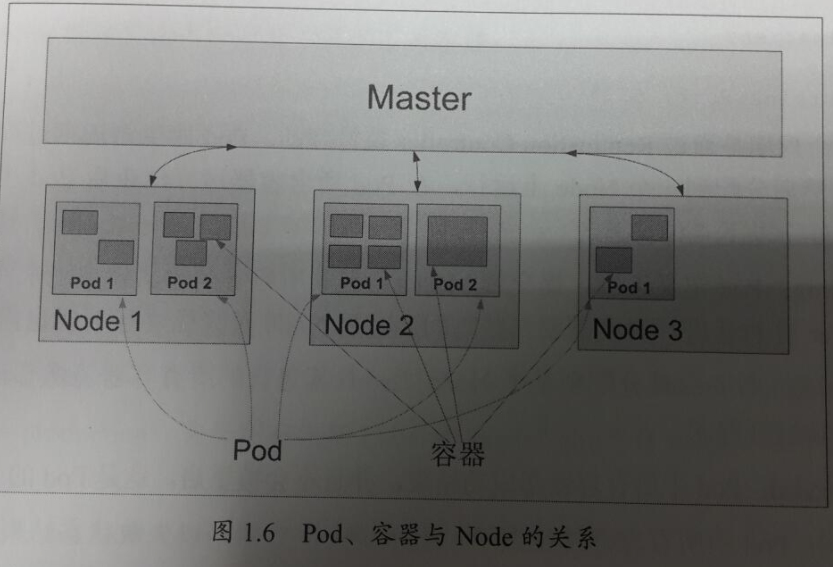

面试官你好，我叫张明柱，来自重庆万州。做过五年测试，今天来面试贵公司的软件测试工程师。

我大学的专业是机械设计及其自动化专业，大学侧重于自动化发展方向，大学期间学习过C语言和计算机基础。通过校招进入中船重工重庆海装风电，担任测试工程师。在海装期间测过硬件、客户端、web，期间学习了python,开始接触自动化测试。于20年6于来到成都晓多科技公司。

晓多科技是一家人工智能客服服务厂商，业务涉及客户端、web、C端小程序。在晓多主要承接一些客户端和web端的测试，参与前期框架的搭建，基于python 和pytest，allure。期间也从事过基于chrome调试协议，cef框架客户端的ui自动化脚本的编写，编写过一些工具脚本，如近期完成的一个去晓多化项目，要去掉所有前端页面，含有晓多的字符。我编写了一个通过re正则模块，采用多进程的方式扫描全部前端文件，找出前端页面中含有晓多字样的数据，交予研发修改。

我性格开朗，喜欢和人打交道，平时喜欢骑车，钓鱼，打球。这是我一个简单的自我介绍。您看我这边还需要做什么补充？


1)我会Linux系统操作和相关命令的使用，项目中搭建过测试环境。

2)用过My[SQL](http://java.tedu.cn/data/131405.html)数据库，使用SQL语句进行数据查询，有时候测试需要进行提交数据和查询数据的对比时，在数据库中查询数据。

3)我会[Python](http://sh.tedu.cn/python/)开发语言，可以用于Selenium的测试脚本编写。项目要求对一部分固定的功能进行自动化测试脚本的实现，使用unittest框架，脚本中插入断言和引入外部数据文件，导出过测试报告。

4)按照项目要求，对系统传输中的敏感数据进行检查和对比。会使用Postman进行接口的数据请求和查看服务器的响应结果，使用Fiddler进行数据抓包，分析敏感数据是否进行加密处理。

5)项目中配合开发和运维做系统的一些性能测试。使用JMeter/Loadrunner对系统的操作复杂和高并发业务进行性能测试的执行。

6)项目中，我全程参与了需求评审，测试计划的设定，编写测试用例，执行测试、提交Bug，我们都用禅道/JIRA进行用例和缺陷的管理和跟踪。

7)对于测试中要搭建的测试开发的框架Selenium、requests、APPium，环境自己搭建。最近做过的一个项目是XXXXX管理系统，在其中负责XXXX模块的测试工作，他的主要功能是XXXX，设计和编写了XXX条用例，发现了XXX个bug。我的自我介绍到此结束/就这么多，面试官，您看有什么需要我补充的，或者您想要知道更详细的的？


step1：连接数据库
step2：创建游标对象
step3：对数据库进行增删改查
step4：关闭游标
step5：关闭连接

```
conn = pymysql.connect(
    host='localhost',
    user='root',
    password='redhat',
    db='helloTest',
    charset='utf8',
    autocommit=True,    # 如果插入数据，， 是否自动提交? 和conn.commit()功能一致。
    
    
cur = conn.cursor()


```


```
# 查看所有的资源信息
kubectl get all

# 查看pod列表
kubectl get pod

# 显示pod节点的标签信息
kubectl get pod --show-labels

# 根据指定标签匹配到具体的pod
kubectl get pods -l app=example

# 查看node节点列表
kubectl get node 

# 显示node节点的标签信息
kubectl get node --show-labels

# 查看pod详细信息，也就是可以查看pod具体运行在哪个节点上（ip地址信息）
kubectl get pod -o wide

# 重启
kubectl rollout restart deploy {your_deployment_name}

# 修改deploy
kubectl -n namespace edit deploy xxx

# 进入容器
k -n namespace exec -it xxxx
```





迈思信息

易宝软件

成都迈思创智科技公司

