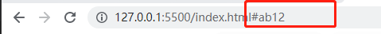

## 一、规则

* **标签嵌套 用缩进**
* **标签必须是<>中间加英文字母，如果是数字如<1>，<1>就会直接被解析出来**
* **块元素中可以放任何元素，P标签除外，p标签中不可以自由嵌套,p标签内只能嵌套内联元素，类似h1、div、ul块元素都不可自由嵌套在p标签内**
* **行内元素中不可以放块元素，a标签除外，但是a标签中不可以嵌套a标签**
* 同一个页面中，如果元素ID相同，那么生效的将会是第一个ID


块元素：独占一行的元素

- `<h1>`、`p`、

内联元素：不会独占一行

- `<em>强调</em>`、`<a>超链接</a>`

## 二、常用标签

#### 1.1 meta

- 用于爬虫程序搜索

​		`<meta name='keywords' content='HTML5,前端,CSSD'>`

- 用于网页重定向

	`<meta http-equiv='refresh' content="3;url=https://www.baidu.com">`

​		效果：打开网页三秒后跳转百度


#### 1.2 内联标签（行内标签）

复制下面一段到Typora里面就可以看到效果了

```html
<em></em>   
-----  今天天气<em>真</em>不错    这个“真”字会变斜,表示重读
```

```html
<strong></strong> 
----- 今天天气<strong>真</strong>不错    这个“真”字不会变斜，默认变黑,表示真正的强调，这个重要，重要的内容
```

```html
<q></q>			
毛主席说:<q>帝国主义都是纸老虎 ... </q>   ----  毛主席说:"帝国主义都是纸老虎 ..."
```

```html
<a></a>
超链接标签
```

```html

行内元素
```


#### 1.3 列表

- 有序标签

	```html
	有序列表 ol ---- oder list     li ----  list items
		<ol>
	        <li>土豆</li>
	        <li>西红柿</li>
		</ol>
	```

- 无序列表

	```html
	<ul>
	    <li>土豆</li>
	    <li>西红柿</li>
	</ul>
	```

- 自定义标签

	dl  ----  define list   dt -- difine items   dd --- difine description

	```html
	<dl>
	    <dt>定义项</dt>
	    <dd>土豆</dd>
	    <dd>西红柿</dd>
	</dl>
	```

**技巧**

- 快速写出多个一个列表

```html

ul > li * 5 生成如下
<ul>
    <li></li>
    <li></li>
    <li></li>
    <li></li>
    <li></li>
</ul>

li + li 生成如下
    <li></li>
    <li></li>
```

​		

#### 1.4 超链接

```HTML
<a href="指定跳转的地方"> content </a>    --- 行内标签，但不能签字自己（a标签嵌套a标签）
    
example
    
    <a href="https://www.baidu.com">超链接</a>
    
属性href --- 指定跳转的目标路径
    
    - 值可以是一个外部网站地址
    	- <a href="https://www.baidu.com">超链接</a>
    - 也可以是一个内部页面地址
    	- <a href="./demo3.html">超链接</a>
    - # 针对滚动条，我们可以跳转回到顶部
    	- <a href='#'>跳转顶部</a>
    - “#”+“id”  指定跳转到一个位置
    	- <a href="#id">指定跳转ID</a>

属性target
    他是一个可选参数(2个)，我们无法自定义
    _self :默认值，跳转链接在当天页面打开
    _blank:在新的空白页面打开
	<a href="https://www.baidu.com" target="_blank">跳转百度</a>


场景：如果我们写一个超链接，但是这个超链接我们还不知道跳转哪里，可以用下面这种形式进行占位
    - javascript:;  占位符
    - <a href='javascript:;'>占位符</a>
	其实就是执行javascript脚本。
	- <a href='javascript:alert('哈哈');'>测试一下</a>
```

给元素指定好ID属性

超链接作用

- 跳转页面
- 跳转到页面其他位置（锚点）



## 三、语义化标签

```
<header></header>  	表示网页的头部

<main></main>		表示网页的主题部分（一个网页只有一个main）

<footer></footer>	表示网页的底部

<nav></nav>			导航   ---- navigate

<aside></aside>		和主体相关的其他内容（侧边栏）

<article></article>	表示一个独立的文章

<section></section>	表示一个独立的区块，上边的标签都不能表示的时候使用section  ---中文:部分，章节

<div></div>			没有语义，就是用来表示一个区块，目前来讲div还是我们的主要布局元素

<span></span>		行内元素，没有语义，一般用于在网页中选中文字
```


## 四、列表

```html
<!--三种标签-->
列表之间可以互相嵌套
1.有序列表 ol ---- oder list     li ----  list items
	<ol>
        <li>土豆</li>
        <li>西红柿</li>
	</ol>

2.无序列表
	<ul>
        <li>土豆</li>
        <li>西红柿</li>
	</ul>

3.自定义列表 dl  ----  define list   dt -- difine items   dd --- difine description
相当于一个下拉菜单
    <dl>
        <dt>定义项</dt>
        <dd>土豆</dd>
        <dd>西红柿</dd>
    </dl>


4. VScode写法
	ul > li * 5 生成如下
	<ul>
        <li></li>
        <li></li>
        <li></li>
        <li></li>
        <li></li>
    </ul>

	li + li 生成如下
		<li></li>
        <li></li>
	
```


## 五、超链接

```html
<a href="指定跳转的地方"> content </a>    --- 多个<a>标签不会换行，不会独占一行，他也是一个行内标签，有点特殊<a>标签中可以嵌套任何元素，除他自身外（对照前面的inline element不可以嵌套block element一样）， 它也是一个行内标签
    
example
    
    <a href="https://www.baidu.com">超链接</a>
    
属性href --- 指定跳转的目标路径
    
    - 值可以是一个外部网站地址
    	- <a href="https://www.baidu.com">超链接</a>
    - 也可以是一个内部页面地址
    	- <a href="./demo3.html">超链接</a>
    - # 针对滚动条，我们可以跳转回到顶部
    	- <a href='#'>跳转顶部</a>
    - javascript:;  占位符
    	- <a href='javascript:;'>占位符</a>
    - “#”+“id”  指定跳转到一个位置
    	- <a href="#id">指定跳转ID</a>
属性target
    他是一个可选参数(2个)，我们无法自定义
    _self :默认值，挑战连接在当天页面打开
    _blank:在新的空白页面打开
	
```

## 六、图片引入

```html

属性src
	- 引入内部图片
		- 写入内部图片的相对位置

	- 引入外部图片
		- 将外部图片链接赋值给src

	- 通过base64字符引入图片,这样图片就可以在网页加载的时候直接加载进来,这个字符就是一个图片，没有它的原始路径，就存在与网页中
	
	使用python实现图片转换base64字符
	import base64
	f = open("C://Users//msi//Desktop//img.gif","rb")
	content = f.read()
	b64 = base64.b64encode(content)
	b64 = b64.decode("utf8")
	result = "data:img/git;base64,{0}".format(b64)

```


## 七、音频标签

```html
<audio src="资源路径" controls loop muted autoplay preload="auto、metadata、none"></audio>

src 		资源路径
controls	控制组件（控制UI）
muted		规定视频输出应该被静音。
loop		循环播放
autoplay	如果出现该属性，则音频在就绪后马上播放。
preload		如果出现该属性，则音频在页面加载时进行加载，并预备播放。如果使用 "autoplay"，则忽略该属性。


开发中为了照顾compatibility 引入<source>src="" type</source>标签

<audio controls>
    Your browser does not support the audio element.
   <source src="horse.ogg" type="audio/ogg">
   <source src="horse.mp3" type="audio/mpeg">
 Your browser does not support the audio element.
</audio> 

执行过程分解
	1.首先浏览器如果不能识别audio标签，那么audio里面的内容都不会再去解析了
	2.当audio可以解析的时候，开始解析source标签，如果第一个就能解析播放，后面的source不会再解析
	3. Your browser does not support the audio element.当source无法被解析的时候显示出来


完美兼容例子
	<audio controls autoplay loop>
        <source src="./沙宝亮 - 完美世界.mp3" type="audio/mp3">
        <source src="./沙宝亮 - 完美世界.mp3" type="audio/mp3">
        <embed src="./沙宝亮 - 完美世界.mp3" type="audio/mp3">
        Your browser does not support the audio element.
    </audio>
```


```html
<table>
    <thead>
        <th>IP</th>
      	<th>iBMC</th>
        <th>username</th>
        <th>password</th>
    </thead>
    <tbody>
        
    </tbody>
    <tfoot>
    </tfoot>
</table>
```

 


<style>
    .box1{
        width: 200px;
        heigth: 100px;
        background-color:#bfa;
        box-shadow: 10px 10px orange;
        borader:2px
    }
</style>


<div class='box1'>1111111111111</div>

