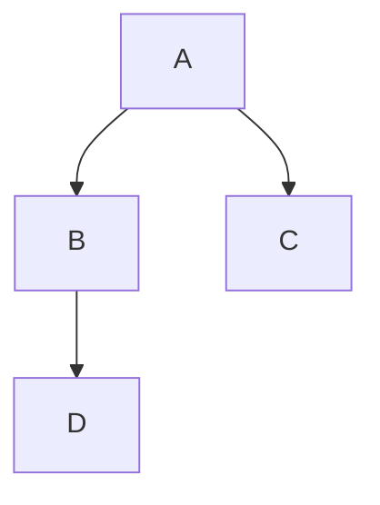

## 一、可靠性/可用性的定义

可靠性：

产品在规定的条件下和规定的时间内完成规定功能的能力。它的概率度量称为可靠度

​	详细解释：对产品，是指产品在规定的时间内，规定的条件下，完成规定的功能的能力。如果一个产品不能按时完成，那就是不可靠的；

可用性：

产品在任意随机时刻需要和开始执行任务时，处于可工作或可使用状态的程度。它的概率度量称为可用度

**总结：一个东西可能可用，但是不一定可靠。比如我要这个产品在2秒内算出100*100，但是它3秒才算出来。只能说这个功能可用，但是不可靠**

可靠性领域有Fault、Error、Failure几个概念，业界对这些术语未完全统一，下面采用欧盟ENISA一个韧性网络研究项目对着几个术语的定义

Fault ----> Error ----> Failure

Fault故障：导致系统产生错误的瑕疵，比如：开发人员未遵循编码规划，在某处申请内存但未对应释放的动作

Error错误：目标值/状态和观测值/状态之间的偏差，可能引起业务失效；比如某运行条件达到触发了上述开发人员的Fault，在系统内形成error导致了真实的内存未进行释放

Failure失效：系统功能未满足需求或期望之间存在偏差；比如上述内存泄漏持续积累，最后导致内存不足并严重到影响业务运行，造成业务失效Failure

graph TD;
    A-->B;
    A-->C;
    B-->D;

