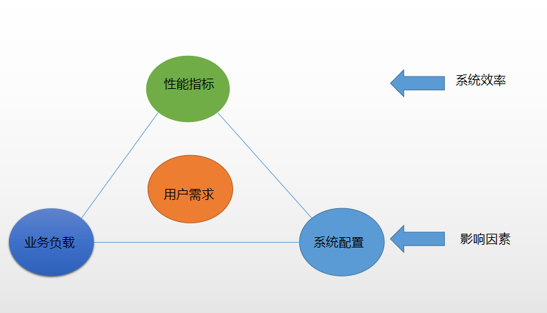
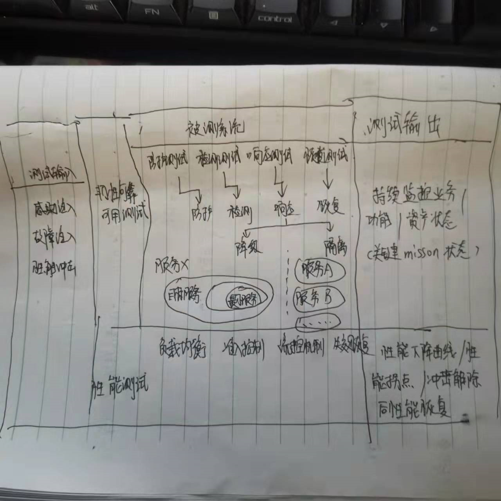

## 软件性能的定义 --- 业界

**定义一**

在特定负载和配置环境下程序的响应时间和吞吐量

**定义二**

性能首先是一种指标， 表明软件性能或构件对于其及时性要求的符合程度，及时性用响应时间和吞吐量来衡量

**本文的定义**

系统或者部件在特定的业务负载和系统配置下正确实现某种功能的一种能力，此能力一般通过时间或者空间效率指标来体现，目标是为了满足用户对于业务的要求

## 软件性能的关键概念

**软件性能的分析原则：**软件性能需要综合考虑软件和硬件，只要是在性能路径上的任何组件（包括软件和硬件）都可能成为性能瓶颈进而影响软件性能，软件性能和业务负载和配置是制约关系，脱离了业务负载和系统配置的单纯性能指标是没有意义的

**业务负载：**指系统在满足某种性能指标条件下能够承受的与之相关的业务量。

**系统配置：**分为软件配置和硬件配置

​					1、硬件配置指软件运行所需要的硬件环境的配置，如cpu、内存等

​					2、软件配置指对性能指标有影响的动态参数设置，和hello报文的交互间隔

**性能指标：**为了满足用户的业务要求而分解出来的软件系统或者部件得可度量得明确指标，如响应时间、吞吐量

## 软件性能测试的定义

**定义：**软件性能测试就是验证系统或者部件在特定的业务负载和系统配置下正确实现某种功能的性能指标是否满足用户对业务的要求

**性能测试的关键活动：**

1、性能需求分析： 分析用户的应用场景，明确业务负载和系统配置，基于被测对象的分层建模，分解出合理的性能需求和相关的性能指标

2、性能测试设计：针对不同的测试需求，适配合适的测试类型/测试方法，设计测试场景和用例、

​	1）设计测试场景、业务负载和系统配置，规划业务负载的模拟工具

​	2）设计性能指标及其他系统表现的预期结果

​	3）设计性能指标的验证计算方法

3、性能测试执行：基于用例使用相应的工具或者脚本完成测试

4、性能测试评估：性能测试数据往往是海量的且存在不确定性，通常会借助数学方法进行分析。

## 性能测试与韧性/可靠/可用测试关系

性能冲击是性能测试的主要手段，也是韧性测试的手段之一，恢复能力也是性能压力测试的考察维度

防护测试：是否防护住，拦截在系统之外。

检测测试：是否在要求时间内检测到工具

响应测试：是否保持在最小服务水平之上，时间满足要求。

恢复测试：攻击解除以后，是否能恢复到原有水平，时间满足要求

## 性能测试需求分析 -- 性能测试的应用领域

①系统马上要上线，客户要求我们必须提供符合当初提出的性能要求的测试报告才可以同意上线，应该如何测试？

②新版本马上就要发布到某大T网络，版本经理要求测试部给出评估，新版本升级后相对老版本，是否有恶化的指标？

③明年，这个系统的用户数会大量增加，系统容量能否满足明年的要求，如果要扩容，该增加哪些配置呢？

④当前的系统性能离设计的目标还差10%，是什么原因导致的？

⑤在实验室测试中，系统一直表现很好，但是上来实际的商用网络，运行一段时间后，出现性能恶化，这类问题该如何拦截？

性能测试人员或多或少都会遇见以上问题。可以将性能测试的应用领域分为5个类型

1. 能力验证：回到“在给定的条件下，系统能否具有预期的能力表现”，比如上面的第一个问题
2. 能力规划：回答“如何使系统达到要求的性能？如何配置扩容以满足用户数的增长需要”，比如上面第三个问题
3. 性能调优：使指有规划，有目标，有方法支撑的对系统性能进行系统性调优的活动，比如上面的第四个问题
4. 缺陷发现：通过性能测试手段，（负载/压力测试，稳定性测试等）发现系统中存在的缺陷，比如上面的第五个问题
5. 基准测试：在不设定性能目标的情况下，来评估相对于已有基准会有哪些性能变化，比如上面的第二个问题