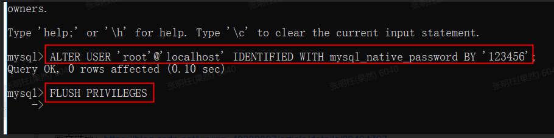

# 一、前端

1. 代码地址：https://gitlab.xiaoduoai.com/tester-group/universe-web
2. 代码涉及：vue + element ui + D2 admin
3. Element ui 官网组件地址：[组件 | Element](https://element.eleme.cn/#/zh-CN/component/button)
4. D2 admin官网地址：[D2 Open Source](https://d2.pub/)
5. [快速上手 | D2 Open Source](https://d2.pub/zh/doc/d2-admin/learn/start.html#安装环境) 

# 二、后端

1. 代码地址：https://gitlab.xiaoduoai.com/tester-group/universe-api  部署在线上服务器 
2. 代码地址：https://gitlab.xiaoduoai.com/tester-group/tester-service-api  部署在本地服务器，因为考虑拉取代码时的安全问题，使用内网访问 
3. 代码涉及：python + django rest framework
4. Django rest framework官网地址：https://www.django-rest-framework.org/

# 三、**本地调试运行**

## 3.1 本地运行

前端：npm start

后端：python manage.py runserver 8000

## 3.2 本地环境部署

#### **后端** 

1.virtualenv --no-site-packages test_platform 

2.进入 test_platform\Scripts目录后，activate 

3.pip install -r requirements.txt -i https://pypi.tuna.tsinghua.edu.cn/simple

4.本地安装redis 

https://www.cnblogs.com/skmobi/p/11696620.html

下载redis 本地解压后执行 redis-server.exe redis.windows.conf 

网盘下载：

链接：https://pan.baidu.com/s/1ZRzMaS5eqCPaotX5DljY3w&shfl=sharepset 

提取码：spf0 

5.安装mysql

https://blog.csdn.net/chic_data/article/details/72286329

安装时选择mysql server 和mysql workbench (navicat替代品，无需破解，免费版的)

踩坑-1：如果workbench 安装后，链接不上mysql server

在cmd黑窗口中启动MySql服务器后输入：

ALTER USER 'root'@'localhost' IDENTIFIED WITH mysql_native_password BY 'your password';

FLUSH PRIVILEGES;

mysql_native_password是旧的密码验证机制

原文链接：https://blog.csdn.net/weixin_40238807/article/details/80464767



踩坑-2.如果新建虚拟环境后，vscode编辑器查找不到最新的虚拟环境，在vscode打开虚拟环境所在的上层目录，此时会自动刷新一次缓存。

踩坑-3 运行后端服务后，报连不到mysql 

原因是本地端口号默认的是3306，后端代码配置的是3308，解决方法是修改代码或修改本地默认端口号


踩坑-3 无法显示图片验证码

方法  在后端注释掉验证码校验

universe-api\users\views.py


数据来源(二选一，从备份数据导入本地，或本地自己添加数据)：

1.从mysql 备份数据库登录

在服务器中将备份数据拷贝到/tmp文件夹下，之后通过https://jumpserver.xiaoduoai.com/users/login/  或在本文档中[copy.sql](https://xiaoduoai.feishu.cn/file/boxcnOM08QMm1gL1phOqsddnqVf)  [tester-service-api.sql](https://xiaoduoai.feishu.cn/file/boxcnUJWkmYRzJOrB4JzFVXQvbb) 下载

进入mysql 安装目录，执行  

mysql -uroot -p123456 --default-character-set=utf8 universe < copy.sql

mysql -uroot -p123456 --default-character-set=utf8 tester-service-api < tester-service-api.sql

> 注：注意和备份命令的区别 一个是< 一个是>

> mysqldump -uroot -p123456 tester-service-api >20210418.jql

> docker cp d8c8df2ed9de:20210418.jql /data

比如：

注：如需登录线上查看线上数据库

docker ps

docker exec -it 容器id bash

mysql -uroot -p123456 

show databases;exit

use 数据库名称;

show tabls;

2.手动创建两个数据库 universe tester-service-api

在本地后端代码中执行：

python manage.py makemigrations

python manage.py migrate

python manage.py createsuperuser  # 创建超级用户 例如admin  admin@xiaoduotech.com 123456 

如果迁移失败，删除migrations 文件夹下删除文件内容，重新迁移


**前端**


查看是否已安装了 node 和npm


安装cnpm :npm install -g cnpm --registry=https://registry.npm.taobao.org

安装相关依赖：cnpm install

进入项目目录下，启动项目：npm start


在本地运行前端时，universe-web 需要注释掉views 目录下的文件（注意不要推到到线上）


tester-service-api （代码覆盖率，接口自动化）调试时，需要在前端注释掉src\api\interface\interface 目录下的路径下第一段的代码，不然前端默认连接的是线上；如果只是调试tester-service-api的前端，则不需要在本地启动后端。


#### 添加新的功能模块

后端

1.python manage.py startapp debug1  （后端生成新的APP）

2.仿照其他APP 新建一个urls.py

例如

 from django.conf.urls import url


from . import views


urlpatterns = [

​    \# url(r'^/debug', views.my_view),

​    url(r'^api/v1/test/test$', views.TestView.as_view()),

  

]

3.在views中添加对应功能模块

例如

from django.shortcuts import render

from django_base_rbac.custom_response import JsonResponse as qsJsonResponse

from rest_framework import mixins, status, viewsets

from rest_framework.views import APIView


\# Create your views here.

def my_view(request):

​    \# View code here...

​    return render(request, 'myapp/index.html', {

​        'foo': 'bar',

​    }, content_type='application/xhtml+xml')


class TestView(APIView):

​    def get(self, request):

​        return qsJsonResponse(data={"test": "111111111"},

​                              code=200,

​                              msg="success",

​                              status=status.HTTP_200_OK)


4.在django_base_rbac （对应tester-service-api项目是这个目录tester-service-api）目录下的settings、 urls中进行配置


访问页面 api/v1/test/test  http://127.0.0.1:8000/api/v1/test/test

前端

1.在views中添加一个新的文件夹，添加一个index.vue ，里面输入些内容，例如

<template>

  <h1 id="app">

​    "i  am  test"

  </h1>

</template>

2.在管理平台https://tester.xiaoduoai.com/api/admin (域名换成本地启动的后端域名 例如 127.0.0.1:8000)，使用超级管理员账号登录，仿照线上，在路由配置中添加新菜单的路由


#### 部署方式

服务器：172.16.123.254 （需要申请这台服务器的权限）


本地服务器

ip地址：10.0.1.164

账号：root

密码：passwd

##### 手动部署:

前端部署方式：

打包后上传到对应服务器路径，解压后即可，详情见nginx配置文件

```
nginx配置


server { 
    listen       80; 
    server_name tester.xiaoduoai.com; 
    charset utf-8; 
    set $ngx_metric_uri_truncation_len 5; 
 
    access_log  /var/log/nginx/test-tools-web.log  main; 
 
    root /home/xiaoduo-tester/tester.xiaoduoai.com/dist/; 
    index index.html index.htm; 
     
    location /  { 
         if ($request_method = OPTIONS ) { 
               add_header Access-Control-Allow-Origin https://tester.xiaoduoai.com; 
               add_header Access-Control-Allow-Headers Origin,X-Requested-With,Content-Type,Accept; 
               return 200; 
         } 
    } 
         
    location /api/ { 
 
        proxy_pass http://127.0.0.1:8990/api/; 
        client_max_body_size 200m; 
        proxy_http_version 1.1; 
        proxy_set_header Connection ""; 
        proxy_set_header Host $host; 
        proxy_set_header X-Forwarded-For $remote_addr; 
        proxy_set_header X-Real-IP $remote_addr; 
        proxy_set_header X-Scheme $scheme; 
    } 
 
} 
```

根目录路径自动访问/home/xiaoduo-tester/tester.xiaoduoai.com/dist/路径下静态文件

带/api/的访问将会自动转发到本地访问 http://127.0.0.1:8990/api/（后端部署端口）

后端部署方式：

docker部署：详情见打包脚本。

pack.sh: https://gitlab.xiaoduoai.com/tester-group/universe-api/blob/master/pack.sh

docker_run.sh:

```
tags=$1 
tags2=$2 
 
docker rmi -f registry.cn-zhangjiakou.aliyuncs.com/xiaoduoai/tester-group-universe-api:$tags2 
docker rmi -f tester-group-universe-api:$tags2 
docker container rm -f universe-api 
 
docker run -d --restart=always\ 
    --net=host\ 
    --name universe-api\ 
    -v /data/image:/root/media \ 
    registry.cn-zhangjiakou.aliyuncs.com/xiaoduoai/tester-group-universe-api:$tags 
```

例如：手动部署tester-service-api

进入164服务器，/opt/xiaoduo-tester/tester-service-api

1.sh pack.sh v4.9

2.sh docker_run.sh v4.9 v4.8

数据库部署：

存放路径：/home/xiaoduo-tester/mysql_run.sh


数据库备份脚本：

存放路径：/home/xiaoduo-tester/back_mysql.sh

备份方式：每天自动运行这个备份脚本

```
# /bin/bash 
. /etc/profile 
. ~/.bash_profile 
 
DB_NAME="universe" 
DB_USER="root" 
DB_PASS="123456" 
BIN_DIR="/usr/bin" 
BACK_DIR="/data/backdata" 
DATE="mysql-`date +'%Y%m%d-%H:%M:%S'`" 
LogFile="$BACK_DIR"/dbbakup.log #日志记录保存的目录 
BackNewFile=$DATE.sql 
 
$BIN_DIR/docker exec $(docker ps -aqf "name=mysql") mysqldump --opt --force -u$DB_USER  -p$DB_PASS $DB_NAME > $BACK_DIR/$DATE.sql 
 
 
echo -----------------------"$(date +"%y-%m-%d %H:%M:%S")"----------------------- >> $LogFile 
 
 
 
echo  createFile:"$BackNewFile" >> $LogFile 
 
 
#find "/data/backdata/" -cmin +1 -type f -name "*.sql" -print > deleted.txt 
#-ctime表示创建时间，这里表示删除创建时间为多少天之前的文件，也就是结果只保留多少天的数据 
find "/data/backdata/" -ctime +7 -type f -name "*.sql" -print > deleted.txt 
 
echo -e "delete files:\n" >> $LogFile 
 
#循环删除匹配到的文件 
cat deleted.txt | while read LINE 
do 
    rm -rf $LINE 
    echo $LINE>> $LogFile 
done 
 
 
echo "---------------------------------------------------------------" >> $LogFile
```

数据库连接方式：navicat（通过ssh的方式连接）

这里要配置id_rsa.pub


```
python


DATABASES = {
    'default': {
        'ENGINE': 'django.db.backends.mysql',
        'NAME': 'universe',
        'USER': 'root',
        'PASSWORD': '123456',
        'HOST': '127.0.0.1',
        'PORT': '3308',
    }
}
```


redis部署脚本：

存放路径：/ho me/xiaoduo-tester/redis_run.sh


##### 自动部署：

1. jenkins地址：http://10.0.0.152:8080/view/tester.xiaoduoai.com---CICD/
2. 前端部署job：http://10.0.0.152:8080/view/tester.xiaoduoai.com---CICD/job/universe-web-cicd/
	1. 本地更新代码到master，运行这个job后会自动拉去最新的代码，在10.0.1.164这台服务器上完成打包操作（线上服务器没有拉代码权限和基于安全考虑），然后将打包后的内容压缩后上传到目标服务器，然后自动运行另外一个job解压，刷新页面完成发布
3. 后端部署job：http://10.0.0.152:8080/view/tester.xiaoduoai.com---CICD/job/universe-api-cicd/build?delay=0sec
	1. 参数介绍
		1. new_tag：本地打包后新的tag名称
		2. old_tag：服务器上正在运行的tag
	2. 本地打包发布master后，打上tag上传，然后运行jenkins job，填写正确的tag即可。其中包含操作，切换到对应tag，完成docker镜像编译，上传镜像，目标服务器拉取镜像，替换tag等。