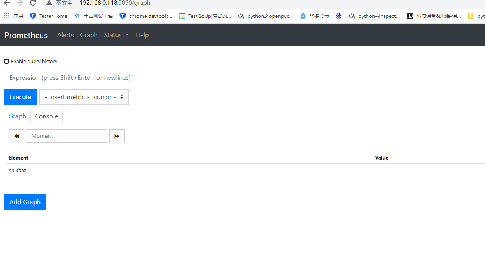
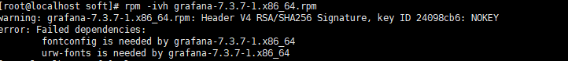
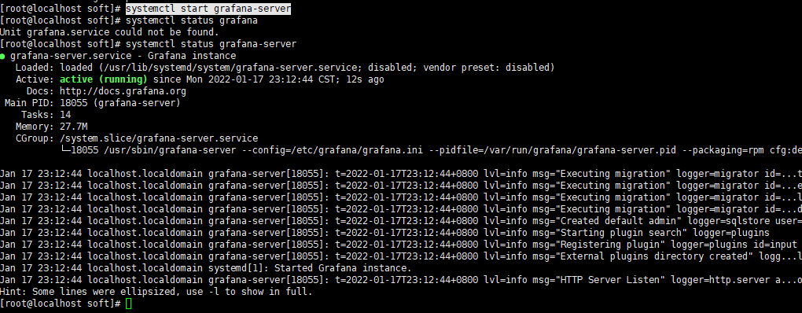
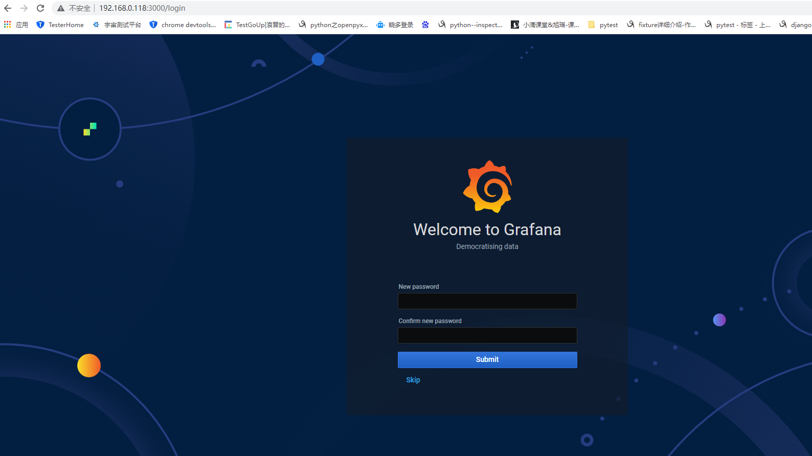
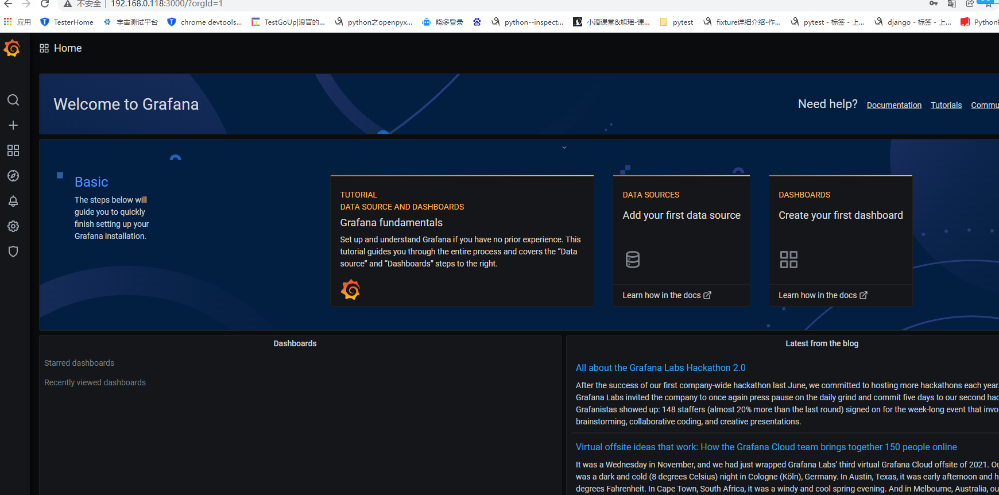
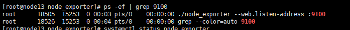
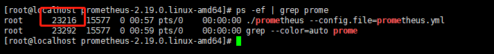
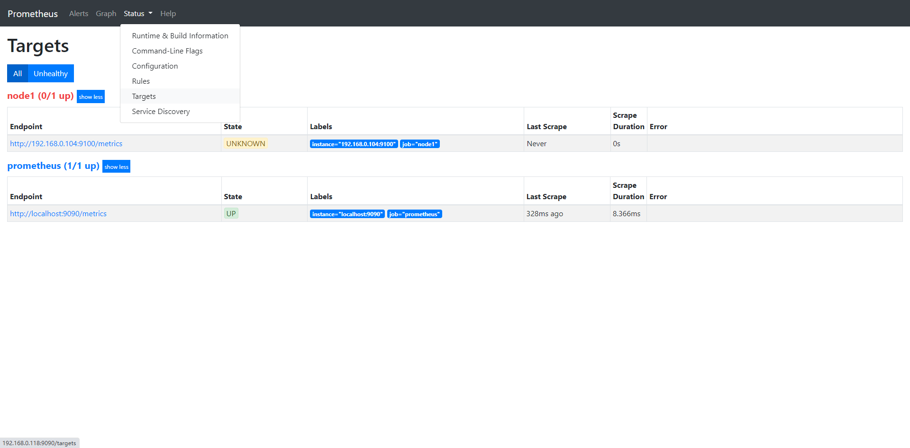
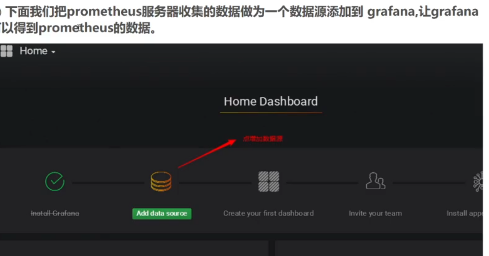

**地址**

```
https://prometheus.io/download/
```

https://www.yuque.com/markus/hon7gx/nedufb

```
https://www.cnblogs.com/bigberg/p/10118137.html
https://www.cnblogs.com/bigberg/p/10118137.html
```


# 一、从零开始搭建prometheus + grafana

## 1.Prometheus介绍

Prometheus是由SoundCloud开发的开源监控报警系统和时序列数据库(TSDB)。Prometheus使用Go语言开发，是Google BorgMon监控系统的开源版本。


## 2.Prometheus+Grafana下载

可以从官网下载

Prometheus 下载地址：https://prometheus.io/download/

Grafana 下载地址：https://grafana.com/grafana/download

node_exporter 下载地址：https://prometheus.io/download/#node_exporter

如果大家从官网下载比较慢，可以使用已下载的资源，地址如下：

链接: https://pan.baidu.com/s/175AybVgriy63MHurq9u5WA 提取码: k3hv 

文件清单：

1.prometheus-2.24.0.linux-amd64.tar.gz

2.grafana-7.3.7-1.x86_64.rpm

3.node_exporter-1.0.1.linux-amd64.tar.gz  // 模拟监控的节点。数据采样就靠他了


## 3、安装Prometheus

把资源下载到~/soft/目录

创建目录

```bash
mkdir ~/usr

mkdir ~/soft
```


### 3.1 安装Prometheus

```bash
cd ~/soft

tar zxvf prometheus-2.24.0.linux-amd64.tar.gz -C ~/usr/

cd ~/usr/prometheus
```

启动

```bash
./prometheus --config.file=prometheus.yml &
```

默认端口是9090，在浏览器中输入你的IP:9090，如果不出意外，你会看到类似下图的页面。



### 3.2 安装Grafana

上传我们的grafana-7.3.7-1.x86_64.rpm到soft目录下


```bash
cd ~/soft
```

```bash
rpm -ivh grafana-7.3.7-1.x86_64.rpm
```

如果执行的时候报如下错误



执行

```bash
rpm -ivh grafana-7.3.7-1.x86_64.rpm --force --nodeps
```

启动

```bash
systemctl start grafana-server
```

使用下面命令检查是否启动成功

```
systemctl status grafana-server
```

如果不出意外，你会看到类似下图的输出。



浏览器输入IP:3000



初始账号密码

admin/admin




### 3.3 测试机安装node_exporter

```bash
cd /root/
mkdir soft usr
```

将我们的node_exporter软件包上传到我们的测试机上的soft目录下

```bash
cd /root/soft
tar -zxvf node_exporter-1.0.1.linux-amd64.tar.gz -C ~/usr/
cd /root/usr
mv mv node_exporter-1.0.1.linux-amd64 node_exporter
cd node_exporter
```

启动

```
nohup ./node_exporter --web.listen-address=:9100 &
```




将node_exporter 服务加入到Prometheus的监控列表

cd ~/usr/prometheus

在prometheus.yml 添加如下内容

\- job_name: 'node'

   static_configs:

   \- targets: ['192.168.0.104:9100']

将IP地址换成你的node_exporter 节点的实际地址即可。


注意：关掉node和grafana的防火墙，要不然就自己配置防火墙策略

关闭已启动的prometheus

```bash
ps -ef | grep prometheus
```



```bash
kill -9 23216
```

启动prometheus

```
./prometheus --config.file=prometheus.yml &
```

登录192.168.0.118:9100, 在Status > Targets中我们将看到我们添加的节点






```
https://blog.csdn.net/heian_99/article/details/103956931
https://blog.csdn.net/weixin_39559486/article/details/111248453
https://www.jianshu.com/p/8d2c020313f0
```

