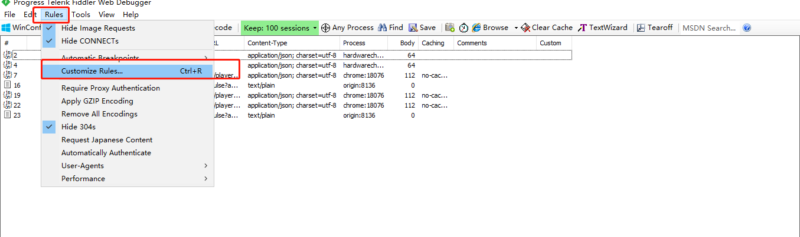
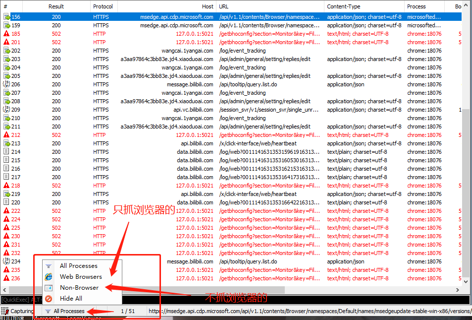

## 设置

zmz@zmz163.com

123456

#### 开关

```
file -- Capture Traffic  ✔选上以后才可以抓包（capture traffic :捕获流量）
```


#### 证书

```
1.fiddler默认是这可以转https请求的，所以我们要安装证书
2. Tools -- Options -- https(里面的全部打勾) -- Acations -- yes
	capture HTTPS connects:捕获HTTPS链接
	Decrypt HTTPS traffic:解密HTTPs
	Ignore server certificate err（unsafe）：忽略服务器证书错误（不安全）
	check for certificate revocation:
	
```


#### 简单过滤

```
Rules -- 	Hide Image request（隐藏图片请求）
			Hide CONNECTS（隐藏链接）
```


#### 快捷操作

```
1.在请求和响应中，点击‘Raw’ -- ‘View in notepad’ 在记事本中显示
```


# 二、常用的操作（菜单栏）


### 1. 充当系统代理

只有fiddler充当系统代理以后，才可以转发客户端和服务器之间的资源，才可以抓取我们想要的数据，根据上面的原理图可以更好的理解


当我们不勾选 自动做系统代理的时候，我们需要自己去配置，比如火狐浏览器，就需要我们自己去配置系统代理

fiddler会自动给我们的电脑系统设置一个代理127.0.0.1端口8888，并且记忆浏览器的代理设置，所有的请求先走fiddler代理，再走浏览器代理。


关闭fiddler以后，这个勾选会被取消，变成如下样式


如果手机要使用fiddler进行抓包的话，我们要勾选上”allow remote computers to connect“

🔺为什么呢？

🔺因为：fiddler是要作为代理的，所有我们手机的数据必须通过fiddler中间人的方式进行获取，fiddler才可以抓到我们需要的包。当我们在本地回环（127.0.01或者localhost）的时候，不需要勾选，当我们手机连接的时候，就需要了，因为手机走的是局域网循环了。


### 2. Rules


### 3. 导出和导入我们的请求

#### 3.1 **导出saz文件**


**第一种：**


**第二种：**


#### 3.2 导出其他格式 比如常用的bat格式


#### 3.3 导入saz格式


#### 3.4 导入一个文件夹

将会把这个文件中的所有saz和bat的请求都导入fiddler，相当于重新请求一次


**备注：导出的文件，在重新导入，他不回去请求。。只是将前面的请求信息和响应信息原封不懂得录入fiddler中，以便观察**


### 4. Replay 重放功能


1. 选中我们的请求，点击replay，就可以重新请求一次。这是实打实的发到服务器的
2. 选中我们要重放的强求，按快捷键R，执行一次重放

2. shift + 左键 点击 replay 可以选择重放多次


### 5. 请求添加注释


### 6. 断点（全局断点）


**解释：当我们设置成了第一个红色图标，那么所有的请求，将会走到fiddler里面（因为fiddler是系统代理，所有的请求都要经过fiddler出去和回来）然后停止，此时，我们点击GO，通过fiddler将请求发送给我服务器， 当我们设置成第二个图标的时候，服务器返回的内容将会再fiddler这里停止，当我们点击GO的时候，才会返给我们的客户端，一般执行断电的时候，我们会停止fiddler的捕获（按F12），结合replay来进行调试**

**备注：当我们使用第一个图标断点的时候，我们可能会发现我们的浏览器一直加载，这是因为，我们请求了，但是被fiddler断点截获了，浏览器一直等待响应**


### 7. 解码


**错误纠正：上面的解码是真正意义上面的解码。因为fiddler作为代理，他是拿到了对称加密的密钥的，可以进行对称加解密**

### 8. 设置抓取请求的条数


### 9. 选择抓取指定进程请求


### 10 . 查询


、


### 11. TextWizard编码解码工具

可以针对一些数据，进行常用的编码和解码操作，最常用的就是url编码了


# 三、会话列表

下面就是会话列表了


### 1. 自定义列

有时候我们需要显示一些重要的信息我们可以自定义列显示

**操作：**

**第一步：打开设置面板**


**第二步：进行设置**


### 2. 添加请求方法列

**第一步：右键会话栏的标题栏，选择Customize colums**


**第二步：Collection选择 Miscellaneous**

Miscellaneous翻译过来就是：多种多样的意思


**第三步:选择RequestMethod**


### 3. 高级玩法，添加列（IP）

比如：添加响应服务器IP

**第一步：Rules >  Customize Rules  或者 侧边栏中点击FiddlerScript** 




**第二步：Ctrl+F查找“static function Main()”字符串，然后添加以下代码**

C# 写的

```c#
FiddlerObject.UI.lvSessions.AddBoundColumn("ServerIP", 120, "X-HostIP");
```


**第三步：重启fiddler然后查看**

```c#
FiddlerObject.UI.lvSessions.AddBoundColumn("ServerIP", 120, "X-HostIP"); 

// 修改'ServerIP' 参数可以，设置显示的名称
```


# 四、命名行和状态栏


## 4.1 命令行（超级有用）

官方地址：https://docs.telerik.com/fiddler/knowledge-base/quickexec ， 内容不多

其他的翻译：https://www.cnblogs.com/nihaorz/p/5455148.html

### 1. `> <`

>高亮一定size的响应体的请求
>
>```SQL
>-- 语法
>> size		# 高亮大于size的请求
>< size		# 高亮小于size的请求
>```

单位：bites     一个字节 8 个位，一个ASCII英文字符占一个字节

**例子：高亮小于59字节响应体的请求**


### 2. `?`

>Fiddler 将所有会话中存在该字符串匹配的全部高亮显示（下图输入的是 ?google.com）
>
>```SQL
>-- 语法
>?sometext
>```
>
>温馨提示：匹配的字符串是 Protocol、Host 和 URL 中的任何子字符串。URL = host + 地址


```sql
? https://cdn.pdd.myjjing.com/fe/xd-mp-mini4/favicon.png

? mp-mini4/favicon.png

-- 备注：就是进行包含正则匹配，就是一个包含关系的简单正则
```


### 3. `=`

等于号（=）后边可以接 HTTP 状态码或 HTTP 方法，比如 =200 表示高亮所有正常响应的会话。

下图输入了 =POST，表示希望高亮所有 POST 方法的会话：


### 4. `@`

@ 后边跟的是 Host，比如我想高亮所有鱼C论坛的连接，我可以 @bbs.fishc.com


### 5. `select`

select 后边跟响应的类型（Content-Type），表示选中所有匹配的会话。

比如希望 Fiddler 选中所有的图片，可以使用 select image；

而 select css 则选中所有的 css 文件；

而select json 则选中所有的返回json的请求

当然，select html 就是选中所有的 html 文件啦~


### 6. `keeponly`

keeponly 后边跟响应的类型（Content-Type）

keeponly 会将所有无关的会话删除

比如我只想看图片，那么我可以 keeponly image，表示将所有与图片无关的会话删除


### 7. bpu 前断点（这是局部断点）

我们一般的使用方式是后跟执行的url达到相对精准点的断点

点击GO 释放，或者在命令行中输入g或者go，但新的匹配内容还是会被断下来，输入命令但不带参数表示取消之前设置的断点。


## 4.2 抓取指定软件的包




# 五、自动响应器（`AutoResponder`）


### 1. **本地代理操作步骤：**

**第一步：将我们要操作的请求拖动到AutoResponder的 if request matchers 里面**


**第二步：代理本地前端资源**


找到对应的请求，我们可以响应对应的js，css，html。感觉没有charles好用啊。charles是直接分层的，看着舒服，而且好查找数据

### 2. 修改响应内容

**第一步：将我们要操作的请求拖动到AutoResponder的 if request matchers 里面**

还是先拖到我们的if request matchers界面里


**第二步：右键点击我们拖进来的请求，选择Edit Response**


**第三步：修改配置就行**


复制粘贴就可以了，注意讲上面的Header也给粘贴下来


# 六、过滤器


### 1. 界面介绍


#### 1.1 filter host


直接从会话列表复制过来，如下（必须要完整的host不然是抓不到的）


#### 1.2 filter client process


#### 1.3 Request Headers


URL = HOST + URI ， fiddler的URL 不能包含HTTPS或者HTTP等这些一些头

只要URL 中包含了 我们指定的关键字就会显示


# 七、再讲断点

## 7.1 全局断点

### 7.1.1 两个设置全局断点

第一个就是在底部状态栏点击设置


第二个就是在Rules里面


#### 7.1.2 使用场景

我们通过filters过滤我们需要的请求，然后，打一个全局断点，然后刷新我们的目标网页，可以一步一步的查看整个请求过程。这样如果我们要设置本地代理前端资源的话，就知道到底发送了哪些请求，以便我们进行修改，还有一个用途，有时候我们输入以下信息，前端做了限制，我们无法通过，我可以截获了以后，篡改信息以后发送给后端

实际使用场景：就是我们的催单设置，只能一天催8次单，我们可以通过请求前断点，截获请求，然后篡改请求体。实操弄过，确实有效


## 7.2 局部断点


#### 7.2.1 bpu host|url | contain filed 请求前断点


#### 7.2.2 bpafter host|url | contain filed  请求后断点


#### 7.2.3 bpu  或者 bpafter取消断点


# 八、弱网测试

> **开启弱网测试 -- Rules > Performance -- Simulate Modern Speeds**


> **自定义弱网设置**

**打开Rules > Customize Rules, 搜索simulate,找到脚本代码**


**修改延时**


**2G网络**

```SQL
上行：2.7K

下行：9.6K

上行：[1/(2.7/8)]X1000=2962ms

下行：[1/(9.6/8)]X1000=833ms
```

**3G网络**

```SQL
电信：上行：1.8M    1.8x1024

     下行：3.1M    3.1x1024

上行：{1/[(1.8x1024)/8]}x1000=4.34ms

下行：{1/[(3.1x1024)/8]}x1000=2.52ms
```

```SQL
移动：上行：384k

     下行：2.8M

上行：[1/(384/8)]x1000=20.8ms

下行：{1/[(2.8x1024)/8]}x1000=2.79ms
```

```SQL
联通：上行：5.76M

     下行：7.2M

上行：{1/[(5.76x1024)/8]}x1000=1.35ms

下行：{1/[(7.2x1024)/8]}x1000=1ms
```

测试点：

1)页面响应时间是否可以接受，关注包括热启动、冷启动时间、页面切换、前后台切换、首字时间，首屏时间等。

2)页面呈现是否完成一致。

3)超时文案是否符合定义，异常信息是否显示正常。

4)是否有超时重连。

5)安全角度：是否会发生dns劫持、登陆ip更换频繁、单点登陆异常等。

6)大流量事件风险：是否会在弱网下进行更新apk包、下载文件等大流量动作。


**热启动和冷启动测试:https://www.itdaan.com/blog/2017/12/29/fbc5ddf27f593737a7d5b9325f243142.html**


# 十一、Fiddler抓不到的包是怎么回事

### 1.分析原因

知己知彼，百战不殆。要搞清楚是怎么回事，最好的办法就是自己写一个程序，进行HTTPS请求，然后通过此方法抓自己的包，看看哪个地方出错。于是用最简单的Python代码进行测试：（前置条件：开启我们的fiddler）

```python
import requests
url = 'https://www.baidu.com/'
res = requests.get(url=url)
```

然而会报如下错误

```python
Traceback (most recent call last):
  File "C:\Users\zmz\AppData\Local\Programs\Python\Python36\lib\site-packages\urllib3\connectionpool.py", line 667, in urlopen
    self._prepare_proxy(conn)
  File "C:\Users\zmz\AppData\Local\Programs\Python\Python36\lib\site-packages\urllib3\connectionpool.py", line 932, in _prepare_proxy
    conn.connect()
  File "C:\Users\zmz\AppData\Local\Programs\Python\Python36\lib\site-packages\urllib3\connection.py", line 371, in connect
    ssl_context=context,
  File "C:\Users\zmz\AppData\Local\Programs\Python\Python36\lib\site-packages\urllib3\util\ssl_.py", line 384, in ssl_wrap_socket
    return context.wrap_socket(sock, server_hostname=server_hostname)
  File "C:\Users\zmz\AppData\Local\Programs\Python\Python36\lib\ssl.py", line 407, in wrap_socket
    _context=self, _session=session)
  File "C:\Users\zmz\AppData\Local\Programs\Python\Python36\lib\ssl.py", line 814, in __init__
    self.do_handshake()
  File "C:\Users\zmz\AppData\Local\Programs\Python\Python36\lib\ssl.py", line 1068, in do_handshake
    self._sslobj.do_handshake()
  File "C:\Users\zmz\AppData\Local\Programs\Python\Python36\lib\ssl.py", line 689, in do_handshake
    self._sslobj.do_handshake()
ssl.SSLError: [SSL: CERTIFICATE_VERIFY_FAILED] certificate verify failed (_ssl.c:841)

During handling of the above exception, another exception occurred:

Traceback (most recent call last):
  File "C:\Users\zmz\AppData\Local\Programs\Python\Python36\lib\site-packages\requests\adapters.py", line 449, in send
    timeout=timeout
  File "C:\Users\zmz\AppData\Local\Programs\Python\Python36\lib\site-packages\urllib3\connectionpool.py", line 727, in urlopen
    method, url, error=e, _pool=self, _stacktrace=sys.exc_info()[2]
  File "C:\Users\zmz\AppData\Local\Programs\Python\Python36\lib\site-packages\urllib3\util\retry.py", line 439, in increment
    raise MaxRetryError(_pool, url, error or ResponseError(cause))
urllib3.exceptions.MaxRetryError: HTTPSConnectionPool(host='www.baidu.com', port=443): Max retries exceeded with url: / (Caused by SSLError(SSLError(1, '[SSL: CERTIFICATE_VERIFY_FAILED] certificate verify failed (_ssl.c:841)'),))

During handling of the above exception, another exception occurred:

Traceback (most recent call last):
  File "<pyshell#3>", line 1, in <module>
    res = requests.get(url=url)
  File "C:\Users\zmz\AppData\Local\Programs\Python\Python36\lib\site-packages\requests\api.py", line 76, in get
    return request('get', url, params=params, **kwargs)
  File "C:\Users\zmz\AppData\Local\Programs\Python\Python36\lib\site-packages\requests\api.py", line 61, in request
    return session.request(method=method, url=url, **kwargs)
  File "C:\Users\zmz\AppData\Local\Programs\Python\Python36\lib\site-packages\requests\sessions.py", line 530, in request
    resp = self.send(prep, **send_kwargs)
  File "C:\Users\zmz\AppData\Local\Programs\Python\Python36\lib\site-packages\requests\sessions.py", line 643, in send
    r = adapter.send(request, **kwargs)
  File "C:\Users\zmz\AppData\Local\Programs\Python\Python36\lib\site-packages\requests\adapters.py", line 514, in send
    raise SSLError(e, request=request)
requests.exceptions.SSLError: HTTPSConnectionPool(host='www.baidu.com', port=443): Max retries exceeded with url: / (Caused by SSLError(SSLError(1, '[SSL: CERTIFICATE_VERIFY_FAILED] certificate verify failed (_ssl.c:841)'),))
```

我们看看最后的traceback，我们发现 raise SSLError(e, request=request)，根据上面charles和fiddler实现抓包的原理，我们知道，fiddler中为中间人代理，会将自己的证书发送给客户端。之前说到，Fiddler之所以能抓到并解密HTTPS包的内容，是因为Fiddler使用了中间人攻击的手段，该手段要能成功实施，有一个前提条件，就是客户端信任Fiddler提供的根证书，之前我们通过 [Actions] — [Trust Root Certificate] 让系统信任Fiddler的根证书后，大部分浏览器以及基于WinInet库进行HTTP通信的程序，都会信任操作系统中我们添加的Fiddler根证书。但如果第三方程序使用其它HTTP库进行通信，比如VC程序使用libcurl，JAVA程序使用JDK中的URLConnection或第三方OkHttp，C#使用System.Net.Http，Python使用requests，这些HTTP库一般自带了一套可信任的SSL根证书，它们不使用操作系统自带的SSL根证书，更不会使用我们向操作系统中添加的Fiddler根证书，于是就验证出错了。
以Python为例，这一点可以在requests文档中得到证实：


### 2.解决办法

那么解决的办法有两种

#### 2.1 一种是让HTTP客户端禁用证书验证：

```python
import requests
requests.get("https://www.baidu.com/", verify = False)
```

但是还是报错了

```python
Warning (from warnings module):
  File "C:\Users\zmz\AppData\Local\Programs\Python\Python36\lib\site-packages\urllib3\connectionpool.py", line 988
    InsecureRequestWarning,
InsecureRequestWarning: Unverified HTTPS request is being made to host '127.0.0.1'. Adding certificate verification is strongly advised. See: https://urllib3.readthedocs.io/en/latest/advanced-usage.html#ssl-warnings
```

给我们警告了，翻译过来就是：强烈建议添加证书验证

#### 2.2 让HTTP客户端信任Fiddler的根证书

**操作步骤：**

**第一步：打开fiddler**

**第二步：访问网站 [http://127.0.0.1:8888](http://127.0.0.1:8888/)**

当我们开启fiddler以后，他会自动去给我们设置系统代理，代理端口就是8888


**第三步：点击http://127.0.0.1:8888/页面中的`FiddlerRoot certificate`下载证书得到如下文件**


**第四步：转换成python支持的格式**

用openssl转换成Python requests支持的格式：

```python
openssl x509 -inform der -in FiddlerRoot.cer -out fiddler.pem
```


**第五步：转换证书格式**

由于window环境下是没有openssl安装包的，我们这是需要一台服务器（我自己买的华为云）

下载openssl

官方下载地址：[ https://www.openssl.org/source/](https://www.openssl.org/source/)


**第六步：将我们下载在window电脑上的openssl-3.0.0.tar.gz包上传到我们的服务器上**

在linux环境下使用rz命令上传

```bash
rz 
```

解压

```bash
tar -zxvf openssl-3.0.0.tar.gz
```

上传证书到linux服务器上

```bash
rz
```

转化格式，生成fiddler.pem文件

```BASH
openssl x509 -inform der -in FiddlerRoot.cer -out fiddler.pem
```

将fiddler.pem文件，导出到windows机器上的桌面上

```bash
sz fiddler.pem
```


**第七步：再次执行python命令**

```bash
import requests
res = requests.get("https://www.baidu.com/", verify='C://Users//zmz//Desktop//fiddler.pem')
```

这次成功了