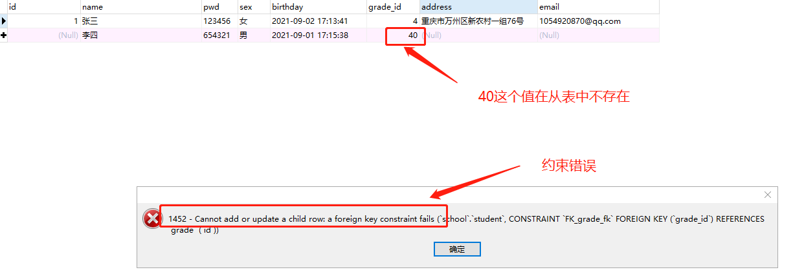
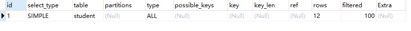
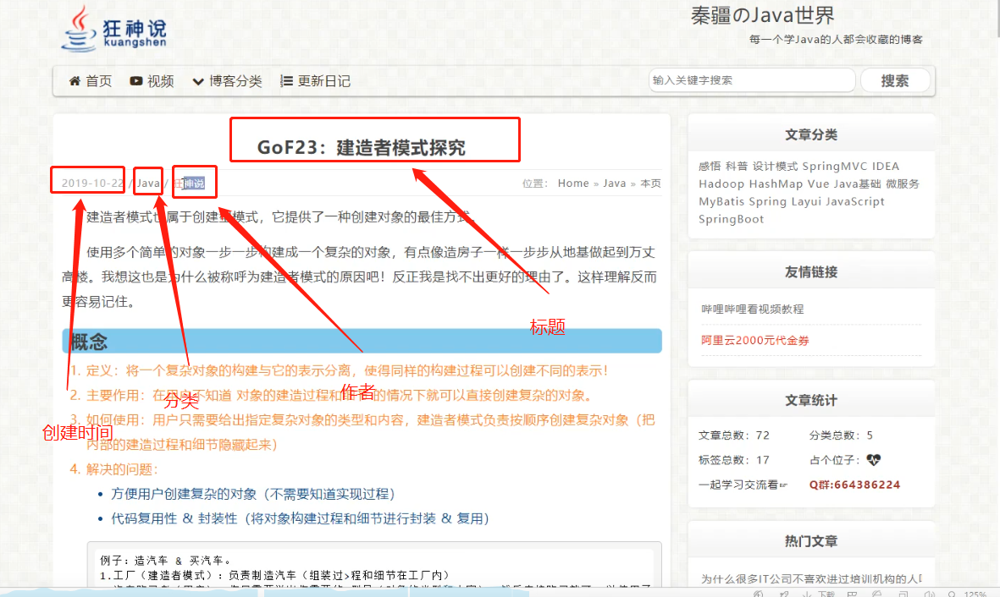

🔺前言：格式规范，本文中，如果命令中出现中括号则是可选参数或者命令，加了大括号就是必填参数或者命令

# 一、数据库分类及介绍


```SQL
-- 完整的一个创建表的

create table `uuu` (
	`id` int unsigned not null auto_increment,
	`name` varchar(50) default '',
	`sign` varchar(40) not null default '开始',
	primary key (`id`),
	unique index `haha` (`name`),
	index `hehe`(`sign`)
) engine = innodb default character set = utf8

```


#### 关系型数据库：（`sql`）

- `Mysql`、`Oracle`、`Sql Server`、`DB2`、`SQLlite`
- 通过表与表之间，行和列之间的关系进行数据存储


#### 非关系型数据库：（`NoSQL`） Not Only 不仅仅是

- `Redis`、`MongDB`
- 非关系型数据库，对象存储，通过对象的自身的属性来决定


#### DBMS（数据库管理系统、软件）

可视化工具去操作我们的数据库，说一点哈，命令行也是可视化的。

`MySql`是最好的`RDBMS`（关系型数据库管理系统）应用软件之一


#### `Mysql`的四种语言

- `DDL`：数据库    定义   语言
- `DML`：数据库    操作   语言
- `DQL`：数据库    查询    语言
- `DCL`：数据库    控制    语言


# 二、`navicat`上表字段介绍

操作数据库 > 操作数据库中的表 > 操作表中的数据


### 2.1 字符集和排序规则


#### 2.1.1 字符集


`UTF8`和`UTF8MB4`是常用的两种字符集，至于这两个选用哪个要根据自己业务情况而定。`UTF8MB4`兼容`UTF8`，比`UTF8`能表示更多的字符，Unicode编码区从编码区1-126属于`UTF8`区，当然`UTF8MB4`也兼容这个区，126行以下就是`UTF8MB4`扩充区，所以你要根据自己的业务进行选择，一般情况下`UTF8`就满足需求，当然如果考虑到以后扩展，比如考虑到以后存储`emoji`,就选择`UTF8MB4`，否则只是浪费空间。我建议还是选择`UTF8MB4`，毕竟对于大部分公司而言空间不是什么大问题。 


#### 2.1.2 排序规则


**准确性**

- `utf8mb4_unicode_ci` 是基于标准的Unicode来排序和比较，能够在各种语言之间精确排序，不区分大小写
- `utf8mb4_general_ci` 没有实现Unicode排序规则，在遇到某些特殊语言或者字符集，排序结果可能不一致，不区分大小写
- `ci`全称为case insensitive,意思是大小写不敏感，cs区分大小写


**性能**

- `utf8mb4_general_ci` 在比较和排序的时候更快
- `utf8mb4_unicode_ci` 在特殊情况下，Unicode排序规则为了能够处理特殊字符的情况，实现了略微复杂的排序算法。相比选择哪一种collation，使用者更应该关心字符集与排序规则在db里需要统一。
- `utf8mb4_bin`：将字符串每个字符用二进制数据编译存储，区分大小写，而且可以存二进制的内容。


总而言之，`utf8mb4_general_ci` 和`utf8mb4_unicode_ci` 是我们最常使用的排序规则。`utf8_general_ci` 校对速度快，但准确度稍差。`utf8mb4_unicode_ci` 准确度高，但校对速度稍慢，两者都不区分大小写。这两个选哪个视自己情况而定，还是那句话尽可能保持db中的字符集和排序规则的统计。 


| 字符集选择                 | 排序规则选择         |
| -------------------------- | -------------------- |
| `utf8mb4 -- UTF-8 Unicode` | `utf8mb4_general_ci` |


### 2.2 数据库常见的字段类型


> ​	数值型

- `tinyint`				只占一个字节的大小，我们一般用不到， tiny：译 - 微小的（8位, 正负2的7次方减1）

- `smallint`              占两个字节，small：译 - 小的

- `mediumint`            占三个字节，medium：译 - 中等

- `int`                        四个字节（32位，即-2³¹-1~2³¹-1的整数，超级大了），标准的整数，我们一般使用这玩意🔺

	

****

- `float`                    浮点数， 四个字节
- `double`                  浮点数，八个字节
- `decimal`                字符串形式的浮点数， 金融计算的时候，一般使用decimal， decimal 译 - 十进制


> ​	字符串

- `char`					固定大小得字符串， 只有0 - 255  ，  存一句话这些玩意还是够用了
- `varchar`              可变字符串。  区间0 ~ 65535  ， 🔺常用的， 比如我们在这个字段里面存一个文本，基本够用了， 一般用来存一些变量就完全完全完全够用了
- `tinytext`            微型文本。 2的8次方减1， 已经很大了，255个字节，80多个字，够用了
- `text`                    文本串， 2的16次方个字节，一个汉字占3个字节，差不多可以存32767.5和汉字， 超级大了一般用不到，这种超级大的我们一般使用文本存储服务器了


> ​	时间跟日期

- `date`                   日期格式： `YYYY-MM-DD`
- `time`                   日期格式：`HH:MM:SS`
- `datetime`           日期格式：`YYYY-MM-DD    HH:MM:SS  `  这是最常用的时间存储格式了 ，或者使用int去存一个时间戳 🔺
- `timestamp`         时间戳
- `year`                    年份表示


> ​	null

空值，注意，不要使用null进行运算


### 2.3 数据库的字段属性

> ​	整型


- 上面的设置都是改变全局的，如果表里面的数据不符合修改后的设定，将会修改失败

- 无符号：勾选上以后，改字段不能为负整数

- 自动递增：
	- 通常理解为自增`autoincrement`, 自动在上一条的基础上 +1 （默认）， 这个是可以改的
	
	- 🔺我们通常用来设计唯一主键，主键必须是唯一的，必须是整数。
	
	- 也可以自定义设置设计主键自增的起始值和步长
	
	- 🔺一个表只能有一个auto_increment，且该列必须是primary key或者unique key
	
	- 
	
		`navicate`里面的自动递增，这个是设置起始值的，注意，起始值必须比主键现在的最大值大，不然无法生效
	
	
	
- 填充0：不足的位数用0来填充，比如我们填入一个整数5，长度为3，`mysql`会给你自动填充为005

- 不是null
	- 如果勾选上了，写入数据时，不填写值，就会报错
	- 如果不勾选上，写入数据时，不填写值，就会自动填充null，默认是null
	
- 默认：

  - 设置默认值，这里有讲究的，如果字段类型是`varchar`字符类型，我们在设置默认值的时候，必须加上双信号或者单引号，否则要报错
  - 空白：即什么都不填，即没有默认值
  - NULL
  - Empty String：空字符串，可以理解为0字节长度的字符串，等同于单引号''和双引号""

- 长度：这个长度是显示长度，和字符类型大小限定的字节一起进行约束的。要同时满足字符类型的存储大小，也要满足显示长度大小


🔺 从8.0.17版本开始，`TINYINT, SMALLINT, MEDIUMINT, INT, and BIGINT` 数值类型的显示宽度将失效。我也不能说会发生多大的不良后果。可能是个BUG。 比如我在`navicate`中给数值类型设置长度为0，但是此时我还是可以添加数据不会报错。。


**字段整理（对照`navicat`中的显示在命令行中对应的字符）**

> ​	**int类型**


类型+长度：int（长度）、`varchar（长度）`等等

不是`null`：`not null`

主键：primary key ('字段名')

默认：default

注释：comment

自动递增: auto_increment

无符号: unsigned,  🔺注意：unsigned属性必须紧跟 类型属性，否则`SQL`报错，当`zerofill`和unsigned同时存在时，他们三个必须紧挨一起

填充零: `zerofill`,   🔺注意：`zerofill`属性也必须紧跟 类型属性，否则`SQL`报错，当`zerofill`和unsigned同时存在时，他们三个必须紧挨一起

其他：`navicat`上需要勾选的属性，在`mysql`命令行中，如果不写，就是不勾选，写上就表示勾选


> ​	**`varchar`类型**


类型+长度：int（长度）、`varchar（长度）`等等

不是`null`：`not null`

主键：primary key ('字段名')

默认：default

注释：comment

字符集：`character set utf8`， 🔺注意：`character set utf8` 属性必须紧跟 类型属性,`character set utf8`可以简写成`charset utf8`

排列顺序：`collate utf8_general_ci`   🔺注意：`collate utf8_general_ci `属性必须紧跟 类型属性


> **选项整理**


**注意：选项中是默认设置,在`SQL`中他们书写的位置也不一样**

引擎：`engine = innodb`

字符集和排序规则: `DEFAULT CHARACTER SET=utf8mb4 COLLATE=utf8mb4_general_ci`， 其中character set 可以简写为`charset`

自动递增：`AUTO_INCREMENT=888`, 设置起始递增


### 2.4 默认值拓展

**默认值拓展**


我们可以看到，默认值的设置主要分为三种：

1. 空值，空白，即什么都不填，等同于NULL（设计表结构时保存空值会自动变成NULL），当然也可以手动输入默认值。
2. NULL。
3. Empty String，空字符串，可以理解为0字节长度的字符串，等同于单引号''和双引号""。

其中，空值 = NULL，Empty String = 空字符串 = ''  "。

那么问题来了，当设定某一个字段的默认值的时候，是设定空值、NULL还是Empty String呢？

**先给出结论**

建议不要使用NULL或空值，String类型的字段可以设置默认为Empty String（即空字符串''），Int类型的字段可以设置默认为0。

因为空值 = NULL，所以谈论区别时只比较NULL和空字符''串即可。

**区别**

1、NULL是占用磁盘空间的（并不是数据本身占用空间，而是存储它是否为NULL的标记占用1个字节），而空字符串''是不占用磁盘空间的（它的长度是0字节所以不占用）。

2、字段类型是`varchar`时可以默认为空字符串，字段类型是int时不可以默认为空字符串，可以设置为0。

3、🔺当字段被设置为not null时，字段就不能是NULL但可以插入空字符串，但空字符串只能插入到字符串类型的字段中，插入其他类型的字段中会报错。而NULL可插入到任何允许为NULL的字段中。

4、`SQL`语句中对空字符串进行判断时可以使用=、>、<符号；但是对NULL进行判断时必须使用is null或is not null。

5、包含NULL的字段列，如果在查询条件中使用is not null会导致索引失效，但是使用is null索引不会失效。

6、使用count()函数进行统计时，会过滤掉NULL值，但不会过滤掉空字符串。

**所以：**建议不要使用NULL或空值，String类型的字段可以设置默认为Empty String（即空字符串''），Int类型的字段可以设置默认为0。因为空值 = NULL


### 2.5 表设计拓展

**阿里规范**

每一个表，都必须存在以下五个字段

```SQL
id			主键
version		用于乐观锁
is_delete	伪删除字段，什么意思呢？ 比如我们后面是不是要到数据库中去查数据，但是我们不希望这个数据真正的被删掉，我们用一个标记来判断，假如被删除的判断标记为1，当我们查询数据的时候发现这个字段为1，我们就认为他被删掉了。但是这条数据在数据库中还存在，这样管理员可以查看被删除的东西，用于数据的健壮性和安全性
gmt_create	创建时间
gmt_update	x
```


# 三、数据库和表的操作


### 3.1 创建数据库


查看上面创建表单的`SQL`，我们发现，在`navicate`中用命令创建，格式是可以很随意的,🔺以后工作中，基本上还是可视化建表


### 3.2 创建数据库表的几个例子

```sql
CREATE TABLE `student1` (
`id`  varchar(22) CHARACTER SET utf8 COLLATE utf8_general_ci NOT NULL ,
PRIMARY KEY (`id`)
)
ENGINE=InnoDB
DEFAULT CHARACTER SET=utf8mb4 COLLATE=utf8mb4_general_ci	# 选项中这两个必须在default之后，x
AUTO_INCREMENT=777
ROW_FORMAT=DYNAMIC

====================
CREATE TABLE `dsfdsf` (
`day`  datetime NOT NULL ON UPDATE CURRENT_TIMESTAMP 
)

====================

CREATE TABLE `student1` (
`id`  varchar(20) CHARACTER SET utf8 COLLATE utf8_general_ci NULL 
)
ENGINE=InnoDB
DEFAULT CHARACTER SET=utf8mb4
AUTO_INCREMENT=888

====================
create table if not exists `student` (
	`id` int(4) unsigned not null auto_increment comment '学号',
	`name` varchar(20) character set utf8 collate utf8_general_ci not null default ''  comment '姓名',
	`pwd` VARCHAR (20) NOT NULL DEFAULT '123456' COMMENT '密码',
	`sex` VARCHAR (2) NOT NULL DEFAULT '女' COMMENT '性别',
	`birthday` datetime not null on update current_timestamp COMMENT '出生日期',
	`adress` VARCHAR (100) DEFAULT NULL COMMENT '家庭住址',
	`email` VARCHAR (50) DEFAULT NULL COMMENT '邮箱',
	PRIMARY KEY (`id`)
) engine=INNODB default charset=utf8mb4 collate=utf8mb4_general_ci auto_increment=1


====================
MODIFY COLUMN `id`  tinyint UNSIGNED NOT NULL AUTO_INCREMENT COMMENT '学号' FIRST

MODIFY COLUMN `id`  tinyint UNSIGNED ZEROFILL NOT NULL AUTO_INCREMENT COMMENT '学号' FIRST

MODIFY COLUMN `birthday`  datetime NULL DEFAULT NULL ON UPDATE CURRENT_TIMESTAMP COMMENT '出生日期' AFTER `sex`


create table if not exists `student` (
	`id` int(4) unsigned not null auto_increment comment '学号',
	-- `name` varchar(20) not null default '' character set utf8 collate utf8_general_ci comment '姓名',
	-- `pwd` VARCHAR(20) not null default '123456' comment '密码',
	-- `sex` varchar(2) not null default '女' comment '性别',
	-- `birthday` datetime not null on update current_timestamp comment '出生日期',
	-- `adress` varchar(100) default '' character set utf8 collate utf8_general_ci comment '地址',
	-- `email` varchar(50) default '' charset utf8 collate utf8_general_ci comment '邮箱',
	PRIMARY KEY (`id`)
) engine=INNODB default -- charset=utf8mb4 collate=utf8mb4_general_ci auto_increment=1
```


### 3.3 修改表结构

> ​	修改

```sql
# 在表尾部新增字段
alter table `表名` add `字段名` int(4) unsigned zerofill not null default 100 comment '年龄';

# 在表中插入字段
ALTER TABLE `student` ADD COLUMN `level`  int(4) UNSIGNED ZEROFILL NOT NULL AFTER `address` comment '等级';

# 在表最前面插入字段
ALTER TABLE `student` ADD COLUMN `xxx`  varchar(255) NOT NULL FIRST

# 删除表的字段
alter table `表名` drop `字段名`

# 修改表名
alter table `旧表名` rename as `新表名` 

# 修改表字段名
alter table `表名` change `旧的字段名` `新的字段名` int(4);  # 这里必须要把int(4)字段类型加上

# 修改表字段约束
alter table `表名` modify `字段名` varchar(20) charset utf8 collate utf8_general_ci not null default 'xxx' comment 'xxxx';
```


# 四、数据库表的类型


数据库引擎我们知道两种就行：

- `INNODB`        现在默认是使用这个
- `MYISAM`        这个是早些年使用的


### 4.1 `innodb`和`MYISAM`数据库引擎却别 === 了解就行了，现在主流就是`INNODB`

|              | `MYISAM` | `innodb`                |
| ------------ | -------- | ----------------------- |
| 是否支持事务 | 不支持   | 支持                    |
| 数据行锁定   | 不支持   | 支持                    |
| 外键约束     | 不支持   | 支持                    |
| 全文索引     | 支持     | 不支持                  |
| 表空间大小   | 较小     | 较大，约为`MYISAM`的2倍 |

常规使用操作：

- `MYISAM`          节约空间，速度较快
- `innodb`          安全性高，支持事务处理，由于他还支持外键、和行锁，可以多表多用户操作


**行锁与表锁**

> `MYISAM` ：假设现在有两条`SQL`要去查同一个表，前面的`SQL`他会先把表锁住.后面的`SQL`就需要等待了。

> `innodb` :   他是实现哪一行数据锁定，不会锁表。所以更加高级


**外键约束**

在数据库级别去关联另外一张表


**存储方式**

```bash
# 数据库名为school
/var/lib/docker/volumes/d2b1c42bc4ec401a433883a5460e1d5f05ebf8c5696dda454e2fb00f92404ada/_data/school

# school目录下就是mysql的数据存储地址, 我的school数据库下面有3张表分别是dfdsf.ibd  dsfdsf.ibd  student.ibd
[root@hecs-263993-0001 school]# ls
dfdsf.ibd  dsfdsf.ibd  student.ibd
```


# 五、`MySQL`数据管理(`DML`)


### 5.1  外键（了解即可）


这种报错是提示无法正确的插入外键约束，那我分析一下，设置外键有以下几个条件： 　　

1、要设置外键的字段不能为主键 （上面学生表的grade字段不是主键）

2、改建所参考的字段必须为主键 （上面年纪表的id一定是主键）

3、两个字段必须具有相同的数据类型和约束（学生表的grade字段和年级表的id字段，数据类型和约束相同，不然以后你会哭的）

🔺连了外键 在新增数据时候，有时候会出错，所以现在大多不练外键，都通过代码逻辑去限制


🔺如果我们非要建立外键的话。我们可以先把两张表建立好以后，在执行下面操作

```sql
# 创建学生表
CREATE TABLE `student` (
	`id` INT (4) UNSIGNED auto_increment NOT NULL COMMENT '学号',
	`name` VARCHAR (30) NOT NULL DEFAULT 'null' COMMENT '姓名',
	`pwd` VARCHAR (20) NOT NULL DEFAULT '123456' COMMENT '密码',
	`sex` VARCHAR (2) NOT NULL DEFAULT '女' COMMENT '性别',
	`birthday` datetime NOT NULL ON UPDATE CURRENT_TIMESTAMP COMMENT '出生日期',
	`address` VARCHAR (100) DEFAULT NULL COMMENT '家庭地址',
	`email` VARCHAR (50) DEFAULT NULL COMMENT '邮箱',
	PRIMARY KEY (`id`)
) ENGINE = INNODB DEFAULT CHARACTER SET = utf8 COLLATE = utf8_general_ci auto_increment = 0

# 给student表添加grade字段
alter table `student` add column `grade_id` int(10) unsigned not null comment '年级id' after `birthday`;


# 创建年纪表
create table `grade` (
	`id` int(4) not null auto_increment comment 'grade_id',
	`grade_name` varchar(20) not null comment '年纪',
	primary key (`id`)
) engine = innodb default charset=utf8 collate=utf8_general_ci

create table `grade` (
	`id` int(4) unsigned not null auto_increment comment 'ID',
	`grade_name` varchar(20) not null comment '年级',
	primary key (`id`)
) engine=innodb default charset=utf8 collate=utf8_general_ci


# 给student表建立外键 使student表的grade_id关联 grade表的id
alter table `student` add constraint `FK_grade_fk` foreign key (`grade_id`) references `grade`(`id`);
解释：
1. add constraint `FK_grade_fk` 添加外键字段，FK_是外键的标识，grade_fk是自定义的外键字段名词
2. foreign key (`grade_id`) references `grade`(`id`) 将student表的`grade_id` 关联引用 `grade`表的 `id`字段
```


**最终效果如下**


填写外键数据的时候，他会去选用关联表中的数据，如果我们在主表中从，外键设置的值，在从表中没有的话，会报错




**以上的操作都是物理外键，数据库级别的外键，我们不建议使用！**

- **避免数据关联过多，造成困扰。看都看不过来**

**最佳实践：**

- **数据库就是单纯的表，只用来存数据，只有行（数据）和列（字段）**
- **我们想使用多张表的数据，想使用外键的功能，我们可以通过代码逻辑去实现。完全OK的，而且条例其清晰**
- **阿里规范中写道，不得使用外键与级联，一切外键概念必须在应用层解决**
- **https://blog.csdn.net/weixin_30312659/article/details/97593832这篇博客原因分析的很透彻**


### 5.2 `DML`语言（全部记住）

**数据库意义：**数据存储、数据管理

`DML`语言： 

- insert
- update
- delete


### 5.3 添加

> ​	添加当行数据

```SQL
# 范式
insert into `表名`(`字段名1`, `字段2`, `字段3`) values('值1','值2','值3',....)

# 实际应用
insert into `student` (`name`, `pwd`, `sex`, `birthday`, `grade_id`, `address`, `email`) values ('土匪', 'zmz123456', '男', '2020-10-22 22:23:45', 16, '新农9队', '404000@qq.com');
```


> ​	添加多行数据

```sql
# 范式
insert into `表名` (`字段名1`, `字段2`, `字段3`) values ('值1','值2','值3',....), ('值1','值2','值3',....), ('值1','值2','值3',....) ....

# 实际操作
insert into grade (`grade_name`) values ('五年级一班'),('五年级二班'),('五年级三班'),('五年级四班');
```


🔺注意：

- 在书写过程中，自增字段我们都不会写的
- 还有更牛逼的，就是全部字段都不写，但是在后面填值的时候，必须全部都写上。对于自增字段感觉不太友好，因为我们手写，很有可能写重复


### 5.4 修改

> ​	根据条件进行修改单个字段

```SQL
# 范式
update `表名` set `字段名` = `值` where 条件

# 实例
update `student` set `pwd` = 11111111 where sex = '女';
```


> ​	根据条件修改多个字段

```sql
# 范式
update `表名` set 字段名1` = `值1`, 字段名2` = `值2`, 字段名3` = `值3` where 条件

# 实例
update `student` set `name` = '强盗', `pwd` = '123456' , `grade_id` = 1 where id = 7;
```


> ​	不加条件进行修改

```SQL
# 范式
update `表名` set `字段名` = `值`

# 实例
update `student` set `pwd` = 'zmz821218';
```


#### 条件


| 操作符                             | 含义                                      | 演示                                    | 结果          |
| ---------------------------------- | ----------------------------------------- | --------------------------------------- | ------------- |
| =                                  | 等于                                      |                                         | False or True |
| <> 或者 !=                         | 不等于                                    |                                         | False or True |
| >                                  | 大于                                      |                                         | False or True |
| <                                  | 小于                                      |                                         | False or True |
| >=                                 | 大于等于                                  |                                         | False or True |
| <=                                 | 小于等于                                  |                                         | False or True |
| where `字段名` between 值1 and 值2 | 在值1和值2之间，包含值1 和值2，[值1，值2] | where id between 2 and 5                |               |
| AND                                | 用于添加多个条件 ， && 逻辑与             |                                         |               |
| OR                                 | \|\| 逻辑或                               |                                         |               |
| in                                 | `id` in (1, 3, 4, 5)                      | delete from `other` where id in (2,3,4) |               |


### 5.5 删除

> ​	delete 命令

语法：

```sql
delete from `表名` where 条件
delete from `表名`
```


> ​	truncate 命令

```
truncate `表名`
```

作用：完全清空一个数据库表，表的结构和索引约束不会变


> ​	delete 和 truncate 区别

- `delete`清空数据表以后，自动增量仍然从上一次的地方开始自增，而`truncate`自增会重置
- `truncate`只能用来清空表，无法和`where`条件进行搭配使用


**了解：`delete` 删除的表后，重启数据库后的现象**

- `innodb`    自增列会重1开始，因为`innodb`数据存在内存当中的，断电即失
- `myisam`    自增列继续从上一个自增量开始，因为数据存在文件当中的，不会丢失


# 六、`DQL` 查询数据


**博客：https://blog.csdn.net/jiadajing267/article/details/81269067**


> ​	**SQL完整语法**

```SQL
SELECT 
	[ALL | DISTINCT | DISTINCTROW]
		[HIGH_PRIORITY]	# 高优先级
		[STRAIGHT_JOIN]	# 直连
		[sql_small_result][sql_big_result][sql_buffer_result]
		[sql_cache | sql_no_cache] [sql_calc_found_rows]
	select_expr [, select_expr ...]
	[FROM table_references
     	[PARTITION partition_list]	# 隔开、分页
    [WHERE where_condition]
    [GROUP BY {col_name | expr | position}
     	[ASC | DESC], ...[with rollup]]	# ASC升序 DESC降序   ROLLUP卷起;上卷;汇总;滚动
    [HAVING where_condition]
    [ORDER BY {col_name | expr | position}
     	[ASC | DESC], ...]
    [LIMIT {[offset,] row_count | row_count offset offset}]
    [PROCEDURE procedure_name(argument_list)]
    [INTO OUTFILE 'file_name'
     	[CHARACTER SET charset_name)]
     	export_options
     	| INTO DUMPFILE 'file_name'
     	| INTO var_name [, var_name]]
    [FOR UPDATE | LOCK IN SHARE MODE]
     
```


### 6.1 查询基础

> ​	查询表单中的全部字段信息
>
> ```SQL
> Select * from `table`
> ```


> ​	查询指定字段
>
> ```SQL
> select `filed1`, `filed2` from `table`
> ```


### 6.2 取别名

> ​	取别名
>
> ```SQl
> #  字段取别名
> select `filed1` as `alias1` , `filed2` as `alias2` from `table`
> 
> # 表取别名:一般用于多表联查，当多张表中有相同命名的字段，这时候就要给表起一个别名了、、一旦起了别名以后，后续操作都必须使用别名
> select `filed1` as `alias1` , `filed2` as `alias2` from `table` as `alias_table`
> ```


### 6.3 拼接(`concat`）

> ​	函数 `Concat(a, b)`拼接字段名
>
> ```SQL
> # 可以'字符串' 和 `字段名` 拼接， 也可以混合拼接,查询的是concat里面字段的数据，但是会给他拼接上， 一般我们还要给他as 一个新名字，用于显示
> select concat('demo:', `SubjectName`, `ClassHour`) as `新名字` FROM `subject`
> ```


**例子:**

- 字符串 + 查询字段

> ```
> select concat('测试:', `StudentName`) from `student`
> ```


- 字符串 + 查询字段 + 别名

> ```SQL
> select concat('测试:', `StudentName`) as `新名字` from `student`
> ```


- 查询字段 + 字符串 + 查询字段

> ```sql
> select concat(`StudentName`, ':电话:',`Phone` ) as `新名字` from `student`
> ```


### 6.4 去重(`distinct`)

**作用：去除SELECT查询出来的结果中重复的数据，重复的数据只显示一条**


> ```SQL
> select distinct `StudentNO` from result
> ```


> ```SQL
> select distinct `StudentNO`, `StudentResult` from result	# `StudentNO`, `StudentResult` 两个字段去重
> ```


### 6.5 数据库中的列（表达式）

```SQL
SELECT VERSION()					-- 查询系统版本 （函数表达式）
SELECT 100*3 - 1 AS `alias`			-- 计算（算术表达式）
SELECT @@auto_increment_increment	-- 查询自增步长（变量表达式）
```

**🔺数据库中的表达式：文本值、列（字段）、Null、函数、计算表达式、数据库变量....**


**例子:给成绩表的每个同学的每个科目都加一分,现有如下一张成绩表**


> ```SQL
> select `StudentNo`,`StudentResult` + 1 as '提分后' from result
> ```


🔺注意：上面提分后，原始数据值是不会发送改变的


### 6.6 `where` 条件语句

**作用：检索数据中`符合条件`的值**

**备注：where中不能使用from里面的别名，因为，根据执行顺序此时别名还没有生成**

> ​	逻辑运算符

| 运算符          | 语法                     | 描述   |
| --------------- | ------------------------ | ------ |
| add    &&       |                          | 逻辑与 |
| or      \|\|    |                          | 逻辑或 |
| Not     ！      | not `StudentResult` = 87 | 逻辑非 |
| between a and b |                          | [a, b] |


> ​	**`mysql`中`where`后为什么不能使用select中定义的别名**

- 因为`mysql`中`sql`语句的书写顺序与执行顺序不同

- `sql`书写顺序：select 查询内容 from 表 where 查询条件 	
- `sql`执行顺序: from 表 where 查询条件 select 查询内容


select destinct from join on where group by 聚合函数 having order by limit

from join on  where group by 聚合函数 having select distinct order by limit

注意:这里on可以使用 join里面的别名

这里有几个需要注意的地方：

1、SQL语句是从FROM开始执行的，而不是SELECT。MySQL在执行SQL查询语句的时，首先是将数据从硬盘加载到数据缓冲区中，以便对这些数据进行操作。

2、SELECT是在FROM和GROUP BY 之后执行的。这就导致了无法在WHERE中使用SELECT中设置字段的别名作为查询条件。


> ​	模糊查询： 比较运算符


| 运算符                   | 语法                      | 描述                                         |
| ------------------------ | ------------------------- | -------------------------------------------- |
| IS NULL                  | a is null                 | 返回bool值                                   |
| IS NOT NULL              | a is not null             |                                              |
| filed between xx and xxx | a between b and c         |                                              |
| like                     | a like b                  | SQL匹配，如果a匹配b，则结果为真              |
| in                       | a in (a1, a2, a3, a4 ...) | 如果a是 a1 , a2 ,a3, a4 其中的一个，则返回真 |

**🔺注意：SQL中的is和not 后面只能是null不然会报错**

 **like详解**

- `%`（代表0到任意个字符）
- `_`(代表一个字符)

> **`like`举例**

有如下 一张 student表


- 查询姓刘的同学的信息

```SQL
select * from `student` where `StudentName` like '刘%'
```


- 查询包含刘字的同学的信息

```SQL
select * from `student` where `StudentName` like '%刘%'
```


- 查询名字中间包含刘字的同学的信息

```SQL
select * from `student` where `StudentName` like '_%刘%_'
```


# 七、联表查询


> ​	JOIN对比


> 笛卡尔积连接(`join`)
>
> ```sql
> select * from `A` JOIN `B`
> select * from `A`, `B`
> ```


> 右联接(`right join`)，必须加上on进行表关联,不然就不是迪科尔连接了，变成笛卡尔积了（笛卡尔连接必须有相同的关联）
>
> ```SQL
> select * from `A` right join `B` on `A`.id = `B`.num
> ```
>
> 注意：右关联，join右边的表数据全部显示， 即B表全部显示


> 左联接（`left join`），必须加上on进行表关联,不然就不是迪科尔连接了，变成笛卡尔积了（笛卡尔连接必须有相同的关联）
>
> ```SQL
> select * from `A` left join `B` on `A`.id = `B`.num
> ```
> 
>注意：左关联，join左边的表数据全部显示，即使A表全部显示


> 内连接(`inner join`)，必须加上on进行表关联,不然就不是迪科尔连接了，变成笛卡尔积了（笛卡尔连接必须有相同的关联）
>
> ```SQL
> select * from `A` inner join `B` on `A`.id = `B`.num
> ```
>
> 注意：内联接，A表和B表没有关联的数据全都不显示


**笛卡尔：https://blog.csdn.net/qq_36310902/article/details/93412933**

**解释:看了上面的blog，知道了，其实左右联接，就是笛卡尔的自然连接**


> 自联接(`inner join`) : 将一张表当成两张表进行联接， 核心：将一张表拆为两张一样的表
>
> ```SQL
> select a.`categoryName` as '父栏目', b.`categoryName` as '子栏目' FROM
> `category` as a, `category` as b where a.`categoryid` = b.`pid`
> ```


```SQL
select a.`categoryName` as '父栏目', b.`categoryName` as '子栏目' FROM
`category` as a join `category` as b on a.`categoryid` = b.`pid`
```


**上面这个就相当于老板和员工在同一个表中的情况一样**

**自联接测试数据**

```SQL
CREATE TABLE `category` (
	`categoryid` INT(10) UNSIGNED NOT NULL auto_increment COMMENT '主题ID',
	pid INT(10) NOT NULL COMMENT '父ID',
	categoryName VARCHAR(50) NOT NULL COMMENT '主题名字',
	PRIMARY KEY(`categoryid`)
) ENGINE=INNODB auto_increment=9 DEFAULT CHARSET = utf8;

INSERT INTO `category`(categoryid,pid,categoryName)
VALUES(2,1,'信息技术'),(3,1,'软件开发'),(4,3,'数据库'),
(5,1,'美术设计'),(6,3,'web开发'),(7,5,'PS技术'),(8,2,'办公信息');
```


> ​	三张表查询
>
> ```SQL
> select st.`StudentNo`, `StudentName`, `SubjectName`,`StudentResult`	# 这里也一样，定义了别名就一定要是用别名
> from `student` as st
> inner join 
> `subject` as su
> on st.`GradeId` = `su`.`GradeID`
> inner join
> `result` as re
> on `re`.StudentNo = `st`.`StudentNo`		# `re`.StudentNo不能再写成 `result`.StudentNo了，因为已经取了别名了，后面只能用别名，不然报错
> where SubjectName='数据库结构-1'
> ```
>
> 🔺注意：别名的使用也是有讲究的，一旦使用了别名，后面就必须使用别名来替代，不然报错


# 八、分页（`limit`）和排序(`order by`)


### 8.1 排序 （升序`ASC--ascending`、降序`DESC --descending`）

**注意: 根据`SQL`的执行顺序，`from on join where group by having select distinct ordery by limit`可知，`odery by`是在查询完成以后，对数据进行排序的**

> 语法
>
> ```SQL
> ORDER BY `字段` DESC 或者 ASC
> ```
>
> 
>
> ```SQL
> select st.`StudentNo`, `StudentName`, `SubjectName`,`StudentResult`
> from `student` as st
> inner join 
> `subject` as su
> on st.`GradeId` = `su`.`GradeID`
> inner join
> `result` as re
> on `re`.StudentNo = `st`.`StudentNo`
> where SubjectName='数据库结构-1'
> ORDER BY `StudentResult` asc
> ```
>
> 


### 8.2  分页(`limit`)

**为什么要分页：缓解数据库压力，个人的体验更好**

**除开分页还有一种，就是瀑布流，就是一直刷不到底**

> ​	语法
>
> ```SQL
> limit 数据起始下标，从起始下标开始几条数据
> 
> 例子：比如我有10条数据，我要显示0 - 4 号下表的数据 limit 0,4
> 注意：mysql跟python的列表一样是从0开始计数的
> ```
>
> 


# 九、`where`子查询


**本质: 在where语句中嵌套一个子查询语句，查询的结果作为where的条件判断**


> ```SQL
> select `StudentNo`, `SubjectNo`, `StudentResult`
> from result
> where `SubjectNo` in (select `SubjectNo` from `subject` where `SubjectName` like '%高等%')
> order by `StudentResult` DESC
> ```


注意点：

- 如果子查询返回了单个字段单行，我们可以使用 等于 不等于 等单个比较
- 如果子查询返回了单个字段多行数据，相当于返回了一个元组，这个时候我们要使用 `in`
- 使用子查询如果超出一行那就使用in，或者any


# 十、`MySQL`函数

**官网：https://dev.mysql.com/doc/refman/5.7/en/func-op-summary=ref.html**

### 10.1 普通函数


> 语法
>
> ```SQL
> SELECT 函数() ....
> ```
>
> 


#### 10.1.1 时间和日期（这个经常使用）

>```SQL
>select current_date()
>select curdate()			# 上面的缩写
>```
>
>


> ```SQL
> select current_timestamp()	
> select now()				# 一样的
> ```
>
> 


> ```SQL
> select localtime()			# 获取本地时间
> ```
>
> 


> ```SQL
> select SYSDATE()			#获取系统时间
> ```
>
> 


> ```SQL
> select year(date)	# select year(now())
> 
> select month(date)	# select month(LOCALTIME())
> 
> select day(date)   ...
> 
> 具体语法： select year/month/day/hour (s)
> ```
>
> 


### 10.2 聚合函数


> `COUNT(value)` 统计数量
>
> ```SQL
> COUNT(value)
> value = `具体字段`
> value = 1			# 统计第一列
> value = 2			# 第二列
> value = *			# 所有列
> 注意:count 会自动过滤掉NUll
> ```
>
> 

**问题：`count(`filed`)、` `count(1)`、 `count(*)`的区别**

- `count(filed)` : 会自动过滤值为null的数据,注意：空字符是不会被过滤的，只会过滤null
- `count(1)`和`count(*)` 他们都不会忽略null，他们的本质就是计算数据有多少行。不管你那一行是不是null

**拓展：如果没有主键的情况下`count(1)`速度最快，`distinct filed` ，得到的结果将除去值为null和重复数据后的结果**

```SQL
select COUNT(DISTINCT `address`) from `xxx`

执行顺序剖解：先执行 from `xxx` → select `address` → distinct (`address`) → count
```


> 求和SUM

```SQL
select sum(`studentResult`) as '总和' from `result`
```


> 求平均值avg

```SQL
select avg(`StudentResult`) as '平均分' from `result`
```


> 最大值MAX	

```SQL
select MAX(`StudentResult`) as '平均分' from `result`
```


> 最小值MIN

```SQL
select MIN(`StudentResult`) as '平均分' from `result`
```


# 十一、分组及过滤（`group by   having`）

```SQL
一、sql执行顺序 
(1)from 
(2) join 
(3) on 		(可以使用join中的别名)
(4) where 
(5)group by(开始使用select中的别名，后面的语句中都可以使用) 🔺
(6) avg,sum.... 
(7)having 
(8) select 
(9) distinct 
(10) order by 
```


**题目: 查询不同课程的平均分，最高分，最低分**

```sql
-- 分析：我们要查课程名称， 最高分， 和最低分
select any_value(s.`SubjectName`), avg(StudentResult), max(StudentResult), min(StudentResult) FROM
result as r
inner JOIN subject s
on r.SubjectNo = s.SubjectNo
group by `SubjectName`

# 解释： group by 我们要理解成他将表按 `SubjectName`分成了多张表。。
```


**题目：以上面的题目为基础，筛选出平均成绩大于80分的**

```SQL
select 
s.`SubjectName` ,avg(StudentResult) as `平均值`,max(StudentResult) as `最大值`, min(StudentResult) as `最小值`
FROM 
result as r
inner JOIN subject s
on r.SubjectNo = s.SubjectNo
group by `SubjectName`
```


由于GROUP BY 实际上也同样会进行排序操作，而且与ORDER BY 相比，GROUP BY 主要只是多了排序之后的分组操作。当然，如果在分组的时候还使用了其他的一些聚合函数，那么还需要一些聚合函数的计算。所以，在GROUP BY 的实现过程中，与 ORDER BY 一样也可以利用到索引。

having 子句的作用是筛选满足条件的组，即在分组之后过滤数据，条件中经常包含聚组函数

不能使用where 而要使用having进行筛选，因为，where 执行顺序在group by前面


# 十二、数据加密(`MD5`)


MD5不可逆，一样得数据具体值得md5是一样得

*MD5*肯定比明文要安全一些(当然肯定不是最安全的) 如果数据库*存储*的是明文,如果数据库被黑了,那么明文密码就全部暴露出去了。我们进行用户密码校验的时候，就是对比这个md5值是否一样，来进行对比的


**实战试用**

**第一步：创建一张如下的表**

```SQL
create table `testmd5` (
	`id` int(4) not null,
	`name` varchar(20) not null,
	`pwd` varchar(50) not null,
	primary key (`id`)
) engine = innodb default character set = utf8

```


**第二步:添加数据加密**

```SQL
insert into `testmd5` (`id`, `name`, `pwd`) values (1, 'zhangsan', '123456'),(2, 'zhangsan', md5('123456')),(3, 'zhangsan', '123456')
```


**第三步：将以后的数据进行加密**

```SQL
update `testmd5` set `pwd` = md5(`pwd`) where id = 1
```


**第四步：校验**

**如何校验：将用户传递进来的密码，进行md5加密，然后比对加密后的hash值**

```python
>>> import hashlib
>>> a = '123456'
>>> b = a.encode('utf8')
>>> md = hashlib.md5()
>>> md.update(b)
>>> md.hexdigest()
'e10adc3949ba59abbe56e057f20f883e'
```


# 十三、事务

### 

### 13.1 什么是事务

**核心：要么都成功，要么都失败**

**概念：将一组SQL放在一个批次中执行**


> 事务的原则: ACID 原则   原子性 ，一致性，隔离性，持久性  （脏读，）

**原子性（Atomicity）**

原子性是指事务是一个不可分割的工作单位，事务中的操作要么都发生，要么都不发生。

**一致性（Consistency）**

事务前后数据的完整性必须保持一致。

**隔离性（Isolation）**

事务的隔离性是多个用户并发访问数据库时，数据库为每一个用户开启的事务，不能被其他事务的操作数据所干扰，多个并发事务之间要相互隔离。

**持久性（Durability）**

持久性是指一个事务一旦被提交，它对数据库中数据的改变就是永久性的，接下来即使数据库发生故障也不应该对其有任何影响

举个简单的例子理解以上四点


**经典的博客：https://blog.csdn.net/weixin_39937312/article/details/111117720**

**经典的博客：https://blog.csdn.net/dengjili/article/details/82468576**


### 13.2 事务的隔离级别

| 设置               | 描述                                                       |
| ------------------ | ---------------------------------------------------------- |
| `Serializable`     | 可避免脏读、不可重复读、虚读情况的发生。（串行化）         |
| `Repeatable read`  | 可避免脏读、不可重复读情况的发生。（可重复读）innodb的默认 |
| `Read committed`   | 可避免脏读情况发生（读已提交）。                           |
| `Read uncommitted` | 最低级别，以上情况均无法保证。(读未提交)                   |

**脏读**：指一个事务读取了另外一个事务未提交的数据（这里的所谓脏，是我们读取了一个事务未提交的数据，这个未提交的数据，很有可能在提交之前的等等情况下，可能会被rollback回滚，所以就脏了啊）

**不可重复读**： 在一个事务内读取表中的某一行数据，多次读取结果不同。这是因为我们在事务中第二次读取改行数据的时候，另外一个事务操作了改行数据

**幻读（虚读）**: 是指在一个事务内读取到了别的事务插入的数据，导致前后读取数量总量不一致(一般是行影响，少一行，也是属于幻读)，所以RR模式可以避免 脏读和不可重复读，但是无法避免幻读


**何为脏：我们读取了一个可能需要回滚的数据，这就叫脏**


### 13.3 不同隔离级别的实现

**REPEATABLE READ （可重读读）**-- 默认隔离级别

默认的隔离级别，读快照(Read View), 是在事务中第一次SELECT发起时建立（给当前拍一个快照，然后读取快照中的数据，这样就不受外界的影响了），而且之后不会再发生变化，所以该隔离模式可以避免脏读和，不可重复读。


**READ COMMITTED （读已提交）**

READ COMMITTED（读已提交），快照(Read View)是在每次SELECT后都会生成最新的Read View，即每次SELECT都能读取到已COMMIT的数据，就会存在不可重复读、幻读 现象。


**SERIALIZABLE  (串行)**

效率太低了，不说了


### 13.4 锁

在并发环境下，为解决并发一致性问题保证事务的隔离性，可采取封锁机制。当一个事务在进行操作时加锁，限制另一个事务的操作。

一般而言，为保证效率，锁的粒度不宜太大。在MySQL中，提供了行锁和表锁。

行锁：事务A操作数据时，只封锁被操作的行，事务B可以操作其他行的数据，并发程度高；

表锁：事务A操作数据时，封锁整个表，事务B要等A完成才能操作，并发度较低。

在读写方面数据库锁也分为读锁（共享锁）和写锁（排他锁）。

读锁：若事务A加了此锁，A可以对数据进行读取操作，但不能更新；其它事务也可以读，但不能修改；

写锁：若事务A加了此锁，A可以对数据进行读和写操作，其它事务不能读写，否则会阻塞。

上面所说的是悲观锁，MySQL中InnoDB也提供了乐观锁的实现——MVCC（多版本并发控制）。用通俗的方式解释悲观锁和乐观锁大概是这样：

悲观锁：认为每次操作都会修改数据，每次都在操作前上锁；

乐观锁：认为每次操作都不会修改数据，不上锁，但是会记录一个版本号或者时间戳，用来对比。

MVCC则是乐观锁的实现，它在每行记录后面都保存着两个隐藏的列，用来存储创建版本号和删除版本号。


### 13.5 事务实战

**备注：MySQL是默认开启了事务自动提交的，所以我们再学习过程中，需要关闭事务自动提交**

```SQL
-- MySQL是默认开启了事务自动提交的
SET autocommit = 0 /* 关闭 */
SET autocommit = 1 /* 开启(默认) */

-- 手动处理事务
SET AUTOCOMMIT = 0  -- 关闭自动提交


-- 事务开启
START TRANSACTION 	-- 标记一个事务的开始，从这个之后的SQL都在同一个事务内
....

-- 提交： 持久化
commit


-- 回滚： 回到原来的样子(失败!)
rollback

-- 事务结束
SET AUTOCOMMIT = 1		-- 开启自动提交（因为前面为了学习，我们将自动提交给关闭了）

-- 设置一个事务的保存点 (了解即可)
SAVEPOINT "point name" 			-- 设置保存点为"point name"
ROLLBACK TO "point name"		-- 回滚到保存点
RELEASE SAVEPOINT "point name"	-- 删除保存点，可以存在多个保存点，在事务执行失败后可以指定回滚到哪一个点
```


提交数据有三种类型：显式提交、隐式提交及自动提交

显式提交

用 COMMIT 命令直接完成的提交为显式提交。

隐式提交

用 SQL 命令间接完成的提交为隐式提交。这些命令是：

ALTER ， AUDIT ， COMMENT ， CONNECT ， CREATE ， DISCONNECT ， DROP ， EXIT ， GRANT ， NOAUDIT ， QUIT， REVOKE ， RENAME 。

自动提交

若把 AUTOCOMMIT 设置为 ON ，则在插入、修改、删除语句执行后，
COMMIT / ROLLBACK这两个命令用的时候要小心。 COMMIT / ROLLBACK 都是用在执行 DML语句(INSERT / DELETE / UPDATE / SELECT )之后的。DML 语句，执行完之后，处理的数据，都会放在回滚段中(除了 SELECT 语句)，等待用户进行提交(COMMIT)或者回滚 (ROLLBACK)，当用户执行 COMMIT / ROLLBACK后，放在回滚段中的数据就会被删除。(SELECT 语句执行后，数据都存在共享池。提供给其他人查询相同的数据时，直接在共享池中提取，不用再去数据库中提取，提高了数据查询的速度。)

所有的 DML 语句都是要显式提交的，也就是说要在执行完DML语句之后，执行 COMMIT 。而其他的诸如 DDL 语句的，都是隐式提交的。也就是说，在运行那些非 DML 语句后，数据库已经进行了隐式提交，例如 CREATE TABLE，在运行脚本后，表已经建好了，并不在需要你再进行显式提交。


#### 模拟银行转账

```SQL
-- 构造测试数据

create table `account` (
	`id` int(3) not null auto_increment,
	`name` varchar(20) not null,
	`money` decimal(9,2) not null,
	primary key (`id`)

) engine = innodb default charset=utf8 collate=utf8_general_ci

insert into `shop` (`name`, `money`) values ('A', 2000.00),('B',10000.00)


-- 正确执行的例子
set autocommit = 0;
start TRANSACTION;
update `account` set `money` = `money` - 500 where `name` = 'A';
update `account` set `money` = `money` + 500  where `name` = 'B';
commit;
set autocommit = 1;

```


**问题：**最近在使用`navicat`编辑数据库表的时候遇到了一些问题，记录下~~

原因：后来查了好多资料，原来是`navicat`的自动提交事务关闭了，导致了修改数据之后事务一直未提交，所以再修改数据的时候就得等之前的事务，但是事务一直未提交，所以就超时了


**pymysql**

```python
try:
    cursor.execute(sql_1)  
    cursor.execute(sql_2)  
    cursor.execute(sql_3)  
except Exception as e:
    connect.rollback()  # 事务回滚
    print('事务处理失败', e)
else:
    connect.commit()  # 事务提交
    print('事务处理成功', cursor.rowcount)# 关闭连接
cursor.close()

```


# 十四、索引

### 14.1 索引的分类

- 主键索引：（primary key）
	- 唯一标识，不可重复，只能有一个
	- 主键索引只能有一个，但是可以是多列组成的一个复合主键，通过多个列来标识数据的唯一性
- 唯一索引：（unique key）
	- 多个列都可以标识为 唯一索引，”唯一“值的是数据唯一
	- 设置了唯一索引的列的值必须唯一，但是允许为空值，与其他数据库系统不同，MySQL将NULL值视为不同的值
- 常规索引:    （key/index）
	- 默认的， 你可以用index和key关键字来设置
	- 设置了常规索引的列的值是可以相同的
- 全文索引： （Fulltext）
	- MySQL 8 版本 innodb 和 myisam都支持了
	- MySQL 5 版本只有myisam支持
	- 快速定位数据


唯一索引的列值必须唯一，但一个表中可以有多个唯一索引，且允许有空值

主键索引只能有一个，但是可以是多列

与其他数据库系统不同，MySQL将NULL值视为不同的值


### 14.2 复合主键

所谓的复合主键 就是指你表的主键含有一个以上的字段组成 
比如 

```SQL
create table test 
( 
  name varchar(19), 
  id number, 
  value varchar(10), 
  primary key (name,id) 
) 


```

上面的name和id字段组合起来就是你test表的复合主键 
它的出现是因为你的name字段可能会出现重名，所以要加上ID字段这样就可以保证你记录的唯一性 
一般情况下，主键的字段长度和字段数目要越少越好 

一个表只能有一个auto_increment，且该列必须是primary key或者unique key


### 14.3 索引的添加和删除

#### 14.3.1 在创建时添加

```

```


#### 14.3.2 在创建完毕以后添加

```SQL
-- 添加唯一索引
alter table `grade` add unique index `haha`(`GradeID`) using btree comment '测试一下'

-- 添加普通索引
alter table `grade` add index `hehe` (`GradeName`) using btree comment '测试一下'

-- 另外一种方式,创建普通索引
create index `id_grade_haha` on `grade`(`GradeID`) comment '测试一下'

-- 另外一种方式，创建唯一索引
create unique index `id_category_houhou` on `category`(`categoryName`) comment '测试一下'
```


#### 14.3.3 删除索引

```SQL
-- 删除唯一索引
ALTER TABLE `grade` DROP INDEX `haha`

-- 删除普通索引
alter table `grade` drop index `hehe`

-- 删除主键
alter table `grade` drop primary key
```


#### 14.3.4 显示所有索引

> ```SQL
> SHOW INDEX FROM `TABLE`
> ```


### 14.4 explain -- 分析SQL

**博客：https://blog.csdn.net/jiadajing267/article/details/81269067**

**简单示例**

```SQL
explain select * from `student`
```

**结果：查询了12行**



**优化等级：**


### 14.5 测试索引（100W数据）

**测试表**

```SQL
create table `app_user` (
	`id` bigint(20) unsigned not null auto_increment,
	`name` varchar(50) default '' comment '用户昵称',
	`email` varchar(50) not null comment '用户邮箱',
	`phone` varchar(20) default '' comment '手机号',
	`gender` tinyint(4) unsigned default '0' comment '性别(0:男,1:女)',
	`password` varchar(100) not null comment '密码',
	`age` tinyint(4) default 0 comment '年龄',
	`create_time` datetime default CURRENT_TIMESTAMP,
	`update_time` timestamp null default current_timestamp on update CURRENT_TIMESTAMP,
	primary key (`id`)
)engine = innodb default charset=utf8mb4 comment 'app用户表'
```


**测试数据生成**

```SQL
-- 插入100万数据
DELIMITER $$								-- 写函数之前必须加，这是定义函数的标志	
CREATE FUNCTION mock_data()
RETURNS INT
DETERMINISTIC
BEGIN
 DECLARE num INT DEFAULT 1000000;			-- 控制插入多少行数据
 DECLARE i INT DEFAULT 0;
 WHILE i < num DO
	INSERT INTO app_user(`name`,`email`,`phone`,`gender`,`password`,`age`)VALUES(CONCAT('用户',i),'24736743@qq.com',CONCAT('18',FLOOR(RAND()*(999999999-100000000)+100000000)),FLOOR(RAND()*2),UUID(),FLOOR(RAND()*100));		-- 插入数据
  SET i = i + 1;
 END WHILE;
 RETURN i;
END $$

select mock_data();								-- 执行上面的函数
```

**备注：上面这个玩意以后可以用一下，用来生成测试数据**


**备注：索引的命名规则**

```SQL
-- 驼峰命名法
id_表名_字段名

-- 创建一个索引
-- 创建一个普通索引
create index id_app_user_name on app_user(`name`)

-- 创建一个唯一索引
create index 
```


🔺：添加索引的本质：就是在内存当中又重新建立了一棵树，这棵树用来存索引。下面100W条数据，我们创建索引的时候，需要花点时间（差不多6秒左右），因为他要给所有数据和index创建一颗索引树


### 14.6 具体数据

当我执行select * from app_user的时候，执行了6分钟，才查询了38W条数据，可见。当我们在查询数据的使用千万不要用上面这个命令，搞不好只有提桶跑路了

```SQL
select * from `app_user` where `name` = '用户9999'
受影响的行: 0
时间: 0.529s

create index `id_app_user_name` on app_user(`name`)
受影响的行: 0
时间: 5.253s


from `app_user` where `name` = '用户9999'
受影响的行: 0
时间: 0.021s

结论：针对这100W条数据，有索引以后，速度块了25倍，这个不简单啊
```


**🔺结论：索引在小数据的时候，区别不大，但是在大数据的时候，区别非常明显**


### 14.7 索引使用原则

- 索引不是越多越好（最开始建表的时候都不要索引，500W条之后开始考虑）
- 不要对经常变动的数据加索引（这里还是 B+树的原理  ，数据变动后用原来的索引会影响性能，一般写库不加 读库才加）
- 小数据量的表，不需要加索引
- 索引一般加在常用来查询的字段上


# 十五、数据库备份


### **导出**

- 直接拷贝物理文件 _data

- 使用navicat手动导出

- 使用mysqldump导出

	- ```SQL
		-- mysqldump -h 主机 -u 用户名 -p 密码 数据库 表1 表2 表3 ... > 物理磁盘位置/文件名字
		mysqldump -hlocalhost -uroot -p123456 school student > /root/a.sql    # 这个是支持远程导出的，但是的操作机器必须按照了mysql，并且设置了环境变量
		
		-- 导出多张表
		mysqldump -hlocalhost -uroot -p123456 school student result > /root/b.sql
		
		-- 然后从docker里面拷贝到宿主机
		docker cp myql:/root/b.sql /root
		
		-- 然后从远程服务器上传到我们的电脑上
		sz /root/b.sql 本机电脑桌面
		```


### 导入

- navicat手动导入

- 命令行导入

	- ```SQL
		-- 登录mysql的情况下导入
		mysql -uroot -p123456		-- 登录mysql
		
		-- 切换到需要导入的数据库
		user demo
		
		-- 开始导入
		source /root/b.sql
		
		
		=======================================================================
		
		-- 不登录mysql的情况下导入
		mysql -uroot -p123456 demo < /root/b.sql		-- 为了安全期间，建议使用上面的
		```

		


# 十六、权限管理

### 16.1 创建用户 

>```SQL
>-- 创建用户  create user 用户名 identified by '密码'
>create user zmz identified by '123456'
>
>-- 由于mysql8.0 之前的版本中加密规则是mysql_native_password,而在mysql8之后,加密规则是caching_sha2_password, 解决此问题方法有两种,一种是升级客户端驱动,一种是把mysql用户登录密码加密规则还原成mysql_native_password。执行下面两段代码以后，才可以生效
>ALTER USER 'zmz'@'%' IDENTIFIED WITH mysql_native_password BY '123456';
>flush privileges;
>```
>
>


### 16.2 修改当前用户密码


>```SQL
>-- 修改当前用户密码
>set password = password('654321')
>```
>
>


### 16.3 修改密码指定用户密码

>```SQL
>-- 修改指定用户密码
>set password for zmz = password('123456')
>```
>
>


**问题blog:https://blog.csdn.net/cxh6863/article/details/104580136/**


### 16.4 用户授权

>```SQL
>-- 用户授权 all privileges 全部权限 
>grant all privileges on *.*	to zmz			-- 给用户zmz，开通全库全表的全部权限
>
>
>-- *.*				全库全表
>-- *.student		全库里面的student表
>-- school.*			school库里面的全部表
>-- school.student	school库里面的student表
>
>grant all privileges on school.* to zmz
>```
>
>


### 16.5 查看权限

>```SQL
>-- 查看指定用户的权限
>show grant for zmz
>
>show grant for zmz@%
>```
>
>


### 16.6 撤销权限

>
>
>```SQL
>-- 撤销权限  revoke 哪些权限， 在哪个库，给谁撤销
>revoke all privileges on *.* from zmz				-- 撤销zmz用户全库全表的全部权限
>```
>
>


### 16.7 删除用户

>
>
>```SQL
>drop user zmz
>```
>
>


# 十七、数据库归约和三大范式（合理设计数据库）


### 1. 糟糕的数据库的劣势

- 数据冗余，浪费空间
- 数据库插入和删除都会麻烦、异常【屏蔽使用物理外键 foreign key】
- 程序的性能差


### 2. 良好的数据库的优势

- 节省内存空间
- 保证数据库的完整性
- 方便开发我们的系统


### 3. 软件开发中，关于数据库的设计

- 分析需求：分析业务和需要处理的数据库需求
- 概要设计：设计关系图 E-R图（流程图）


### 4. 设计数据库步骤:(个人博客)

主页：


文章：




- 收集信息，分析需求
	- 用户表（用户登录注销，用户的个人信息，写博客，创建分类）
	- 分类表（文章分类，谁创建的。。。）
	- 文章表（文章的信息，创建时间，分类，作者，文章具体内容，点赞，评论）
	- 评论表
	- 友情联接表（友情链接）
	- 自定义表（系统信息，某个关键的字，或者一些主题）
- 标识实体（把需求落到每个字段，设计表）


# 十八、[关系型数据库设计：三大范式的通俗理解](https://www.cnblogs.com/wsg25/p/9615100.html)


目前[关系数据库](https://baike.baidu.com/item/关系数据库/1237340)有六种范式：第一范式（1NF）、第二范式（2NF）、第三范式（3NF）、巴斯-科德范式（BCNF）、[第四范式](https://baike.baidu.com/item/第四范式/3193985)(4NF）和[第五范式](https://baike.baidu.com/item/第五范式/5025271)（5NF，又称完美范式）。

而通常我们用的最多的就是第一范式（1NF）、第二范式（2NF）、第三范式（3NF），也就是本文要讲的“三大范式”。

**第一范式（1NF）：要求数据库表的每一列都是不可分割的原子数据项。**

举例说明：


在上面的表中，“家庭信息”和“学校信息”列均不满足原子性的要求，故不满足第一范式，调整如下：


可见，调整后的每一列都是不可再分的，因此满足第一范式（1NF）；

 

**第二范式（2NF）：在1NF的基础上，非码属性必须完全依赖于候选码（在1NF基础上消除非主属性对主码的部分函数依赖）**

**第二范式需要确保数据库表中的每一列都和主键相关，而不能只与主键的某一部分相关（主要针对联合主键而言）。每张表只描述一件事情**

举例说明：


在上图所示的情况中，同一个订单中可能包含不同的产品，因此主键必须是“订单号”和“产品号”联合组成，

但可以发现，产品数量、产品折扣、产品价格与“订单号”和“产品号”都相关，但是订单金额和订单时间仅与“订单号”相关，与“产品号”无关，

这样就不满足第二范式的要求，调整如下，需分成两个表：

  

 

**第三范式（3NF）：在2NF基础上，任何非主[属性](https://baike.baidu.com/item/属性)不依赖于其它非主属性（在2NF基础上消除传递依赖）**

**第三范式需要确保数据表中的每一列数据都和主键直接相关，而不能间接相关。**

举例说明：


上表中，所有属性都完全依赖于学号，所以满足第二范式，但是“班主任性别”和“班主任年龄”直接依赖的是“班主任姓名”，

而不是主键“学号”，所以需做如下调整：

 

这样以来，就满足了第三范式的要求。

ps:如果把上表中的班主任姓名改成班主任教工号可能更确切，更符合实际情况，不过只要能理解就行。


**规范性和性能的问题**

阿里规范：关联查询的表不能超过3张表（多表查询性能降低）

规范不是唯一，冗余有时候是很必要的，它是一个指导思想


# 十九、子查询

### 1. 子查询

子查询(小括号里的内容)可出现在几乎所有的SELECT子句中(如：SELECT子句、FROM子句、WHERE子句、ORDER BY子句、HAVING子句……)

这里说的是特殊的几个子查询

- select 子查询：https://blog.csdn.net/qq_38643434/article/details/81490053   https://blog.csdn.net/kankan231/article/details/47336733
- from 子查询
- where 子查询：https://blog.csdn.net/weixin_39603357/article/details/113949222


### 2. where 子查询 

**备注：上面已经说过了，这里就不多解释了**


### 3. from 子查询

商品表：

```SQL
CREATE TABLE `product` (
 `id` int(11) NOT NULL AUTO_INCREMENT,
 `product_name` varchar(30) CHARACTER SET utf8 NOT NULL,
 `price` float NOT NULL,
 PRIMARY KEY (`id`)
) ENGINE=InnoDB;
```

评论表：

```SQL
CREATE TABLE `comment` (
 `id` int(11) NOT NULL AUTO_INCREMENT,
 `entity_id` int(11) NOT NULL,
 `content` varchar(100) CHARACTER SET utf8 NOT NULL,
 PRIMARY KEY (`id`)
) ENGINE=InnoDB;
```

然后插入一些数据：

```SQL
INSERT INTO `product` (`id`, `product_name`, `price`) VALUES
(1, '肉松饼', 5),
(2, '可乐', 5),
(3, '鸡翅', 12),
(4, '杯子', 42);
INSERT INTO `comment` (`id`, `entity_id`, `content`) VALUES
(1, 1, '味道还不错'),
(2, 1, '还行啊'),
(3, 3, '很实用哦');
```


希望得到如下的结果：查询评论数


**首先我们使用常规的多表联查解题**

```SQL
select p.*, count(`c`.content) as tongji from `product` as p left join `comment` as c on p.id = c.entity_id group by `p`.`id`
```


**from子查询**

**首先介绍一下from子查询的规则**

- from子查询是查询一份结果表，作为临时表，然后从这个临时表中查询我们要的数据，因为是创建了一份临时表，所有开销很大。如果数据量较大的话，那可能要很长时间，性能不好，工作中尽量避免
- from子查询生成的虚拟表必须加上别名

```SQL
select t.id,t.product_name,t.price, count(t.content) 
from (select p.*, `c`.id as `cid`,entity_id,content from product as p left join `comment` as `c` on p.id = c.entity_id ) as t group by `t`.`id`
```


### 4. select 子查询

```SQL
SELECT product.*,
(select count(comment.id) from comment where product.id=comment.entity_id) as comment_count FROM `product` limit 5;
```

对于这种查询，可以分成两部来理解，首先忽略整个select子查询，查出商品表中的数据。

1. 根据商品的id执行子查询（因为where product.id=comment.entity_id ，逐条数据进行查询），对于一个商品id,子查询只能返回一条数据（因为是根据逐条数据进行查的，不能有多条数据，不然报错），如果子查询返回多条数据则会出错。
2. 每一条select子查询只能查询一个字段。


```SQL
4 of SELECT list is not in GROUP BY clause and contains nonaggregated column 'school.c.content' 问题报错解决

-- 查看group by 模式
show variables like 'sql_mode'

-- 修改为空
set sql_mode = ''

-- 修改回来
set sql_mode = 'ONLY_FULL_GROUP_BY,STRICT_TRANS_TABLES,NO_ZERO_IN_DATE,NO_ZERO_DATE,ERROR_FOR_DIVISION_BY_ZERO,NO_ENGINE_SUBSTITUTION'
```


**还是上面的表，我们希望查询最新评论**

```SQL
-- 查询最新评论，不使用select 子查询
select p.id, p.product_name,p.price,c.content
from product as p left join `comment` as c on p.id = c.entity_id  where c.id in (select max(id) from `comment` group by `comment`.entity_id )

🔺from 子查询生成的表，不受set sql_mode的限制，默认是采用的sql_mode=''
r


-- 使用select 子查询，查询最新评论
SELECT product.*,
(select comment.content 
    from comment 
    where product.id=comment.entity_id 
    order by comment.id desc limit 1
) comment_count 
FROM `product` limit 5;
```


# 二十、使用pycharm联接数据库


### **第一步：选择MySQL**


### **第二步：配置**


注意：点击Test Connection 的时候，它会自动去下载和按照依赖包


### **第三步：连接成功**

连接成功以后出现如下


### **第四步：选择数据库**


可以选择多个数据库


### 第五步：查看


### 第六步：修改数据


### 第七步：执行SQL


# 二十一、特性汇总

## 1. 关于group by

现有如图一张表


执行如下SQL

```SQL
select max(id), entity_id from `comment` group by `entity_id`
```

得到


执行如下SQL 就会报错

```SQL
select max(id), entity_id,content from `comment` group by `entity_id`
```

为什么呢？

因为分组以后，每组只有一条数据，但是以entity_id分组，content有两条，这样就不行了


> 表操作的关键字 --- 主要用来修改表的结构

```SQL
# 增
create table `表名` ....

# 删
drop table `表名`

# 改
alter table `旧表名` rename as `新表名` 

alter table `表名` add `字段名` .....

alter table `表名` drop `字段名` .....

alter table `表名` modify `字段名` ....

alter table `表名` change `旧字段名` `新字段名` .....


# 改的五个例子

-- 改表名字
alter table `nianji` rename as `custom_grade`

-- 增加字段
alter table `custom_grade` add `name` varchar(10) not null comment '姓名' after `id`

-- 删除字段
alter table `custom_grade` drop `name`

-- 改字段属性
alter table `custom_grade` modify `name` varchar(2) not null comment '姓名'

-- 修改字段名的同时，也修改字段属性
alter table `custom_grade` change `name` `new_name` varchar(20) not null comment '姓名'

-- 删除唯一索引
ALTER TABLE `grade` DROP INDEX `haha`

-- 删除普通索引
alter table `grade` drop index `hehe`

-- 删除主键
alter table `grade` drop primary key


# 单独添加添加主键
alter table `custom_grade` add primary key (`id`)

# 添加主键的同时设置自动递增，说明：alter 里面可以以下假如两种命令操作，modify 和add
ALTER TABLE `custom_grade` MODIFY COLUMN `id`  int UNSIGNED NOT NULL AUTO_INCREMENT COMMENT 'grade_id' FIRST ,ADD PRIMARY KEY (`id`)

# 添加外键
alter table `student` add constraint `FK_grade_id` foreign key (`grade_id`) references `custom_grade`(`id`)
```


> 操作数据

```sql
# 增
insert into `table` (....) values (....)

# 删
delete from `table` where condition.....
truncate `table`

# 改
update `table` set `filed1` = `值1`, `filed2` = `值2`, `filed3` = `值3` where condition ....
```


```sql
# 特殊说明：如果我们的表名或者字段名是mysql的一个元字符的话，这字符就必须带上``符号，表示丢弃元字符含义

# 连接数据库
mysql -uroot -p12345

# 查看所有的数据库
show databases

# 切换数据库
use information_schema

# 查看所有表
show tables

# 查看表结构
describe 表名			
desc 表名 		# 简写,也是可以的

# 创建一个数据库
create database 数据库名					#创建一个数据库，如果创建的数据库已经存在，则报错
create database if not exists 数据库名		#创建一个数据库，如果创建的数据库已经存在，则不创建，这个不会报错

create database `shop` character set utf8 collate utf8_general_ci


# 创建一张表
create table `表名` ( [字段属性定义] ) [默认选项设定];

# Sql的单行注释
-- 当行注释

# Sql的多行注释

/*
多行
注释
*/


# 查看当前所在数据库
select database()							# 🔺当前数据库才可以查看其下的表

# 删除数据库
drop database 数据库名字
drop database if exists 数据库名字			# 如果数据库存在，则删除

# 删除表
drop table 表名


# 🔺 查看创建数据库的SQL语句， 很有用的，用于copy别人的s
show create database 数据库名

# 🔺 查看创建表的SQL语句， 很有用的，用于copy别人的表结构
show create table 表名

# 查看表结构
describe 表名			
desc 表名 		# 简写,也是可以的


==========================修改表============================
# 在表尾部新增字段
alter table `表名` add `字段名` int(4) unsigned zerofill not null default 100 comment '年龄';

# 在表中插入字段
ALTER TABLE `student` ADD COLUMN `level`  int(4) UNSIGNED ZEROFILL NOT NULL AFTER `address` comment '等级';

# 在表最前面插入字段
ALTER TABLE `student` ADD COLUMN `xxx`  varchar(255) NOT NULL FIRST

# 删除表的字段
alter table `表名` drop `字段名`

# 修改表名
alter table `旧表名` rename as `新表名` 

# 修改表字段名
alter table `表名` change `旧的字段名` `新的字段名` int(4);  # 这里必须要把int(4)字段类型加上

# 修改表字段约束
alter table `表名` modify `字段名` varchar(20) charset utf8 collate utf8_general_ci not null default 'xxx' comment 'xxxx';


=======================操作数据=============================

# 插入单行数据
insert into `表名`(`字段名1`, `字段2`, `字段3`) values('值1','值2','值3',....)

# 插入多行数据
insert into `表名` (`字段名1`, `字段2`, `字段3`) values ('值1','值2','值3',....), ('值1','值2','值3',....), ('值1','值2','值3',....) ....

# 修改表内容
update `表名` set `字段名` = `值` where 条件

# 删除表内容
delete from `表名` where 条件

# 清空表
truncate `表名`

======================常用变量=============================
# 当前时间
current_time


```


change 和 modify 区别:

以前：change只能用来修改字段名，不能修改字段约束，现在也可以了。modify只能用来修改约束。

针对`mysql`8版本，change和modify语法是一样的了，只是比modify多了一个修改字段名的功能，都必须把字段类型加上，否则报错


```bash
# 消息存储
热点信息我们一般放到NoSql里面

# 稳定版本Mysql
5.7 banb


```


**`解决问题：Navicat 连接远程服务器mysql 长时间不操作会连接很久`**

右键你的连接，编辑连接，高级，保持连接间隔勾选，把240改为3600，确定


```
一、sql执行顺序 
(1)from 
(2) join 
(3) on 
(4) where 
(5)group by(开始使用select中的别名，后面的语句中都可以使用) 🔺
(6) avg,sum.... 
(7)having 
(8) select 
(9) distinct 
(10) order by 

从这个顺序中我们不难发现，所有的 查询语句都是从from开始执行的，在执行过程中，每个步骤都会为下一个步骤生成一个虚拟表，这个虚拟表将作为下一个执行步骤的输入。 
第一步：首先对from子句中的前两个表执行一个笛卡尔乘积，此时生成虚拟表 vt1（选择相对小的表做基础表） 
第二步：接下来便是应用on筛选器，on 中的逻辑表达式将应用到 vt1 中的各个行，筛选出满足on逻辑表达式的行，生成虚拟表 vt2 
第三步：如果是outer join 那么这一步就将添加外部行，left outer jion 就把左表在第二步中过滤的添加进来，如果是right outer join 那么就将右表在第二步中过滤掉的行添加进来，这样生成虚拟表 vt3 
第四步：如果 from 子句中的表数目多余两个表，那么就将vt3和第三个表连接从而计算笛卡尔乘积，生成虚拟表，该过程就是一个重复1-3的步骤，最终得到一个新的虚拟表 vt3。 
第五步：应用where筛选器，对上一步生产的虚拟表引用where筛选器，生成虚拟表vt4，在这有个比较重要的细节不得不说一下，对于包含outer join子句的查询，就有一个让人感到困惑的问题，到底在on筛选器还是用where筛选器指定逻辑表达式呢？on和where的最大区别在于，如果在on应用逻辑表达式那么在第三步outer join中还可以把移除的行再次添加回来，而where的移除的最终的。举个简单的例子，有一个学生表（班级,姓名）和一个成绩表(姓名,成绩)，我现在需要返回一个x班级的全体同学的成绩，但是这个班级有几个学生缺考，也就是说在成绩表中没有记录。为了得到我们预期的结果我们就需要在on子句指定学生和成绩表的关系（学生.姓名=成绩.姓名）那么我们是否发现在执行第二步的时候，对于没有参加考试的学生记录就不会出现在vt2中，因为他们被on的逻辑表达式过滤掉了,但是我们用left outer join就可以把左表（学生）中没有参加考试的学生找回来，因为我们想返回的是x班级的所有学生，如果在on中应用学生.班级='x'的话，left outer join会把x班级的所有学生记录找回（感谢网友康钦谋__康钦苗的指正），所以只能在where筛选器中应用学生.班级='x' 因为它的过滤是最终的。 
第六步：group by 子句将中的唯一的值组合成为一组，得到虚拟表vt5。如果应用了group by，那么后面的所有步骤都只能得到的vt5的列或者是聚合函数（count、sum、avg等）。🔺原因在于最终的结果集中只为每个组包含一行。这一点请牢记。 
第七步：应用cube或者rollup选项，为vt5生成超组，生成vt6. 
第八步：应用having筛选器，生成vt7。having筛选器是第一个也是为唯一一个应用到已分组数据的筛选器。 
第九步：处理select子句。将vt7中的在select中出现的列筛选出来。生成vt8. 
第十步：应用distinct子句，vt8中移除相同的行，生成vt9。事实上如果应用了group by子句那么distinct是多余的，原因同样在于，分组的时候是将列中唯一的值分成一组，同时只为每一组返回一行记录，那么所以的记录都将是不相同的。 
第十一步：应用order by子句。按照order_by_condition排序vt9，此时返回的一个游标，而不是虚拟表。sql是基于集合的理论的，集合不会预先对他的行排序，它只是成员的逻辑集合，成员的顺序是无关紧要的。对表进行排序的查询可以返回一个对象，这个对象包含特定的物理顺序的逻辑组织。这个对象就叫游标。正因为返回值是游标，那么使用order by 子句查询不能应用于表表达式。排序是很需要成本的，除非你必须要排序，否则最好不要指定order by，最后，在这一步中是第一个也是唯一一个可以使用select列表中别名的步骤。 
第十二步：应用top选项。此时才返回结果给请求者即用户。 
```


索引能提高查询效率，但是会降低增删改的效率，但是利大于弊


mysql内存交互一次是16k  假设索引类型是int一个索引还有一个指针 就是8bit+6bit 所以一层就可以有16k/14bit 就是1170  三层树就是千万级别了

drop index 索引名 on 表名；删除索引


索引在小数据量的时候，用处不大，但是在大数据的时候，区分十分明显