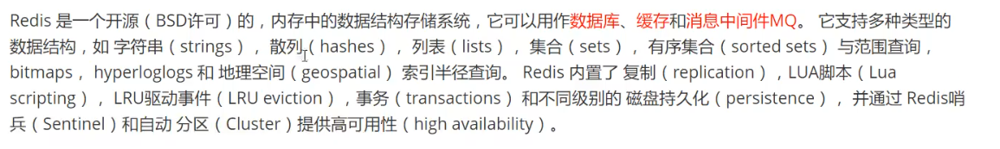

Redis是很快的， 官方表示，Redis是基于内存操作的，CPU不是Redis的性能瓶颈，Redis的性能瓶颈是根据机器的内存和网络带宽，既然可以使用单线程来实现，为什么不用单线程呢？


Redis是C语言写的，官方提供的数据为 十万多的QPS。。非常强大

**Redis为什么单线程还 这么快？**

误区：1. 高性能的服务器一定是多线程或者多进程的 2.多线程一定比单线程效率高

速度：CPU > 内存 >  硬盘

核心: redis是将所有的数据放在内存中的，所以说使用单线程去操作效率就是最高的，多线程（cpu上下文切换、线程调度，也是耗时的），对于内存系统来说，如果没有上下文切换效率就是最高的！多次读写都是在一个cpu上，在内存情况下，这就是最佳方案


# 一. Redis的五大数据类型



**备注：我觉得应该是6种数据类型，还有一种数据类型就是整形， 但是又不能算是严格的算整形。请看如下例子**

```bash
set num "1"		# num的数据为字符1
incr 1
get num			# 整数字符可以进行自增,这样看来redis如果发现数据是整数字符，这时就可以进行自增、自减等算术运算了
>> 2			
---------------------------------------
```


## 1.1 String类型

String类型的使用场景:value除了是字符串，可以是数字，JSON

1. 数字可以用来做一些计数器(incr、incrby、decr、decrby)，统计数量
	1. 比如blibili的点赞数  set user:zmz1054920870:dianzan 1 # 这种设计格式一定要记住了，很TM 实用
2. 对象缓存 （expire key seconds）


## 1.2 List类型


根据list的特性，我们在redis里面，我们可以把list玩成，栈（先进后出）、队列（先进先出）、阻塞队列（两头出）

所有list命令都是以l开头的

```bash
# lpush 从list的左边往list中添加数据
lpush key value1
lpush key value2
lpush key value3
上面的结构是这样的 key:[value3, value2, value1] 

# Rpush 从list的右边往list中添加数据
rpush key value4
结构就变成这样了 key:[value3, value2, value1, value4]

# lrange 从list左边开始计数取范围
lrange key 0 -1						# [value3, value2, value1, value4]
lrange key 0 1						# [value3, value2]


# lpop 从左边弹出一个值
lpop key

# rpop 从右边弹出一个值
rpop key


# lindex 通过下表获取值
lindex key 0
lindex key 1

# llen	获取列表的长度
llen key


# lrem 移除list中指定的value
lrem key count value	# count表示移除几个指定的value（如果list中有多个value，从左边开始）


# ltrim 截取指定位置的值
ltrim key start stop
如果一个list = [1, 2, 3, 4, 5]
ltrim list 0 1
lrange list 0 -1	# 得到[1, 2]


# list 从列表右边弹出一个元素返回，并从左边加入到另外一个列表, 如果list2不存在，直接新建i
rpoplpush list1 list2
如果一个list1 = [1, 2, 3, 4, 5], list2 = [one]
rpoplpush list1 list2	# 返回5 ，并将5移动到list2中


# lset 将列表中指定下标的值设置为另外一个值🔺list必须存在，下标也必须存在，否则报错
lset list index value

# linsert 在指定元素前面或者后面插入一个值
linsert key before|after pivot value
如果一个list1 = [a, b, c, a, b, c]
linsert list1 before b xxxx		# list1 = [a, xxxx, b, c, a, b, c], 🔺从左到右第一个pivot（单词）前面插入
```


**小结：**

- 它实际上就是一个链表
- 如果移除了所有值，空链表，也代表不存在
- 在两边插入或者改动值，效率最高！中间元素，相对来说效率会低一些
- 可以做消息队列！ Lpush Rpop, | Rpush Lpop,  作为一个MQ使用
- 可以作为一个栈！ Lpush Lpop | Rpush Rpop


## 1.3 Hash

**样式：Map集合 ---- key -《key value》存储样式就像这样,他的值是一个map集合, 它本质和String没有太大区别，只是多了一层field而已**

**备注：基本上所有的Hash类型的命令都是H开头的**


```bash
# 设置一个hash
hset key field value	# 看嘛，这玩意就是多了一层, 比如 hset article:kuangrenriji view 100
127.0.0.1:6379[1]> hset article:kuangrenriji view 10000
1

# 获取一个哈希key的field对应的z
hget key field
127.0.0.1:6379[1]> hget article:kuangrenriji view
10000

# 给同一个哈希key设置多个field和value
hmset key filed1 value1 filed value2

# 同时获取哈希key的多个field得值
hmget key1 filed1 file2

# 获取哈希key的全部field值
hgetall key

# 删除哈希key中的某一个field
hdel key 


# 获取一个哈希key中有多少个字段
hlen key

# 判断一个哈希key中是否存在一个field
hexists key field


# 只获得所有的field
hkeys key

# 只获得所有field的value
hvals key

# 整数字符字段自增,返回自增后的结果， 如果key不存在，则新增一个key，从0开始自增
hincrby key filed increment

# key里面的filed不存在  设置，存在啥也不干
hsetnx key file value


🔺 还是是没有减的，只有增加
```


## 1.4 Set（集合）

**注意点： 不能重复**

```bash
# 添加一个元素
sadd key value
sadd key value

# 查看集合中所有member（成员）
smembers key

# 判断一个只是否存在于 member中
sismember key member

# 查看一个集合中有多少个member（成员）
scard key

# 移除一个member
srem key member

# 随机选择集合中的几个元素，默认是一个
srandmember key count

# 随机弹出几个元素，默认是一个
spop key count

# 两个集合的不同
sdiff key1 key2

# 两个集合的交集
sinter key1 key2

# 两个集合的并集
sunion key1 key2

```


## 1.5 bitmap

按二进制位来存储，0 1 0 1 0 1 这种， 一般用于存储有两种状态的数据， 一个bitmap对象差不多有40+多亿个位，也就是说可以存40多亿个数据。。

场景： 登录、未登录、 打卡、未打卡、365打卡 。。。。

**下面是一个记录1周是否打开的数据(把bitmap的三个命令全部用上了)**

```bash
# 设置一个bitmap
setbit key offset value

setbit daka 0 1 # 星期1打卡了，星期一=0 value=1
setbit daka 1 0 # 星期二没有打卡, 星期二=1 value=0
setbit daka 4 1 # 星期三、星期四都没有打卡，星期五打卡了（一个bitmap有40+亿个位，默认是0，所因为星期三和星期四没有打卡，就使用默认值）
setbit daka 5 1 # 星期六打卡
setbit daka 6 1 # 星期天打卡


# 获取任意一天的打开记录
getbit daka 0	# 获取星期一 是否打卡


# 获取指定范围内，位值为1的个数（场景就是，一周打卡了几次）
bitcount daka
```


**备注：Redis命令操作目前晓得的有3种情况**

1. 返回数字0， 表示操作无效
2. 返回数字1， 表示个数
3. 返回数字-2， 表示
4. 返回ERR

```bash
# redis当前数据库大小
DBSIZE

#查看当前数据库中所有的key
keys *

#清空当前库中的数据
flushdb

#清楚所有数据库中的数据
flushall


# 查看key是否存在, 存在返回1不存在返回0
exists key

# 查看多个key，有几个存在
exists key1 key2 key3		# 有几个key存在就返回对应的数字，存在1个key就返回1，存在2个就返回2，都不存在就返回0

# 将一个key 从一个数据库转到到另外一个数据库
move key db					# select key1 1	将key1 从当前数据库转义到数据库1


# 给一个key设置过期时间
expire key 100				# 给key设置为100秒过期，时间到期以后，自动删除这个key

#查看一个key的过期时间
ttl key						# 返回剩余过期时间 time to live： 存活时间


#查看key的数据类型
type key

上面是通用的
##############################################################################################
下面是string的

# 🔺在已存在的key后面添加字符，如果不存在创建新的key
append key value


# 获取字符的长度 
strlen key


# 🔺 整数字符自增
incr key 			# 自增1，必须是整数字符.. 每执行一次 incr 则key的值 加1

# 🔺 整数字符自减
decr key			# 自减1，必须是整数字符.. 每执行一次 decr 则key的值 减1

# 🔺 自定义步长自增
incrby key 10		# key 按每次10的步长进行自增

# 🔺 自定义步长自减
decrby key 10		# key 按每次10的步长进行自减


# 获取起始长度的字符串，字符截取.， 如果stop 长度大于strlen的总长，则截取全部
getrange key start stop

# 修改指定位置的字符
setrange key offset value


# 设置key的值的同时设置过期时间 （set with expire）
setex key seconds value


# 🔺 如果key不存在，设置value，如果存在啥也不干	（set if not exist）
setnx key value


# 批量获取
mget key1 key2 key3


# 批量设置
mset key1 value1 key1 value2 ...


# 当key不存在时候批量设置， setnx 的 批量 命令
msetnx key1 value1 key2 value2	# 当key1 key2不存在时，设置，存在时，不设置。。🔺：由于数据库的原子性，要么都执行，要么都不执行（要么都要一起成功，要么一起失败）。。如果当key中有一个已经存在，整个命令失败。不会存在一些设置了，一些由于已经存在不设置。。他们是有原子性的，之所有有这个，数据库才能保证一致性


# 先获key的值，然后再更新这个值 （一般用来做数据的更新）
getset key value


# 经典设计
set article:1000:view 0   # key还是article:1000:view, 但是我们实际解读的时候，可以把它当成三个部分，article表示数据库， 10000表 ，view字段 0 表示值，这样采用拓展性。。如果使用 set article {1000:{view:0},1001:{view:1}} 这种形式就没有拓展性了，如果这时候1001这个文章的view变成2了， 你要将整个json串删除，然后重写更新。。就不好复用，如果是使用上面的方法，我们可以直接修改article:1001:view 2，这样速度快很多，拓展性也强很多，条理也清楚很多

# JSON串
set key {name:1,age:2,class:3}	# 后面字典不要加引号，:和,后面不要加空格，redis认为z


```


使用expire来做单点登录


# 二. Redis的事务


## 1.1 前言


关系型数据的事务有如下特点

- 原子性 ： 一个事务要么同时成功、要么都失败
- 一致性
- 隔离性
- 持久性


```
在传统的关系型数据库中，只要任意一条指令失败，则整个事务都会被撤销回滚，而在redis中，中间某条指令的失败不会导致前面已执行指令回滚，也不会造成后续的指令不做，也因此得出redis 事务的执行不具备原子性
```


Redis事务的本质：一组命令的集合！ 一个事务中的所有命令都会被序列化，在事务执行的过程中，会按照顺序执行（谁先入队，谁的优先级高） -- 一次性（出队执行完就结束）、顺序性（序列化）、排他性（不被其他命名干扰）

```
讲解：
比如我们前面学习的时候都是一条命令执行完，再敲下一条命令。。
如果这个是我们将前面的多条命令放到一个块里面。一次性执行，这个时候就有一个入队的过程（队列），入队完成以后，出队一条一条执行，这整个队列就是一个事务，可是Redis的事务是不存在原子性的
```

🔺redis数据的单条命令是保证原子性的，但是redis的事务不保证原子性的

🔺所有的命令在事务中（队列），并没有直接被执行！只有发起执行命令的时候才会执行！（命令：Exec）

🔺redis事务没有隔离级别的概论！


redis的事务：

- 开启事务 （multi）
- 命令入队 （multi 命令执行后，自动入队序列化）
- 执行事务（exec）


锁：Redis可以实现乐观锁（watch -- 监视器来实现）


## 2.1 命令


> ​	**正常执行事务**

```bash
127.0.0.1:6379[4]> multi		#  开启事务
OK
127.0.0.1:6379[4]> set k1 v1	# 入队
QUEUED
127.0.0.1:6379[4]> set k2 v2
QUEUED
127.0.0.1:6379[4]> get k2
QUEUED
127.0.0.1:6379[4]> set k3 v3
QUEUED
127.0.0.1:6379[4]> exec			#  执行事务
OK
OK
v2
OK

```


> ​	**放弃事务**

```bash
127.0.0.1:6379[4]> multi
OK
127.0.0.1:6379[4]> set k1 v1
QUEUED
127.0.0.1:6379[4]> set k2 v2
QUEUED
127.0.0.1:6379[4]> get k2
QUEUED
127.0.0.1:6379[4]> discard
OK
```


> ​	编译型错误(Redis是c语言写的): 将会使整个事务不执行

```bash
127.0.0.1:6379[4]> multi
OK
127.0.0.1:6379[4]> set k1 1
QUEUED
127.0.0.1:6379[4]> getset k1	# 编译性错误也是语法性错误，但是他无法通过编译检查，编译型错误是语法性错误的一种，是他的子集
ERR wrong number of arguments for 'getset' command

127.0.0.1:6379[4]> get k1
QUEUED
127.0.0.1:6379[4]> exec
EXECABORT Transaction discarded because of previous errors.

```


> 运行时异常(如 1/0), 如果事务队列中存在语法性错误（就是说可以通过编译检查），其他命令是可以正常执行的，错误命令抛出异常	

```bash
127.0.0.1:6379[4]> multi
OK
127.0.0.1:6379[4]> set k1 "v1"
QUEUED
127.0.0.1:6379[4]> incr k1
QUEUED
127.0.0.1:6379[4]> set k2 "v2"
QUEUED
127.0.0.1:6379[4]> set k3 "v3"
QUEUED
127.0.0.1:6379[4]> exec
OK
ERR value is not an integer or out of range

OK
OK

```


# 三. 悲观锁


## 1.1 Redis的监视测试


**悲观锁:**

- 很悲观，认为任何情况都会出问题，这个时候就很警惕，所以无论干什么都加锁，造成性能降低


**乐观锁:**

- 很乐观，认为任何情况都不会出现问题，所以不会上锁，更新数据的时候去只判断一下在此期间是否有人修改过这个数据


**redis通过watch命令来监控判断，实现乐观锁**

- 获取比对数据
- 更新时比较比对数据


## 1.2 Redis的监视测试 -- watch


> ​	正常执行成功!

```bash
127.0.0.1:6379[4]> set money 100	# 有100块钱
OK
127.0.0.1:6379[4]> set out 0		# 花费0元
OK
127.0.0.1:6379[4]> watch money		# 监视money对象
OK
127.0.0.1:6379[4]> MULTI			# 开启事务
OK
127.0.0.1:6379[4]> decrby money 20	# 花费20块
QUEUED
127.0.0.1:6379[4]> incrby out 20	# 花费20块
QUEUED
127.0.0.1:6379[4]> EXEC				# 执行事务
80
20

```

**注意：**

- **watch不能写道multi事务里面，否则报错， watch 和事务配合才能有效果**

- **每次执行正确完事务，exec会自动unwatch，再watch ，即自动解锁再上锁，如果是由于乐观锁导致的执行失败，需要我们自行去unwatch解锁，如果是由于编译执行导致不执行事务的，也需要我们自行去解锁。说白了会不会自动去unwatch和watch取决于是否完整执行了exec**

> ​	执行失败！

```bash
=============== 原始数据===========================
127.0.0.1:6379[4]> set money 0		# 初始拥有0块钱
OK
127.0.0.1:6379[4]> set out 0		# 初始花费0元

=============== 进程 1=============================
127.0.0.1:6379[4]> set money 100	# 给我100块钱
OK
127.0.0.1:6379[4]> set out 0		# 目前花费0元
OK
127.0.0.1:6379[4]> watch money		# 监视money对象
OK
127.0.0.1:6379[4]> MULTI			# 开启事务
OK
127.0.0.1:6379[4]> decrby money 20	# 花费20块
QUEUED
127.0.0.1:6379[4]> incrby out 20	# 花费20块
QUEUED
127.0.0.1:6379[4]> EXEC				# 执行事务		# 执行到这里的时候进程二执行突然介入执行了它的命令
null								# null说明事务执行失败

=============== 进程 2=============================
127.0.0.1:6379[4]> decrby money 10	# 花费10块
ok
127.0.0.1:6379[4]> incrby out 20	# 花费10块
ok
```

**疑惑点1：Redis不是单线程？**

**解释：对的redis是单线程I/O多路复用，上面是模拟的多个进程来访问redis，由于redis采用的是I/O多路复用，是可以实现多个进程同时访问的。。这是没有问题的**

**疑惑点2：Redis是如何通过watch来实现乐观锁的呢**

**解释：我们watch了money，这个money当前值会被加到队列当中，当我们执行事务的时候，首先会对比前面和值和现在值是否一样，如果不一样。。事务全部执行失败**

**抑或点3：被乐观锁限制，导致执行失败了，我们怎么解锁执行呢？**

```
1. unwatch		# 取消监视（行为上抽象成解锁）

2. watch money 	# 重新监视

3. ....
4. ....
```