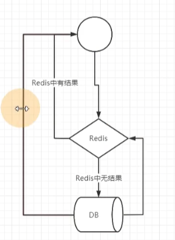
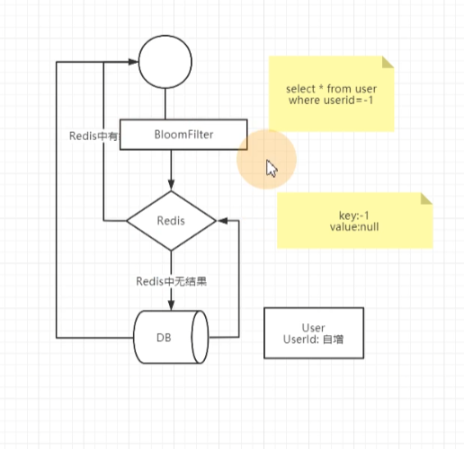
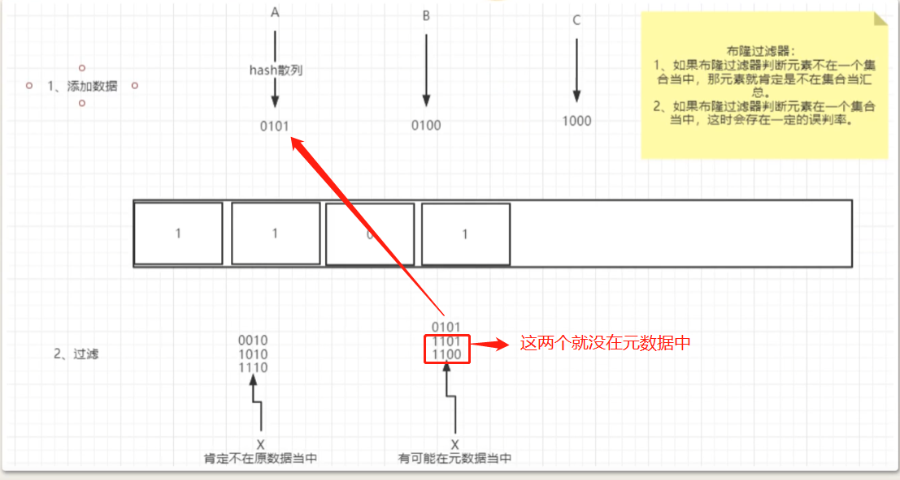
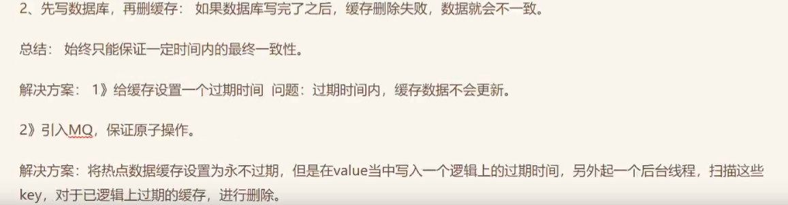
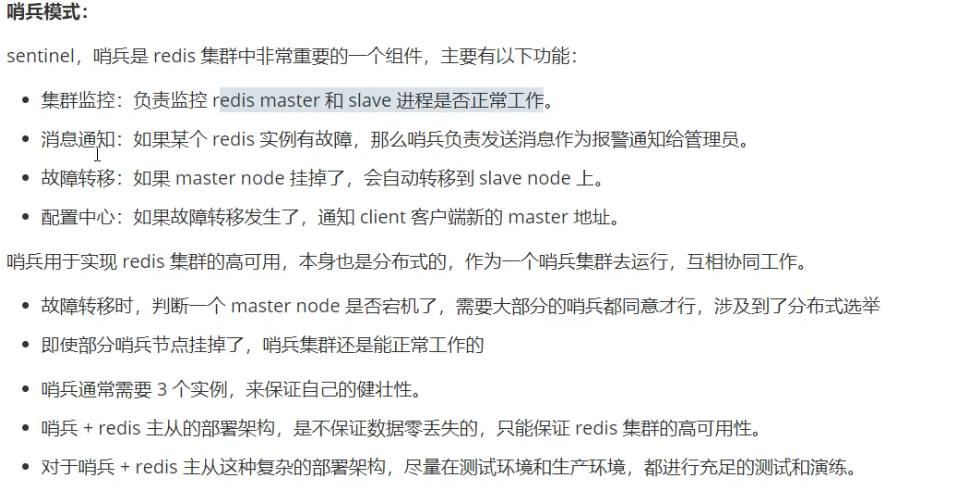
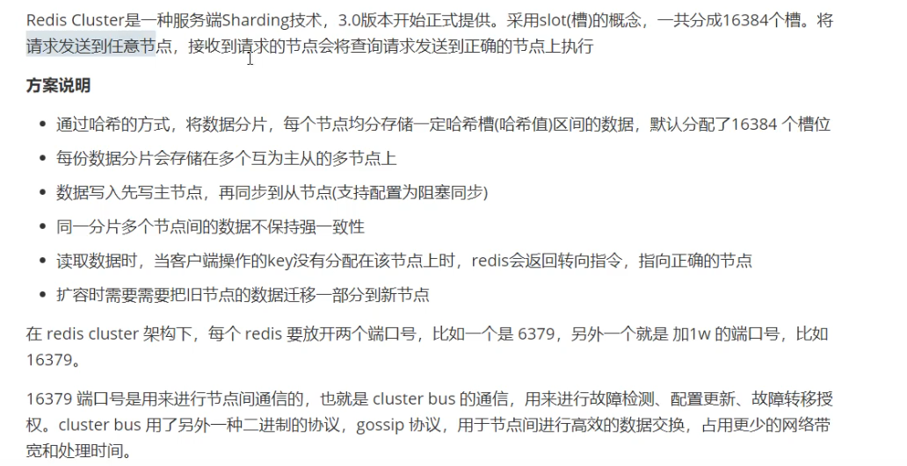

# 一.redis的典型使用场景及缓存击穿、穿透、雪崩

​		场景：前端请求资源时，现在redis里面查，有没有缓存，如果redis里面有结果，直接返回给前端。如果redis里面没有结果，就去数据库里面查询，如果DB中有结果，返回给前端，同时将结果缓存到redis当中



​																														 图（一）

## 1.1	什么是缓存穿透？缓存击穿？缓存雪崩？怎么解决？


#### 1.1.1	缓存穿透

​		概念：缓存中查不到，数据库中也查不到（结合图（一））

​		危害：如果有人一直用一个穿透数据来查询，这时DB中就会一直有一条查询不到结果的SQL在执行。如果这个SQL查询面又特别广，就很容易把DB搞崩溃了

​		解决方案

```python
1. 在业务层对参数进行合法性校验（比如：有一张user表，里面的userID采用的是自增的方式(从0开始自增)，这个时候查询SQL是 select * from user where userID=-1, 在业务层就限制-1不存在或者合法）
2. 将数据库中没有查到结果的数据写入缓存（比如：select * from user where userID=-1 没有在DB中查询到，我们也对redis进行一次写操作，key=-1，value=null） -- 但是这样也有风险，就是redis被很多无效的key占用。这时我们可以在redis中给key加一个短一点的过期时间。但是怕大量无效数据爆破
3. 🔺最好的方法就是引入布隆过滤器（Bloomfilter）。要注意布隆过滤器存在一定的误判率，并且，布隆过滤器只能加数据不能减数据
```


​		BloomFilter过滤器（百度看解释）



​		BloomFilter过滤器的原理



```
按上面的例子：将DB中的全部userID通过hash散列成010101这样的位数据，存放到BloomFilter里面（如果BloomFilter的元过滤器是0000四位的，第一个元数据A0101，将把BloomFilter的元过滤器的第二和第四位变成1，第二个元数据B0100，将不影响BloomFilter过滤器，因为BloomFilter过滤器的第二位已经是1了，第三个元数据C1000，将会把BloomFilter过滤器的第一位变成1，最后就变成上图所示的样子了）。当用户带有userid字段来请求的时候，比如数据D，D的userid也会按同样的hash规则散列成0101的位数据。。然后进行过滤，过滤的时候。将D散列值中的1和BoomFilter中的对应的位进行比较，如果都为1，表示过滤通过。。
```

问题：怎么样散列的呢？

```
比如现在有一个数据A， 它有1000个字符，这个时候，BloomFliter会在一定的位置上，截取一段数据，进行散列转换，变成010101这种数据
```


#### 1.1.2	缓冲击穿

​		概念：缓存中没有，数据库中有。一般是出现在缓存数据初始化以及Key过期时。它的问题在于重新写入缓存需要一定的时间，如果是在高并发场景下，过多的请求写在DB上，给DB造成很大的压力。


​		解决方案：

```
1. 设置这个热点缓存永不过期（永远存在redis中）这时要注意在value当中包含一个逻辑上的过期时间，然后另外起一个线程，定期过滤重建这些缓存（比如usrid=1, expire=5min, 这个线程一直扫描这个expire，这个expire充当临时过期逻辑校验参数，如果过期，去DB中拉取新的usrid，重新定义expire）
2. 
```


#### 1.1.3	缓存雪崩

​		概念：缓存大面积过期，导致请求都被转发到DB

​		解决方案：

```
1. 把缓存的失效时间分散开（造成缓存雪崩的一个最主要的原因就是expire一致）。例如在原有的统一失效时间基础上，增加一个随机值。
2. 对热点数据设置永不过期（但是永不过期就会造成永久资源占用）
```


# 二.如何保证redis与数据库的数据一致？


前言：当我们对数据进行修改的时候，到底是先删缓存，还是先写数据库？


## 2.1	先删缓存，再写数据库

1、如果是先删缓存，再写数据库：在高并发场景下，当第一个线程删除了缓存，还没有来得及写数据库，第二个线程来读取数据，会发现缓存中的数据为空，那么就会去读数据库中的数据（旧值，脏数据），读完之后，把读到的结果写入缓存（此时，第一个线程已经将新的值写到缓存里面了），这样缓存中的值就会被覆盖为修改前的脏数据


解决方案：1》 先操作缓存，但不 删除缓存。将缓存修改为一个特殊值（-9999）.客户端读缓存时，发现是默认值，就休眠一小会，再去查一次redis

带来问题：特殊值对业务有侵入。休眠时间，可能会多次重复，对性能有影响

解决方案：2》延时双删：先删除缓存，然后再写数据库，休眠一小会，再次删除缓存（业界流行的方案）

带来问题：如果数据写操作频繁，同样还是会有脏数据

总结：这种方式，通常要求写操作不能太频繁


## 2.2	先写数据库，再删缓存




# 三. 如何设计一个分布式锁？如何对锁性能进行优化？

前言： 分布式锁的本质，就是在所有进程都能访问到的一个地方，设置一个锁资源，让这些进程都来竞争锁资源。数据库、zookeeper，redis。。。通常对于分布式锁，会要求响应快、性能搞、与业务无关。（加一嘴：数据库是用来存数据的，性能和zookeeper、redis还是有很大的差距的）


## 3.1	Redis实现分布式锁

```bash
# 当key不存在时，就将key设置为value，并返回1。如果key存在，就返回0
SETNX key value 


#设置key的有效时常,过了这个locktime之后，这个key就失效了
EXPIRE key locktime

#删除key
DEL key


#先返回key的值，如果没有就返回空，然后再将key设置成value
GETSET key value
```


#### 3.1.1	最简单的分布式锁: SETNX加锁、DEL解锁

1.解决方案：SETNX加锁，DEL解锁

```python
# python实现一个伪代码

def get_lock(key, value):
    if SETNX(key, value)==1:
        return true
    return false
DEL
```

1.问题：如果获取到锁的进程执行失败，它就死锁了

2.解决方案：给锁加设置过期时长

```python
# python实现一个伪代码


def get_lock(key, value):
    if SETNX(key, value)==1:
        return true
    return false
DEL
```

2.问题： SETNX和EXPIRE并不是原子性，所以获取到锁的进程有可能还没有执行EXPIRE指令，就挂了，这时锁还是会被锁死

3.将锁的内容设置为过期时间（客户端时间+过期时长），SETNX获取锁失败时，拿这个时间跟当前时间对比，如果是过期的锁，就先删除锁，再重新锁上。问题：再高并发场景下，会产生多个进程同时拿到锁的情况

4.SETNX失败后，获取锁上时间戳，然后getset，将自己的过期时间更新上去，并获取旧值。如果这个旧值，跟之前获得的时间戳不一致，就表示这个锁已经被其他进程占用了，自己就要放弃竞争锁

5.上面就形成了一个比较搞笑的分布式锁。分析一下，上面各种优化的根本问题在于，SETNX和EXPIRE两个质量无法保证原子性。Redis2.6提供了直接执行Lua脚本的方式，通过Lua脚本来保证原子性


# 四.Redis如何配置Key的过期时间？他的实现原理是什么？


## 4.1	redis设置key的过期时间

- EXPIRE（最常用）
- 对于字符串：SETEX


## 4.2	他的实现原理

我们通常的做法：

- 定期删除：每隔一段时间，执行一次删除过期key的操作
- 懒汉式删除：当用到时候删除，当使用get、getset等指令去获取数据时，判断key是否过期。过期后，就先把key删除，再执行后面的操作

Redis是将上面两种方式结合来使用：

- 懒汉式删除：只有当访问一个key时，才会判断该key是否已过期，过期则清除。该策略最大化地节省了cpu资源，却对内存非常不友好。极端情况下可能出现大量key没有 再次被访问，从而不会被清除，占用大量内存
- 定期删除：redis会平衡执行频率和执行时长，有综合考量
	- redis定期删除的时候会在指定时间内，遍历每一个database（默认是16个）（由于指定了时长不一定全部库都遍历完），检查当前库中指定个数的key（默认是20个，随机的）。随机抽查这些key，如果有过期的，就删除。程序中有一个全局变量，这个全局变量记录了扫描到了哪一个数据库。
	- 就是根据指定时长，来计划要扫描多少个库，每个库中扫描多少个key。通过调整定时扫描的时间间隔和每次扫描的限定耗时，可以在不同情况下使得CPU和内存资源达到最优平衡效果


# 五. 海量数据下，如何快速查找一条记录

1. mysql数据下的话，就要考虑怎么优化一个索引结构，怎么优化一个B+树。
2. 大数据层下，怎么维护好一个分布式存储结构


#### 5.1 REDIS中

- 使用布隆过滤器，快速过滤不存在的记录
	- 在redis中，我们使用Redis的bitmap结构来实现布隆过滤器（字节级别的这个操作，一个bitmap的key呢，也就是一个0101这样的数组，我们通过它的API，快速的控制去操作它这个bitmap当中每一位的值是0还是1.）
- 在Redis中建立数据缓存（尽量在redis这一层就完成数据查询）
	- 以普通字符串形式来存储（userid作为key -> user.json。json格式作为数据结构）.以一个hash来存储一条记录（userid key->username field -》 ）
	- 以一个整的hash来存储所有的数据，UserInfo key- > field 就用 userid ,value 就用user.json .一个hash 最多能支持 2^32 -1（40多亿）个键值对
- 查询优化
	- 由于redis集群是根据hash槽来分配数据到哪一个分布式机器上
	- 所以我们可以自己实现槽位计算，找到记录应该分配在哪台机器上，然后直接去目标机器上找


# 六. Redis databash 和AOF机制


## 6.1 RDB

RDB（redis databash）

在指定的时间间隔内将内存中的数据集快照写入磁盘，实际操作过程中是fork一个子进程，先将数据集写入临时文件，写入成功后，在替换之前的文件，用二进制压缩存储。我们可以把redis理解为一个内存数据库。它这么快，最主要的原因就是他在内存当中进行操作的

我们要知道redis是一个单进程的，这个单进程下面只有一个单线程来处理我们的请求，因为是在内存中操作，速度快，单进程基本能够满足。。在生成临时文件的时候，就要fork一个子进程来处理。这样就redis的业务进程和写临时文件的的进程就分开了。

**优点：**

1. 整个Redis数据库将只包含一个dump.rdb,方便持久化
2. 容灾性好，方便备份（只有一个文件嘛，方便得不得了）
3. 性能最大化，fork子进程来完成写操作，让主进程继续处理命令，所以是IO最大化。使用单独子进程来进行持久化，主进程不会进行任何IO操作，保证了redis的高性能
4. 相对于数据集很大时，比AOF的启动效率更高，因为他就是一个快照文件

**缺点：**

1. 数据安全性低。RDB是间隔一段时间进行持久化，如果持久化之间redis发生故障，会发生数据丢失。所以这种方式更适合数据要求不严谨的时候
2. 由于RDB是通过fork子进程来协助完成数据持久化工作的，因此，如果当数据集较大时，可能导致整个服务器停止服务几百毫秒，甚至一秒钟


## 6.2 AOF机制

AOF：Append only File

以日志得形式记录服务器所处理的每一个写、删除操作，查询操作不会记录，以文本方式记录，可以打开文件看到详细的操作记录

**优点：**

1. 数据安全，redis中提供了3中同步策略，即每秒同步，没修改同步、不同步。事实上，每秒同步也是异步完成的，其效率也是非常高的，所差的是一旦系统出现宕机现象，那么这一秒钟之内的数据将会丢失。而没修改同步，我们可以将其视为同步持久化，每次发生数据变化都会被立即记录到磁盘中
2. 通过append模式写文件，即使中途服务器宕机也不会破坏已存在的内容，可以通过redis-check-aof工具解决数据一致性问题
3. AOF机制的rewrite模式，定期会对AOF文件进行重写，以达到压缩的目的

**缺点：**

1. AOF文件比RDB文件打，且恢复速度慢
2. 数据集大的时候，比rdb启动效率低
3. 运行效率没有rdb高


AOF文件比RDB更新频率高，优先使用AOF还原数据

AOF比RDB更安全

RDB性能比AOF好

如果两个都配置了，优先加载AOF


# 七. redis的事务实现

前言：事务的四大特性ACID

1. 原子性
2. 一致性：哪怕执行一半崩溃了，还是可以去恢复的
3. 持久性：RDB和ROF机制
4. 隔离性：单线程的，事务被同一个线程执行（IO多路复用），所以数据安全


# 八. redis集群方案

1. 主从模式（普遍模式）：一个master主节点一个salve从节点
2. 哨兵模式（基于主从模式）



3. Redis cluster （docker 那一章节）

