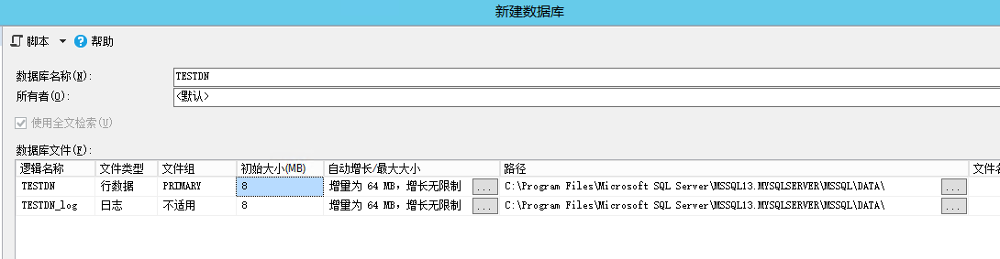
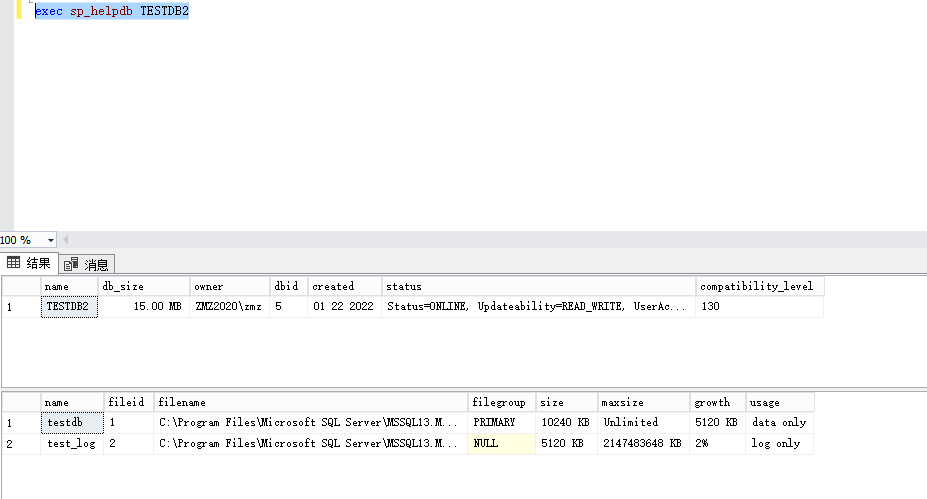
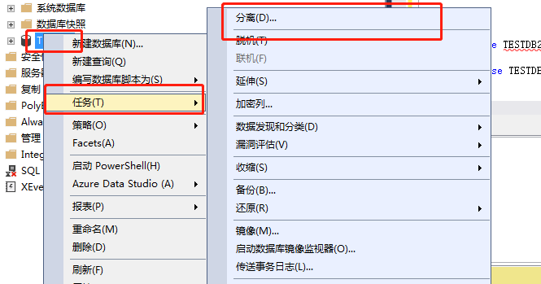
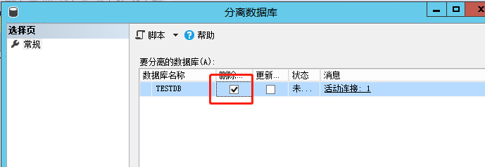
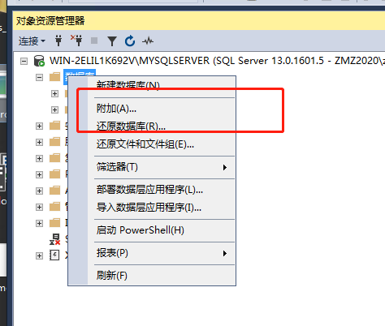
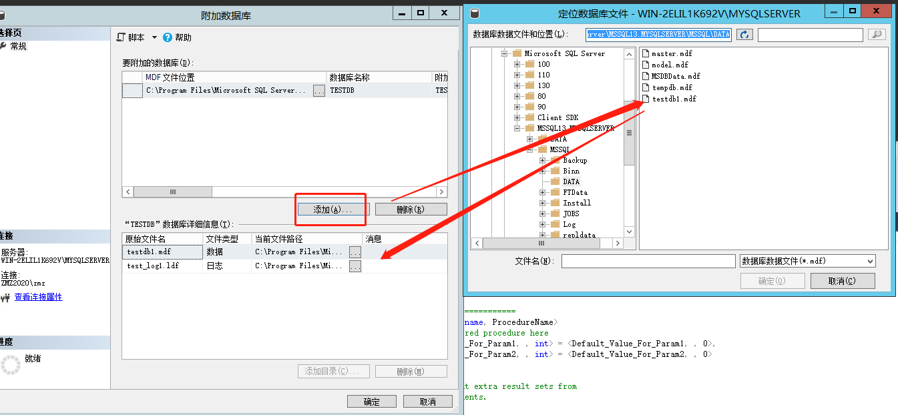
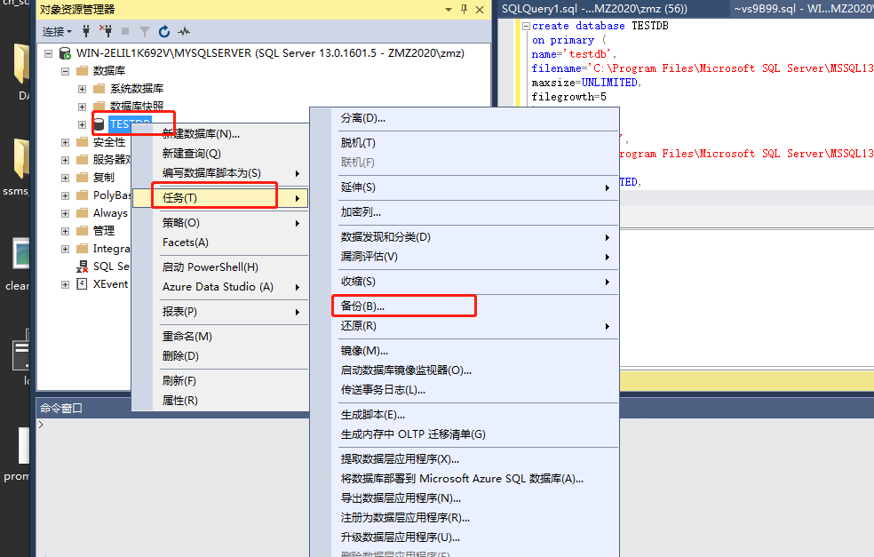
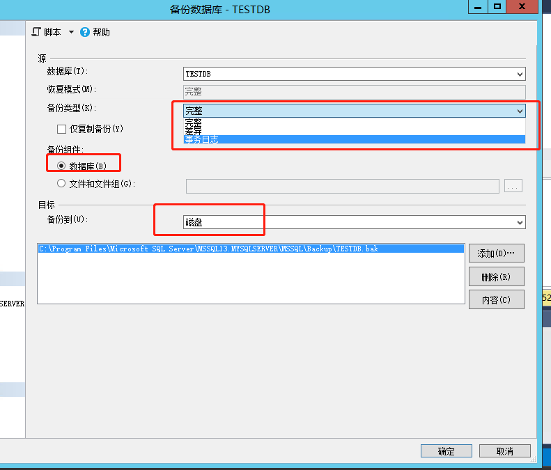
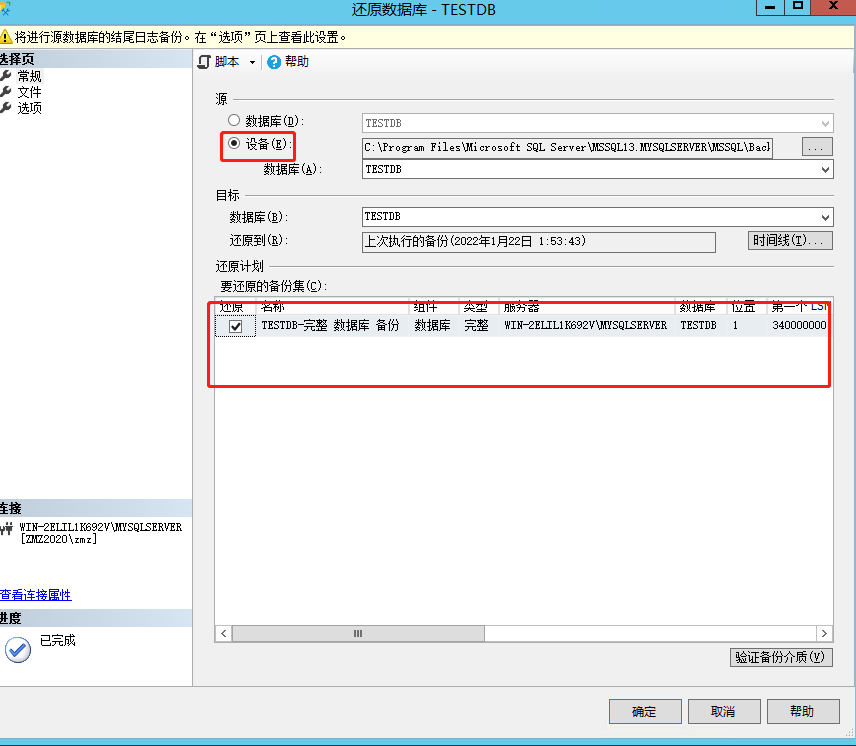
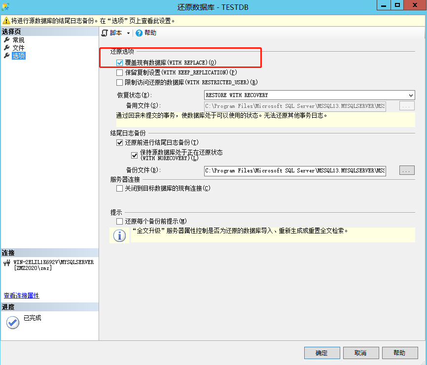

## 一、创建数据库



数据库文件又叫逻辑名称分为

- 主文件  .mdf结尾
- 日志文件 .ldf结尾

```SQL
create database TESTDB on primary(
    name='test_db_dat',	# 逻辑文件名称
    filename='C:\Users\zmz\Desktop\DATA\TESTDB.mdf',
    size=10mb,			# 初始大小
    maxsize=500,		# 最大数据，单位默认MB
    filegrowth=5		# 文件增长（可以是百分比可以是具体数值，默认单位MB）
)
log on (
    name='test_db_log',
    filename='C:\Users\zmz\Desktop\DATA\test_log.ldf'，
    size=5mb,
    maxsize=UNLIMITED,	# 无限制
    filegrowth=10%		# 按10%进行增长
)

create database TESTDB
on primary (
name='testdb',		# 逻辑文件名称
filename='C:\Program Files\Microsoft SQL Server\MSSQL13.MYSQLSERVER\MSSQL\DATA\testdb1.mdf',	# 真实文件名称
size=10mb,
maxsize=UNLIMITED,	# 无限制
filegrowth=5
)
log on (
name='test_log',
filename='C:\Program Files\Microsoft SQL Server\MSSQL13.MYSQLSERVER\MSSQL\DATA\test_log1.ldf',
size=5mb,
maxsize=UNLIMITED,
filegrowth=2%		# 按百分比增长
)
```

目前的理解：逻辑文件名=路径+物理文件名
物理文件名表示在路径下的文件名

什么意思呢?使用逻辑文件名就可以免去用路径+物理文件名了，更方便简单


如果提示操作系统错误5（拒绝访问）文件权限问题

https://www.pianshen.com/article/23021183974/


## 二、Transact-SQL 修改

```sql
# 修改数据库名字
alter database TESTDB modify name=TESTDB02

# 修改数据文件属性（这里不能修改逻辑名称，只能修改文件属性）
alter database TESTDB02
modify file(
	name=testdt,
    size=20MB,
    maxsize=80MB,
    filegrowth=10MB
);

```


```SQL
# 查看数据库信息
exec sp_helpdb TESTDB2
```




**常见错误：无法用排他锁锁定该数据库，以执行该操作。**

```SQL


alter database TESTDB modify name=TESTDB2 　　　　　 --更改数据库名
EXEC sp_renamedb 'TESTDB' , 'TESTDB2'				--更改数据库名
更改上面这些时，需要保证没有其他人或者应用连接数据库，否则会报错（无法用排他锁锁定该数据库，以执行该操作。 (Microsoft SQL Server，错误: 5030)）

可以使用以下语句来查看spid：
select spid from master.dbo.sysprocesses where dbid=db_id('TESTDB')

然后干掉这个spid
kill spid 就行了

```


## 三、删除数据库

```SQL
drop database TESTDB01,TESTDB02,TESTDB03,
```


## 四、数据库分离

当数据库正在使用中，前面的方法十采用下面的命令找到pid，然后kill

```sql
select spid from master.dbo.sysprocesses where dbid=db_id('TESTDB')
```







通过分离，数据的存储文件和日志文件还存在，我们还可以把他给加回来

数据库 右键  附加







## 五、数据库备份和还原

#### 1、备份

- 差异备份（differential backup）
- 完整备份（full backup）
- 。。。。。https://www.cnblogs.com/gaizai/archive/2011/06/29/2093575.html








#### 2、还原

通过备份文件进行还原


常规：



选项




https://www.cnblogs.com/chenmh/p/3640751.html

https://www.cnblogs.com/gaizai/archive/2011/06/29/2093575.html

## 十、存储过程

存储过程说白了就是一堆的SQL的组合，在逻辑控制下处理比较复制的业务

存储过程优点

- 已经编译，响应速度快

存储过程缺点

- 调式麻烦，不易扩展
- 维护麻烦（维护太多的存储过程就是一场噩梦）


场景：

多业务处理，例如多表之间的进行复制操作
