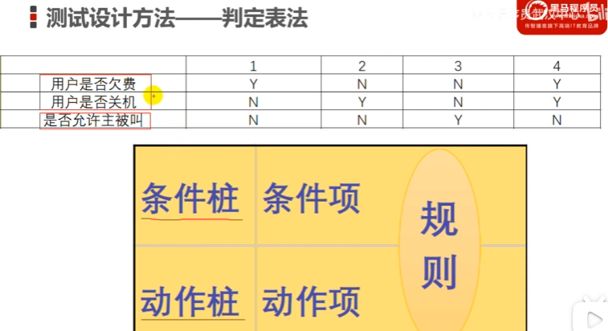
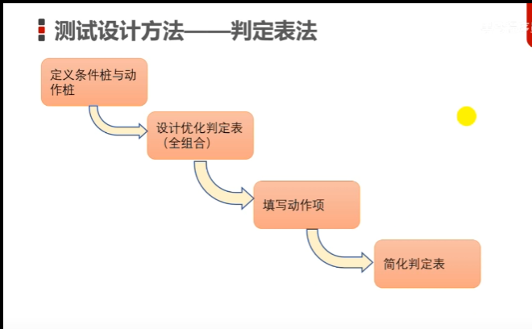
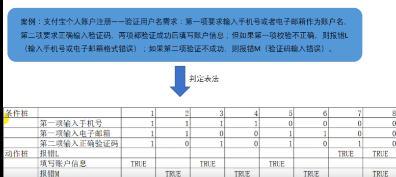
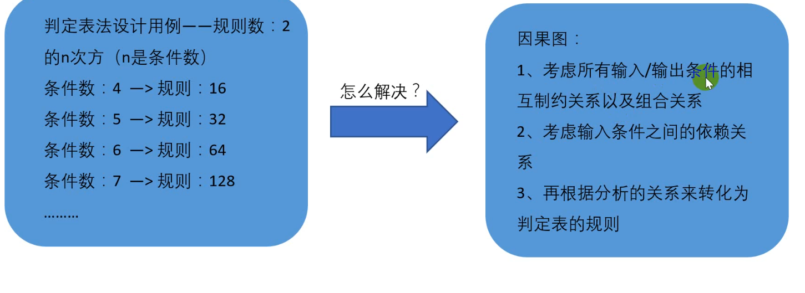
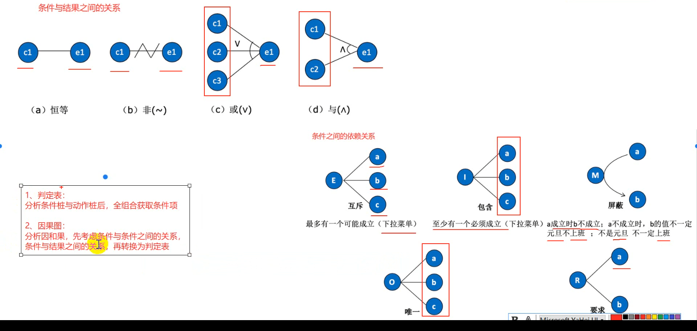
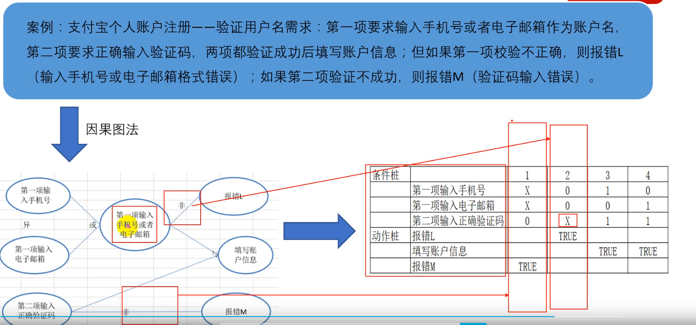

# **等价类**

# 边界值

# 判定表

解决条件之间存在关联的情况

-

怎么简化判定表呢：将结果相同的那些列，我们在看他的条件，如果只有一个条件不相同，那么可以将这两个规则合并成一个

怎么测试导入导出功能（晓多的）

首先我们对单个字段进行验证设计用例：  单个字段的等价类，边界值，排除其他字段的影响（其他字段全部正确填写）。将单个字段的用例设计完成以后。

在针对必填项和有特殊要求的字段单独提出来，设计判定表。简化判定表，遵循，结果相同，且两条结果只有一个条件不相同，这时可以合并成一个用例

# 因果图

因果图是基于判定表

唯一：a.b.c有，且只能有一个

要求：有a必然有b

# 场景法

# 正交实验法

正交表去网上查

5因子2水平的  没有，我们可以采用 7因子2水平，往大的选

7 * 7 = 49