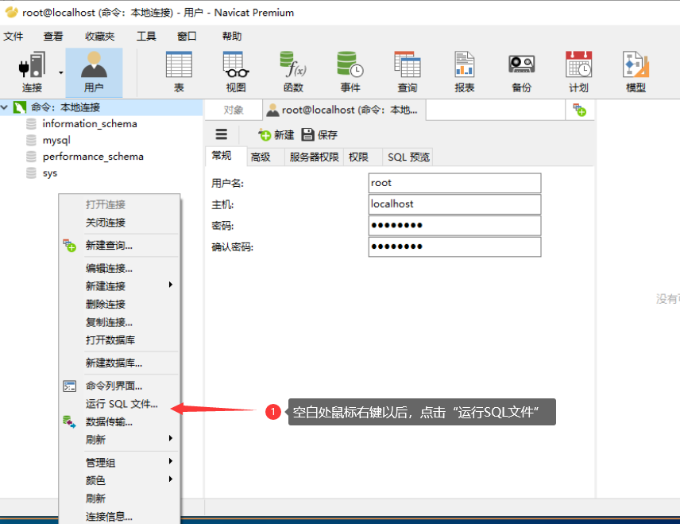

## 1. Mysql的安装

#### 第一步：解压mysql安装包

这里我解压到D:\mysql下面

#### 第二步：配置环境变量

```bash
D:\mysql\mysql-5.7.24-winx64\bin	#bin目录
D:\mysql\mysql-5.7.24-winx64		#整个mysql文件目录
```


#### 第三步：Mysql配置


- 通过管理员权限打开CMD


- 进入到Mysql安装路径的bin目录下

```bash
cd /d D:\mysql\mysql-5.7.24-winx64\bin
```


- 安装mysql服务

```bash
mysqld -install
```

**注意：这里可能会缺失dll文件**

```
我们需要安装MSVBCRT.AIO_2019.03.02.X64.exe这个dll，U盘中有
```


- 初始化数据库服务

```bash
mysqld --initialize-insecure  #一定不要打错了
```


- 启动mysql服务

```bash
net start mysql
```

也可以到服务列表中去手动启动


- 其他命令

```bash
net stop mysql #关闭数据库服务
```


- 开启服务以后，我们就可以退出管理员CMD，通过普通CMD来访问我们的数据库了


- 首次进入mysql

```bash
mysql -u root -p
```

**注意首次登录是不需要密码的，有密码提示也直接回车**


## 2. navicat 安装


#### 第一步：解压navicat

我解压到D:\navicat

得到 navicat112_premium_cs_x64.exe 和PatchNavicat.exe文件

由于navicat是收费得，所以我们需要PatchNavicat.exe来破解一下 哈哈


#### 第二步：安装navicat

我们点击navicat112_premium_cs_x64.exe来安装

安装到D:\navicat目录下，这时，navicat目录下会生成一个Navicat Premium文件夹


#### 第三步：破解收费

将PatchNavicat.exe复制到Navicat Premium目录下，然后双击，这个时候有一个弹窗。提示成功Path successfully(3 modifueds)!,这时我们得navicat就安装成功了


## 3. 通过navicat连接数据库


#### 第一步：打开navicat


#### 第二步：连接数据库


#### 第三步：通过navicat修复数据库


这个时候，我们通过CMD登录mysql也需要密码了


## 3.  添加数据库

#### 第一步：准备数据

我这里有一份数据哈，在D:\navicat目录下，叫猫宁，我们解压出来，会有一个db_morning.sql的文件，这就是我们的数据库数据文件


#### 第二步：导入已经数据到我们当前数据库中




